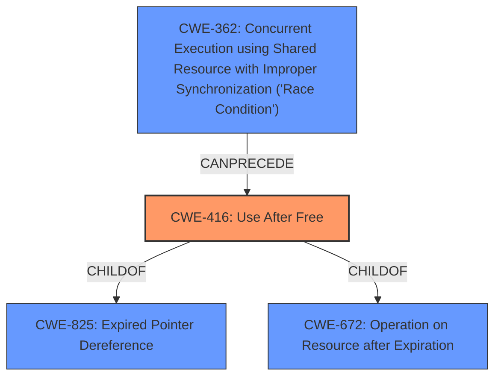

# Raw Analyzer Response for CVE-2021-37988

# Summary
| CWE ID | CWE Name | Confidence | CWE Abstraction Level | CWE Vulnerability Mapping Label | CWE-Vulnerability Mapping Notes |
|---|---|---|---|---|---|
| CWE-416 | Use After Free | 1.0 | Variant | Allowed | Primary CWE |
| CWE-366 | Race Condition within a Thread | 0.5 | Base | Allowed | Secondary Candidate |

## Evidence and Confidence

*   **Confidence Score:** 0.9
*   **Evidence Strength:** HIGH

## Relationship Analysis
The primary CWE is CWE-416, which is a Variant of CWE-825 (Expired Pointer Dereference) and CWE-672 (Operation on Resource after Expiration). CWE-416 is also related to race conditions (CWE-362) because concurrent access can lead to use-after-free scenarios. The relationships between these CWEs helped refine the classification to the most specific and relevant option.

## Vulnerability Chain
The vulnerability chain starts with a **use-after-free** condition, potentially triggered by specific gestures in a crafted HTML page. This leads to **heap corruption**, which can then be exploited for arbitrary code execution or denial of service.

`Use After Free -> Heap Corruption -> Arbitrary Code Execution / Denial of Service`

## Summary of Analysis
The initial analysis focused on the **use-after-free** condition described in the vulnerability. The evidence from the "Vulnerability Description Key Phrases" and "CVE Reference Links Content Summary" clearly points to **use-after-free** as the root cause. The retriever results also strongly suggest CWE-416 as the best match.

The relationship analysis further solidified this decision. CWE-416 is a variant, offering a more specific classification than its parents. The mapping guidance for CWE-416 explicitly allows its use and emphasizes the importance of carefully reviewing the description to ensure a proper fit, which is confirmed in this case.

The analysis also considered whether a race condition might be involved, given that concurrent access can sometimes lead to use-after-free vulnerabilities. While not explicitly stated, the possibility exists that the specific gestures might trigger concurrent actions that exacerbate the **use-after-free**. Therefore, CWE-366 is considered a secondary candidate.

The final decision is based on the provided evidence and the relationship insights. CWE-416 is the most specific and accurate representation of the vulnerability, aligning perfectly with the "use-after-free" condition described.

Relevant CWE Information:

# Enhanced Context (25 CWEs)
The following CWEs were identified as potentially relevant to this vulnerability:

## CWE-366: Race Condition within a Thread
**Abstraction Level**: Base
**Similarity Score**: 0.79
**Source**: dense

**Description**:
If two threads of execution use a resource simultaneously, there exists the possibility that resources may be used while invalid, in turn making the state of execution undefined.

**Mapping Guidance**:
- Usage: Allowed
- Rationale: This CWE entry is at the Base level of abstraction, which is a preferred level of abstraction for mapping to the root causes of vulnerabilities.

## CWE-416: Use After Free
**Abstraction:** Variant
**Status:** Stable

### Description
The product reuses or references memory after it has been freed. At some point afterward, the memory may be allocated again and saved in another pointer, while the original pointer references a location somewhere within the new allocation. Any operations using the original pointer are no longer valid because the memory "belongs" to the code that operates on the new pointer.

### Extended Description
Not provided

### Alternative Terms
Dangling pointer: a pointer that no longer points to valid memory, often after it has been freed
UAF: commonly used acronym for Use After Free
Use-After-Free

### Relationships
ChildOf -> CWE-825
ChildOf -> CWE-672
ChildOf -> CWE-672
ChildOf -> CWE-672
CanPrecede -> CWE-120
CanPrecede -> CWE-123

### Mapping Guidance
**Usage:** Allowed
**Rationale:** This CWE entry is at the Variant level of abstraction, which is a preferred level of abstraction for mapping to the root causes of vulnerabilities.
**Comments:** Carefully read both the name and description to ensure that this mapping is an appropriate fit. Do not try to 'force' a mapping to a lower-level Base/Variant simply to comply with this preferred level of abstraction.
**Reasons:**
- Acceptable-Use

### Observed Examples
- **CVE-2022-20141:** Chain: an operating system kernel has insufficent resource locking (CWE-413) leading to a use after free (CWE-416).
- **CVE-2022-2621:** Chain: two threads in a web browser use the same resource (CWE-366), but one of those threads can destroy the resource before the other has completed (CWE-416).
- **CVE-2021-0920:** Chain: mobile platform race condition (CWE-362) leading to use-after-free (CWE-416), as exploited in the wild per CISA KEV.