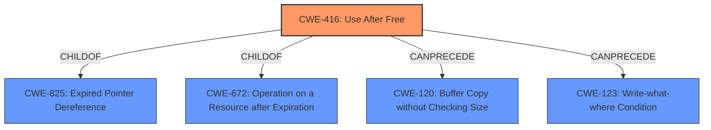

# Analysis Report for CVE-2021-37993

# Vulnerability Analysis Report: CVE-2021-37993

## Description


## Analysis (with Relationship Data)

# Summary
| CWE ID | CWE Name | Confidence | CWE Abstraction Level | CWE Vulnerability Mapping Label | CWE-Vulnerability Mapping Notes |
|---|---|---|---|---|---|
| CWE-416 | Use After Free | 1.0 | Variant | Allowed | Primary CWE |

## Evidence and Confidence

*   **Confidence Score:** 1.0
*   **Evidence Strength:** HIGH

## Relationship Analysis
The primary relationship that influenced the decision was the direct match of the vulnerability description to **CWE-416 (Use After Free)**, a variant-level CWE. The vulnerability description explicitly states "**Use after free**" as the root cause, and the CVE reference link confirms this. The other related CWEs such as **CWE-366 (Race Condition within a Thread)**, **CWE-415 (Double Free)**, and **CWE-787 (Out-of-bounds Write)** were considered but deemed less relevant as they didn't directly match the stated root cause.



## Vulnerability Chain
The vulnerability chain is relatively short:
1.  **Root Cause:** **CWE-416 (Use After Free)** - The product reuses memory after it has been freed.
2.  **Impact:** Heap corruption, potentially leading to arbitrary code execution, denial of service, or information disclosure.

## Summary of Analysis
The analysis is based on the explicit statement of "**Use after free**" in the vulnerability description and supporting information from the CVE reference.

The vulnerability description clearly states: "**Use after free** in PDF Accessibility in Google Chrome prior to 95.0.4638.54 allowed a remote attacker to potentially exploit heap corruption via a crafted HTML page."

The CVE Reference Links Content Summary confirms this:
```
{
  "CVE-2021-37993": {
    "Description": "Use after free in PDF Accessibility.",
    "Root cause": "Use-after-free vulnerability",
    "Weaknesses": [
      "Use after free"
    ],
    "Impact": "Arbitrary code execution, denial of service, or information disclosure",
    "Attack vectors": "Exploiting a vulnerability in PDF Accessibility feature.",
     "Required attacker capabilities/position": "An attacker would need to be able to trigger the vulnerability by crafting a malicious PDF document or manipulating the PDF accessibility features."
  }
}
```
The presence of "**Use after free**" as both the description and root cause makes **CWE-416 (Use After Free)** the most appropriate and specific classification. The retriever results also list **CWE-416 (Use After Free)** as the top candidate.

Other CWEs considered:
*   **CWE-366 (Race Condition within a Thread)**: While concurrency issues can sometimes lead to use-after-free vulnerabilities, there's no direct evidence of a race condition in the provided description.
*   **CWE-415 (Double Free)**: Similar to race conditions, there's no direct indication of a double-free in the vulnerability description.
*   **CWE-787 (Out-of-bounds Write)**: While heap corruption is mentioned as a potential impact, the root cause is explicitly identified as use-after-free, not an out-of-bounds write.

Therefore, **CWE-416 (Use After Free)** is the most specific and accurate representation of the vulnerability based on the available evidence.


## CWE Relationship Analysis

Current CWEs represent these abstraction levels: .


### Vulnerability Chain Analysis

**Chain starting from CWE-415:**
- 415 (Double Free) - ROOT


**Chain starting from CWE-787:**
- 787 (Out-of-bounds Write) - ROOT


### CWE Relationship Diagram

```mermaid
graph TD
    classDef primary fill:#f96,stroke:#333,stroke-width:2px
    classDef secondary fill:#69f,stroke:#333
    classDef tertiary fill:#9e9,stroke:#333
```


*Report generated on 2025-04-01 17:58:40*
