# Raw Analyzer Response for CVE-2021-37998

# Summary
| CWE ID | CWE Name | Confidence | CWE Abstraction Level | CWE Vulnerability Mapping Label | CWE-Vulnerability Mapping Notes |
|---|---|---|---|---|---|
| CWE-416 | Use After Free | 1.0 | Variant | Primary | Allowed |

## Evidence and Confidence

*   **Confidence Score:** 1.0
*   **Evidence Strength:** HIGH

## Relationship Analysis
The primary CWE is CWE-416 **Use After Free**, which is a Variant. CWE-416 is a child of CWE-825 **Expired Pointer Dereference** and CWE-672 **Operation on Resource after Expiration**. It can be preceded by CWE-120 **Buffer Copy without Checking Size** and CWE-123 **Write-what-where Condition**.

```mermaid
graph TD
    cwe416["CWE-416: Use After Free"]
    cwe825["CWE-825: Expired Pointer Dereference"]
    cwe672["CWE-672: Operation on Resource after Expiration"]
    cwe120["CWE-120: Buffer Copy without Checking Size"]
    cwe123["CWE-123: Write-what-where Condition"]

    cwe416 -->|CHILDOF| cwe825
    cwe416 -->|CHILDOF| cwe672
    cwe416 -->|CHILDOF| cwe672
    cwe416 -->|CHILDOF| cwe672
    cwe120 -->|CANPRECEDE| cwe416
    cwe123 -->|CANPRECEDE| cwe416
    
    classDef primary fill:#f96,stroke:#333,stroke-width:2px
    classDef secondary fill:#69f,stroke:#333
    classDef tertiary fill:#9e9,stroke:#333
    class cwe416 primary
    class cwe825,cwe672,cwe120,cwe123 secondary
```

## Vulnerability Chain
The vulnerability chain starts with a **Use After Free** (**CWE-416**) in the Garbage Collection component, leading to potential heap corruption. The attack vector is a crafted HTML page, exploited by a remote attacker.

## Summary of Analysis
The analysis is based on the vulnerability description, especially the key phrase "**Use after free**". The CVE Reference Links Content Summary also confirms that the root cause is "**Use after free** in Garbage Collection". The primary CWE match from similar CVE descriptions is CWE-416, and it is also the top CWE.

The graph relationships show that CWE-416 is a child of CWE-825 and CWE-672, which are related to expired pointers and operations on resources after expiration, respectively.

CWE-416 is at the Variant level of abstraction, which is preferred. The MITRE mapping guidance for CWE-416 indicates that its Usage is Allowed and the rationale is that it's a preferred level of abstraction.

The other CWEs considered were:

*   CWE-366: Race Condition within a Thread - While race conditions can lead to use-after-free, the description doesn't explicitly mention a race condition.
*   CWE-843: Access of Resource Using Incompatible Type ('Type Confusion') - This CWE is not directly related to the **use-after-free** condition.
*   CWE-911: Improper Update of Reference Count - While reference counting issues can cause premature freeing of memory, the description doesn't mention reference counting.
*   CWE-415: Double Free - Similar to use-after-free, but the description specifically indicates "**use after free**" rather than a double free.
*   CWE-590: Free of Memory not on the Heap - This is not related to **use-after-free**.
*   CWE-123: Write-what-where Condition - This is a potential consequence of a **use-after-free** but is not the root cause.
*   CWE-362: Concurrent Execution using Shared Resource with Improper Synchronization ('Race Condition') - This is a class-level CWE, and the description doesn't explicitly mention a race condition.
*   CWE-122: Heap-based Buffer Overflow - This is a type of buffer overflow, but the description points to a **use-after-free**.
*   CWE-755: Improper Handling of Exceptional Conditions - This is a high-level class and not specific enough.

The evidence supports the selection of CWE-416, as the vulnerability description explicitly states a **use-after-free** condition.