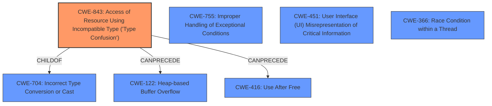

# Analysis Report for CVE-2021-38001

# Vulnerability Analysis Report: CVE-2021-38001

## Description


## Analysis (with Relationship Data)

# Summary
| CWE ID | CWE Name | Confidence | CWE Abstraction Level | CWE Vulnerability Mapping Label | CWE-Vulnerability Mapping Notes |
|---|---|---|---|---|---|
| CWE-843 | Access of Resource Using Incompatible Type ('Type Confusion') | 1.0 | Base | Allowed | Primary CWE |

## Evidence and Confidence

*   **Confidence Score:** 1.0
*   **Evidence Strength:** HIGH

## Relationship Analysis
The primary CWE, CWE-843, is a base-level CWE. It is a child of CWE-704 which represents improper handling of inputs, which is what leads to type confusion. The other CWEs considered are either too general (CWE-755), represent a resulting impact of type confusion (CWE-122, CWE-416), or are unrelated to the root cause (CWE-451, CWE-366).



## Vulnerability Chain
The vulnerability chain starts with the **Type Confusion** (CWE-843) in the V8 engine, leading to potential heap corruption.

## Summary of Analysis
The initial analysis correctly identified CWE-843 as the primary weakness based on the **rootcause** "**Type confusion**" and the CVE Reference Links Content Summary which states "Type Confusion in V8" and lists "Type Confusion" as a Weakness. The retriever results also listed CWE-843 as the top combined result. The vulnerability description explicitly mentions "Type confusion" as the root cause. This aligns perfectly with the description of CWE-843, which describes a scenario where a resource is accessed using a type incompatible with its original type. This leads to memory corruption and potential exploitation. The confidence in this mapping is very high (1.0) due to the direct match between the vulnerability description and the CWE definition, and the consistent evidence from different sources.

Relevant CWE Information:

# Enhanced Context (25 CWEs)

## CWE-823: Use of Out-of-range Pointer Offset
**Abstraction Level**: Base
**Similarity Score**: 0.77

This CWE is not selected because, while it relates to memory access, it is specifically about pointer arithmetic with an out-of-range offset, which is not explicitly stated in the vulnerability description.

## CWE-125: Out-of-bounds Read
**Abstraction Level**: Base
**Similarity Score**: 0.77

This CWE is not selected because the vulnerability description specifies a type confusion leading to heap corruption, not explicitly an out-of-bounds read.

## CWE-191: Integer Underflow (Wrap or Wraparound)
**Abstraction Level**: Base
**Similarity Score**: 0.77

This CWE is not selected because integer underflow is not mentioned in the vulnerability description.

## CWE-131: Incorrect Calculation of Buffer Size
**Abstraction Level**: Base
**Similarity Score**: 0.77

This CWE is not selected because incorrect buffer size calculation is not mentioned in the vulnerability description.

## CWE-805: Buffer Access with Incorrect Length Value
**Abstraction Level**: Base
**Similarity Score**: 0.77

This CWE is not selected because incorrect length value during buffer access is not mentioned in the vulnerability description.

## CWE-843: Access of Resource Using Incompatible Type ('Type Confusion')
**Abstraction Level**: Base
**Similarity Score**: 0.76

This CWE is selected as the primary weakness. The vulnerability description and CVE summary both explicitly mention "Type Confusion."

## CWE-126: Buffer Over-read
**Abstraction Level**: Variant
**Similarity Score**: 0.76

This CWE is not selected because the vulnerability description specifies a type confusion leading to heap corruption, not explicitly a buffer over-read.

## CWE-197: Numeric Truncation Error
**Abstraction Level**: Base
**Similarity Score**: 0.76

This CWE is not selected because numeric truncation error is not mentioned in the vulnerability description.

## CWE-404: Improper Resource Shutdown or Release
**Abstraction Level**: Class
**Similarity Score**: 0.76

This CWE is not selected because improper resource shutdown is not mentioned in the vulnerability description.

## CWE-130: Improper Handling of Length Parameter Inconsistency
**Abstraction Level**: Base
**Similarity Score**: 0.75

This CWE is not selected because inconsistent length parameter handling is not mentioned in the vulnerability description.

## CWE-451: User Interface (UI) Misrepresentation of Critical Information
**Abstraction Level**: Class
**Similarity Score**: 5445.40

This CWE is not selected because UI misrepresentation is not relevant to the type confusion vulnerability in the V8 engine.

## CWE-125: Out-of-bounds Read
**Abstraction Level**: Base
**Similarity Score**: 5181.07

This CWE is not selected because the vulnerability description specifies a type confusion leading to heap corruption, not explicitly an out-of-bounds read.

## CWE-415: Double Free
**Abstraction Level**: Variant
**Similarity Score**: 5088.40

This CWE is not selected because double free is not mentioned in the vulnerability description.

## CWE-190: Integer Overflow or Wraparound
**Abstraction Level**: Base
**Similarity Score**: 5062.00

This CWE is not selected because integer overflow is not mentioned in the vulnerability description.

## CWE-843: Access of Resource Using Incompatible Type ('Type Confusion')
**Abstraction Level**: Base
**Similarity Score**: 4951.52

This CWE is selected as the primary weakness. The vulnerability description and CVE summary both explicitly mention "Type Confusion."

## CWE-123: Write-what-where Condition
**Abstraction Level**: base
**Similarity Score**: 5.03

This CWE is not selected because it is a potential consequence of a type confusion, but the root cause is the type confusion itself.

## CWE-416: Use After Free
**Abstraction Level**: variant
**Similarity Score**: 4.53

This CWE is not selected because it is a potential consequence of memory corruption caused by type confusion, but the root cause is the type confusion itself.

## CWE-120: Buffer Copy without Checking Size of Input ('Classic Buffer Overflow')
**Abstraction Level**: base
**Similarity Score**: 4.33

This CWE is not selected because the vulnerability description does not mention unchecked buffer copies.

## CWE-787: Out-of-bounds Write
**Abstraction Level**: base
**Similarity Score**: 4.33

This CWE is not selected because, while out-of-bounds write may be a consequence of type confusion leading to heap corruption, the root cause is the type confusion itself.

## CWE-825: Expired Pointer Dereference
**Abstraction Level**: base
**Similarity Score**: 4.33

This CWE is not selected because expired pointer dereference is not explicitly mentioned in the vulnerability description.

## CWE-190: Integer Overflow or Wraparound
**Abstraction Level**: base
**Similarity Score**: 4.33

This CWE is not selected because integer overflow is not mentioned in the vulnerability description.

## CWE-170: Improper Null Termination
**Abstraction Level**: base
**Similarity Score**: 4.33

This CWE is not selected because null termination issues are not mentioned in the vulnerability description.

## CWE-1284: Improper Validation of Specified Quantity in Input
**Abstraction Level**: base
**Similarity Score**: 4.33

This CWE is not selected because improper input validation is not the primary issue; it's the type confusion.

## CWE-1341: Multiple Releases of Same Resource or Handle
**Abstraction Level**: base
**Similarity Score**: 4.33

This CWE is not selected because multiple releases of the same resource are not mentioned in the vulnerability description.

## CWE-415: Double Free


## CWE Relationship Analysis

Current CWEs represent these abstraction levels: .


### Vulnerability Chain Analysis

**Chain starting from CWE-787:**
- 787 (Out-of-bounds Write) - ROOT


**Chain starting from CWE-123:**
- 123 (Write-what-where Condition) - ROOT


### CWE Relationship Diagram

```mermaid
graph TD
    classDef primary fill:#f96,stroke:#333,stroke-width:2px
    classDef secondary fill:#69f,stroke:#333
    classDef tertiary fill:#9e9,stroke:#333
```


*Report generated on 2025-04-02 16:26:21*
