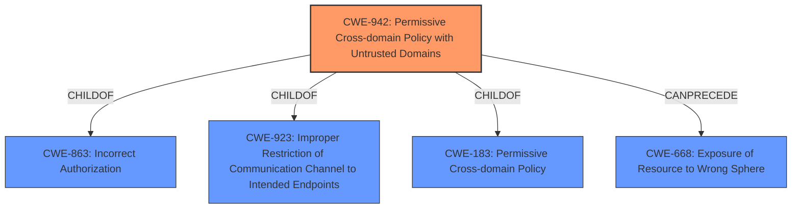

# Enhanced Analysis for CVE-2021-38019

# Summary
| CWE ID    | CWE Name                                                         | Confidence | CWE Abstraction Level | CWE Vulnerability Mapping Label | CWE-Vulnerability Mapping Notes |
| --------- | ---------------------------------------------------------------- | ---------- | --------------------- | ----------------------------- | ------------------------------- |
| CWE-942   | Permissive Cross-domain Policy with Untrusted Domains           | 0.8        | Variant               | Allowed                       | Primary CWE                    |
| CWE-668   | Exposure of Resource to Wrong Sphere                             | 0.6        | Class                 | Discouraged                   | Secondary Candidate             |
| CWE-923   | Improper Restriction of Communication Channel to Intended Endpoints | 0.5        | Class                 | Allowed-with-Review           | Secondary Candidate             |

## Evidence and Confidence

*   **Confidence Score:** 0.8
*   **Evidence Strength:** HIGH

## Relationship Analysis
The primary CWE selected, CWE-942, is a Variant of CWE-863 (Incorrect Authorization), CWE-923 (Improper Restriction of Communication Channel to Intended Endpoints), and CWE-183 (Permissive Cross-domain Policy). It also CanPrecede CWE-668 (Exposure of Resource to Wrong Sphere). The choice of CWE-942 as the primary mapping is driven by its specificity in addressing cross-domain policy issues, aligning directly with the vulnerability description which explicitly mentions CORS (Cross-Origin Resource Sharing). While CWE-668 and CWE-923 are broader Class-level CWEs, CWE-942 offers a more precise characterization of the **insufficient policy enforcement** in CORS. The graph relationships confirm that CWE-942 can lead to resource exposure (CWE-668), making it a reasonable, albeit less specific, secondary consideration.



## Vulnerability Chain
The chain of events in this vulnerability is as follows:
1.  **Root Cause:** **Insufficient policy enforcement** in CORS (CWE-942).
2.  **Weakness:** The **insufficient policy enforcement** allows cross-origin requests from untrusted domains.
3.  **Impact:** A remote attacker can leak cross-origin data via a crafted HTML page.

## Summary of Analysis
The initial analysis focused on the description of **insufficient policy enforcement** in CORS, which strongly suggests CWE-942. The evidence from the "Vulnerability Description Key Phrases" and "CVE Reference Links Content Summary" confirms that the root cause is related to CORS policy.

The "Retriever Results" suggested several other CWEs. However, CWE-942 aligns most directly with the provided information.

Here's the evidence supporting this decision:

*   "Vulnerability Description Key Phrases": "**rootcause:** **insufficient policy enforcement**"
*   "CVE Reference Links Content Summary": "root_cause: Insufficient policy enforcement in CORS."
*   CWE-942 Description: "The product uses a cross-domain policy file that includes domains that should not be trusted."

The selection of CWE-942 is based on its direct relevance to the weakness described in the vulnerability report. The other considered CWEs, while potentially related, do not capture the specific flaw in cross-domain policy enforcement as precisely as CWE-942. Therefore, CWE-942 is at the optimal level of specificity.

Relevant CWE Information:

# Enhanced Context (25 CWEs)
The following CWEs were identified as potentially relevant to this vulnerability:

## CWE-156: Improper Neutralization of Whitespace
**Abstraction Level**: Variant
**Similarity Score**: 0.78
**Source**: dense

**Description**:
The product receives input from an upstream component, but it does not neutralize or incorrectly neutralizes special elements that could be interpreted as whitespace when they are sent to a downstream component.

**Mapping Guidance**:
- Usage: Allowed
- Rationale: This CWE entry is at the Variant level of abstraction, which is a preferred level of abstraction for mapping to the root causes of vulnerabilities.

## CWE-1289: Improper Validation of Unsafe Equivalence in Input
**Abstraction Level**: Base
**Similarity Score**: 0.77
**Source**: dense

**Description**:
The product receives an input value that is used as a resource identifier or other type of reference, but it does not validate or incorrectly validates that the input is equivalent to a potentially-unsafe value.

**Mapping Guidance**:
- Usage: Allowed
- Rationale: This CWE entry is at the Base level of abstraction, which is a preferred level of abstraction for mapping to the root causes of vulnerabilities.

## CWE-451: User Interface (UI) Misrepresentation of Critical Information
**Abstraction Level**: Class
**Similarity Score**: 0.76
**Source**: dense

**Description**:
The user interface (UI) does not properly represent critical information to the user, allowing the information - or its source - to be obscured or spoofed. This is often a component in phishing attacks.

**Mapping Guidance**:
- Usage: Allowed-with-Review
- Rationale: This CWE entry is a Class and might have Base-level children that would be more appropriate

## CWE-41: Improper Resolution of Path Equivalence
**Abstraction Level**: Base
**Similarity Score**: 0.76
**Source**: dense

**Description**:
The product is vulnerable to file system contents disclosure through path equivalence. Path equivalence involves the use of special characters in file and directory names. The associated manipulations are intended to generate multiple names for the same object.

**Mapping Guidance**:
- Usage: Allowed
- Rationale: This CWE entry is at the Base level of abstraction, which is a preferred level of abstraction for mapping to the root causes of vulnerabilities.

## CWE-184: Incomplete List of Disallowed Inputs
**Abstraction Level**: Base
**Similarity Score**: 0.76
**Source**: dense

**Description**:
The product implements a protection mechanism that relies on a list of inputs (or properties of inputs) that are not allowed by policy or otherwise require other action to neutralize before additional processing takes place, but the list is incomplete.

**Mapping Guidance**:
- Usage: Allowed
- Rationale: This CWE entry is at the Base level of abstraction, which is a preferred level of abstraction for mapping to the root causes of vulnerabilities.

## CWE-113: Improper Neutralization of CRLF Sequences in HTTP Headers ('HTTP Request/Response Splitting')
**Abstraction Level**: Variant
**Similarity Score**: 0.76
**Source**: dense

**Description**:
The product receives data from an HTTP agent/component (e.g., web server, proxy, browser, etc.), but it does not neutralize or incorrectly neutralizes CR and LF characters before the data is included in outgoing HTTP headers.

**Mapping Guidance**:
- Usage: Allowed
- Rationale: This CWE entry is at the Variant level of abstraction, which is a preferred level of abstraction for mapping to the root causes of vulnerabilities.

## CWE-653: Improper Isolation or Compartmentalization
**Abstraction Level**: Class
**Similarity Score**: 0.76
**Source**: dense

**Description**:
The product does not properly compartmentalize or isolate functionality, processes, or resources that require different privilege levels, rights, or permissions.

**Mapping Guidance**:
- Usage: Allowed
- Rationale: This CWE entry is at the Base level of abstraction, which is a preferred level of abstraction for mapping to the root causes of vulnerabilities.

## CWE-668: Exposure of Resource to Wrong Sphere
**Abstraction Level**: Class
**Similarity Score**: 0.75
**Source**: dense

**Description**:
The product exposes a resource to the wrong control sphere, providing unintended actors with inappropriate access to the resource.

**Mapping Guidance**:
- Usage: Discouraged
- Rationale: CWE-668 is high-level and is often misused as a catch-all when lower-level CWE IDs might be applicable. It is sometimes used for low-information vulnerability reports [REF-1287]. It is a level-1 Class (i.e., a child of a Pillar). It is not useful for trend analysis.

## CWE-843: Access of Resource Using Incompatible Type ('Type Confusion


## CWE Relationship Analysis

Current CWEs represent these abstraction levels: .


### Vulnerability Chain Analysis

**Chain starting from CWE-113:**
- 113 (Improper Neutralization of CRLF Sequences in HTTP Headers ('HTTP Request/Response Splitting')) - ROOT


**Chain starting from CWE-843:**
- 843 (Access of Resource Using Incompatible Type ('Type Confusion')) - ROOT


### CWE Relationship Diagram

```mermaid
graph TD
    classDef primary fill:#f96,stroke:#333,stroke-width:2px
    classDef secondary fill:#69f,stroke:#333
    classDef tertiary fill:#9e9,stroke:#333
```