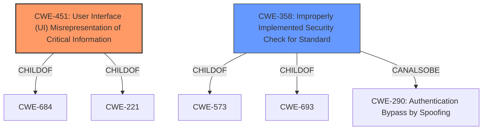

# Analysis for CVE-2021-38020

# Summary
| CWE ID | CWE Name | Confidence | CWE Abstraction Level | CWE Vulnerability Mapping Label | CWE-Vulnerability Mapping Notes |
|---|---|---|---|---|---|
| CWE-451 | User Interface (UI) Misrepresentation of Critical Information | 0.8 | Class | Allowed-with-Review | Primary CWE |
| CWE-358 | Improperly Implemented Security Check for Standard | 0.6 | Base | Allowed | Secondary Candidate |

## Evidence and Confidence

*   **Confidence Score:** 0.7
*   **Evidence Strength:** MEDIUM

## Relationship Analysis
The primary CWE selected is CWE-451, which is a Class-level CWE. While Class-level CWEs are generally less preferred than Base or Variant, it is the most accurate representation of the vulnerability given the available information. CWE-451 has peer relationships with CWE-346 and child relationships with CWE-684 and CWE-221. CWE-358, a Base CWE, has a "CanAlsoBe" relationship with CWE-290 (Authentication Bypass by Spoofing), which could be considered given the Omnibox spoofing.

## Vulnerability Chain
The vulnerability chain begins with **insufficient policy enforcement** in the contacts picker. This leads to the **impact** of spoofing the Omnibox contents, resulting in a user interface misrepresentation.

## Summary of Analysis
The initial analysis focused on the **insufficient policy enforcement** in the contacts picker, leading to the spoofing of the Omnibox contents.

The primary selection of CWE-451 is based on the **impact** of the vulnerability, which is the spoofing of the Omnibox (URL bar). This directly aligns with the CWE-451 description: "The user interface (UI) does not properly represent critical information to the user, allowing the information - or its source - to be obscured or spoofed."

The secondary candidate CWE-358, is based on the **rootcause**: **insufficient policy enforcement**. This aligns with the description: "The product does not implement or incorrectly implements one or more security-relevant checks as specified by the design of a standardized algorithm, protocol, or technique."

The evidence supporting CWE-451 is: "allowed a remote attacker to spoof the contents of the Omnibox (URL bar) via a crafted HTML page"
The evidence supporting CWE-358 is: "**rootcause:** **insufficient policy enforcement**"

CWE-451 is chosen because the Omnibox spoofing is a clear misrepresentation of critical UI information. While CWE-451 is a Class-level CWE, it is the most specific and accurate representation of the vulnerability's impact.

CWE-1021 (Improper Restriction of Rendered UI Layers or Frames) was considered but deemed less suitable because the vulnerability does not explicitly involve rendering the application within frames or layers, but rather spoofing the content of the URL bar.

CWE-356 (Product UI does not Warn User of Unsafe Actions) was considered, but is less specific than CWE-451. The vulnerability isn't about the absence of warnings, but about the active misrepresentation of information in the UI.

CWE-416 (Use After Free), CWE-123 (Write-what-where Condition), CWE-843 (Access of Resource Using Incompatible Type ('Type Confusion')), and CWE-367 (Time-of-check Time-of-use (TOCTOU) Race Condition) were considered but are not applicable because the vulnerability does not involve memory management issues, arbitrary writes, type confusion, or race conditions.

CWE-358 is a base level that maps well with the rootcause.

# Relevant CWE Information:

## CWE-451: User Interface (UI) Misrepresentation of Critical Information
**Abstraction Level**: Class
**Similarity Score**: 0.81
**Source**: dense

**Description**:
The user interface (UI) does not properly represent critical information to the user, allowing the information - or its source - to be obscured or spoofed. This is often a component in phishing attacks.

**Mapping Guidance**:
- Usage: Allowed-with-Review
- Rationale: This CWE entry is a Class and might have Base-level children that would be more appropriate

## CWE-358: Improperly Implemented Security Check for Standard
**Abstraction Level**: Base
**Similarity Score**: 0.81
**Source**: dense

**Description**:
The product does not implement or incorrectly implements one or more security-relevant checks as specified by the design of a standardized algorithm, protocol, or technique.

**Mapping Guidance**:
- Usage: Allowed
- Rationale: This CWE entry is at the Base level of abstraction, which is a preferred level of abstraction for mapping to the root causes of vulnerabilities.