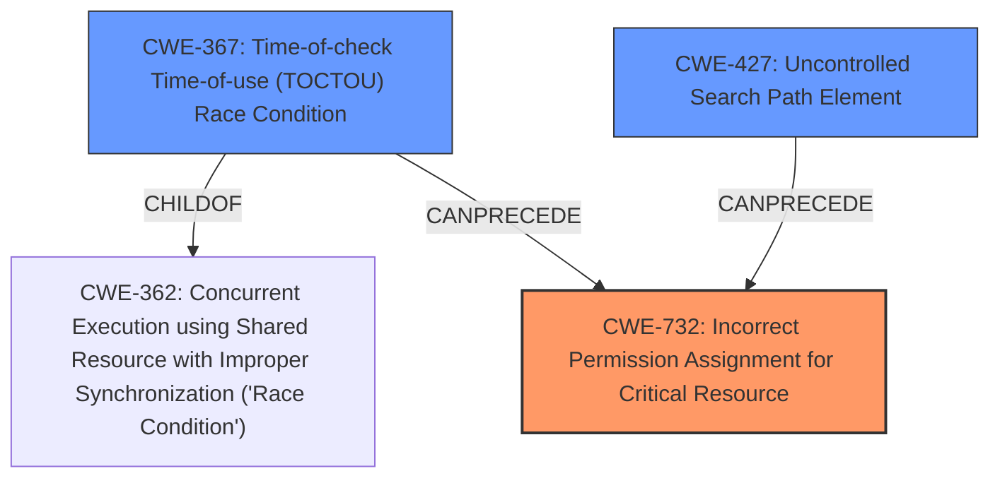

# Raw Analyzer Response for CVE-2021-38085

# Summary
| CWE ID | CWE Name | Confidence | CWE Abstraction Level | CWE Vulnerability Mapping Label | CWE-Vulnerability Mapping Notes |
|---|---|---|---|---|---|
| CWE-732 | Incorrect Permission Assignment for Critical Resource | 1.0 | Class | Allowed-with-Review | Primary CWE |
| CWE-367 | Time-of-check Time-of-use (TOCTOU) Race Condition | 0.7 | Base | Allowed | Secondary CWE |
| CWE-427 | Uncontrolled Search Path Element | 0.6 | Base | Allowed | Secondary CWE |

## Evidence and Confidence

*   **Confidence Score:** 0.8
*   **Evidence Strength:** HIGH

## Relationship Analysis
The primary weakness is **CWE-732 (Incorrect Permission Assignment for Critical Resource)**, a Class-level CWE. The vulnerability description states that the Canon TR150 print driver drops a world-writable DLL into a location that is then loaded by a system process. This directly corresponds to the CWE-732 description of a critical resource (the DLL) being given permissions that allow it to be modified by unintended actors (any local user).

**CWE-367 (Time-of-check Time-of-use (TOCTOU) Race Condition)** is related because the attacker must overwrite the DLL at the correct time before the system process loads it. CWE-367 is a child of **CWE-362 (Concurrent Execution using Shared Resource with Improper Synchronization ('Race Condition'))**, indicating that it's a specific type of race condition.

**CWE-427 (Uncontrolled Search Path Element)** is related because the system process loads the DLL from a location where a local attacker can write to. This path contains a location that can be modified by an attacker.

## Vulnerability Chain
The vulnerability chain starts with the **CWE-732 (Incorrect Permission Assignment for Critical Resource)**, where the print driver sets world-writable permissions on the DLL. This allows a local attacker to overwrite the DLL. To successfully exploit this, the attacker needs to overwrite the DLL at the right time which leads to **CWE-367 (Time-of-check Time-of-use (TOCTOU) Race Condition)**. Finally, because the system process loads the DLL from a predictable location where the attacker can write to, **CWE-427 (Uncontrolled Search Path Element)** is present. This leads to privilege escalation.

## Summary of Analysis
The analysis identified **CWE-732 (Incorrect Permission Assignment for Critical Resource)** as the primary **weakness**. The Canon TR150 print driver creates a DLL with world-writable permissions, allowing a local attacker to overwrite it. This aligns directly with the CWE-732 description. The "CVE Reference Links Content Summary" section explicitly states: "Insecure File Permissions (CWE-732): The core issue is that the DLL dropped by the driver has world-writable permissions. This allows any local user to modify or replace it." This provides strong evidence for this classification. The retriever results also list CWE-732 as the top candidate.

**CWE-367 (Time-of-check Time-of-use (TOCTOU) Race Condition)** is included because the attacker needs to time the DLL overwrite correctly. The vulnerability description states: "if timed properly, the overwritten DLL will be loaded into a SYSTEM process resulting in escalation of privileges." This timing element introduces the race condition.

**CWE-427 (Uncontrolled Search Path Element)** is included because the system process loads the DLL from a location where a local attacker has write access. The vulnerability description states: "This occurs because the driver drops a world-writable DLL into a CanonBJ %PROGRAMDATA% location that gets loaded by printisolationhost (a system process)."

Other CWEs were considered but deemed less relevant. **CWE-59 (Improper Link Resolution Before File Access ('Link Following'))** was considered since DLL hijacking *can* involve symlinks, but in this case, it's a direct file overwrite, so it's less applicable. **CWE-250 (Execution with Unnecessary Privileges)** and **CWE-276 (Incorrect Default Permissions)** were considered, but CWE-732 provides a more precise description of the root cause.

The selected CWEs are at the optimal level of specificity. CWE-732 is a Class CWE but precisely describes the **incorrect permission assignment** on a critical resource. CWE-367 and CWE-427 provide further details on the race condition and the uncontrolled search path, respectively.