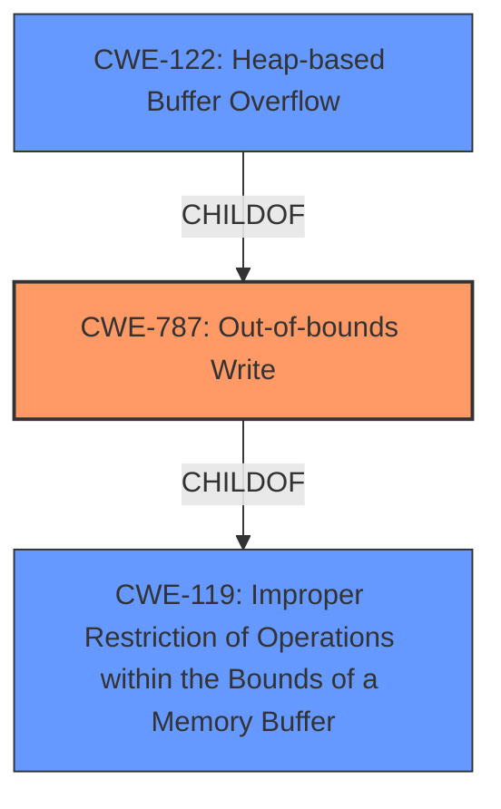

# Enhanced Analysis for CVE-2021-38098

# Summary
| CWE ID    | CWE Name                                                     | Confidence | CWE Abstraction Level | CWE Vulnerability Mapping Label | CWE-Vulnerability Mapping Notes |
| :-------- | :----------------------------------------------------------- | :--------- | :---------------------- | :------------------------------ | :------------------------------ |
| CWE-787   | Out-of-bounds Write                                          | 1.0        | Base                    | Primary                         | Allowed                       |
| CWE-122   | Heap-based Buffer Overflow                                   | 0.8        | Variant                 | Secondary                       | Allowed                       |
| CWE-119   | Improper Restriction of Operations within the Bounds of a Memory Buffer | 0.7 | Class | Secondary | Allowed |

## Evidence and Confidence

*   **Confidence Score:** 0.9
*   **Evidence Strength:** HIGH

## Relationship Analysis
The primary CWE is CWE-787, which represents an out-of-bounds write. CWE-122 (Heap-based Buffer Overflow) is a more specific variant, which is a type of out-of-bounds write that occurs specifically on the heap. CWE-119 is a parent class of CWE-787 and CWE-122. The vulnerability description indicates a heap corruption due to an improper bounds check, suggesting a heap-based out-of-bounds write, making CWE-787 and CWE-122 the most relevant.



## Vulnerability Chain
The vulnerability chain starts with a crafted PDF file that bypasses the **improper bounds check**, leading to an **out-of-bounds write** on the heap, resulting in **heap corruption** and potentially **arbitrary code execution**.

## Summary of Analysis
The initial analysis focused on identifying the root cause of the vulnerability, which is a **heap corruption** resulting from an **improper bounds check** when parsing a crafted PDF file. The "CVE Reference Links Content Summary" explicitly states this root cause and its impact. The retriever results and the CWE specifications were then used to pinpoint the most appropriate CWE.

The evidence from the vulnerability description and CVE summary points to an out-of-bounds write (CWE-787) on the heap. The phrase "**Heap Corruption**" and the description of an **out-of-bounds heap memory access** due to an **improper bounds check** strongly suggest this.

CWE-787 (Out-of-bounds Write) is selected as the primary CWE because it directly reflects the vulnerability's root cause: writing data past the end of an intended buffer. The description of CWE-787 aligns perfectly with the vulnerability description, which indicates that the malformed PDF file causes an out-of-bounds write on the heap due to an improper bounds check.

CWE-122 (Heap-based Buffer Overflow) is considered a secondary CWE because it is a more specific variant of CWE-787, indicating that the out-of-bounds write occurs specifically on the heap. The vulnerability description mentions "Heap Corruption," which supports the selection of CWE-122.

CWE-119 (Improper Restriction of Operations within the Bounds of a Memory Buffer) is the parent Class of both CWE-787 and CWE-122.

Other CWEs Considered but Not Used:

*   CWE-788 (Access of Memory Location After End of Buffer): This is similar to CWE-787, but CWE-787 is more specific because it explicitly mentions a write operation, whereas CWE-788 is more generic, covering both read and write operations. Since the vulnerability involves writing past the end of the buffer, CWE-787 is more appropriate.
*   CWE-416 (Use After Free): This CWE describes a vulnerability where memory is accessed after it has been freed. While heap corruption can sometimes lead to use-after-free vulnerabilities, the primary issue here is the out-of-bounds write, not the use of freed memory.
*   CWE-190 (Integer Overflow or Wraparound): This CWE describes a vulnerability where an integer calculation results in a value that is too large to store in the associated representation. While integer overflows can sometimes lead to buffer overflows, the primary issue here is the out-of-bounds write caused by the improper bounds check.
*   CWE-20 (Improper Input Validation): This CWE is a broad category that covers cases where input is not properly validated. While the **improper bounds check** could be considered a form of improper input validation, CWE-787 provides a more specific description of the vulnerability.
*   CWE-1289, CWE-1288, CWE-183, CWE-606, CWE-807, CWE-1173, CWE-184, CWE-179, CWE-1286, CWE-138, CWE-125, CWE-1284, CWE-252, CWE-193, CWE-41, CWE-123, CWE-170, CWE-825, CWE-22: These CWEs were not selected because they did not directly relate to the specific out-of-bounds write vulnerability described in the provided information. They represent different types of weaknesses or vulnerabilities that are not applicable to this particular case.


## CWE Relationship Analysis

Current CWEs represent these abstraction levels: .


### Vulnerability Chain Analysis

**Chain starting from CWE-787:**
- 787 (Out-of-bounds Write) - ROOT


**Chain starting from CWE-123:**
- 123 (Write-what-where Condition) - ROOT


### CWE Relationship Diagram

```mermaid
graph TD
    classDef primary fill:#f96,stroke:#333,stroke-width:2px
    classDef secondary fill:#69f,stroke:#333
    classDef tertiary fill:#9e9,stroke:#333
```