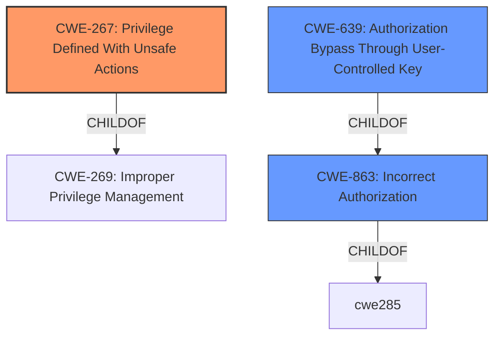

# Analysis for CVE-2021-38140

# Summary
| CWE ID | CWE Name | Confidence | CWE Abstraction Level | CWE Vulnerability Mapping Label | CWE-Vulnerability Mapping Notes |
|---|---|---|---|---|---|
| CWE-267 | Privilege Defined With Unsafe Actions | 0.8 | Base | Allowed | Primary CWE |
| CWE-639 | Authorization Bypass Through User-Controlled Key | 0.6 | Base | Allowed | Secondary Candidate |
| CWE-863 | Incorrect Authorization | 0.5 | Class | Allowed-with-Review | Secondary Candidate |

## Evidence and Confidence

*   **Confidence Score:** 0.7
*   **Evidence Strength:** HIGH

## Relationship Analysis
The primary CWE is CWE-267, a base level CWE, which is a child of CWE-269. CWE-639 is also considered as a secondary weakness since it has similar traits. The retriever results listed CWE-863 which is a Class level. The decision was to keep the classification at the Base level because there was enough information to make that decision.



## Vulnerability Chain
The vulnerability chain starts with the **improper definition of a privilege** (CWE-267) that allows unintended actions. Specifically, the failure to block `RESET SESSION AUTHORIZATION` after `set_user()` leads to the **privilege escalation**. The chain is:
1.  **Improper Privilege Definition** (CWE-267)
2.  **Privilege Escalation** (Impact)

## Summary of Analysis
The initial assessment pointed towards authorization issues and privilege escalation due to the **failure to block** `RESET SESSION AUTHORIZATION` after `set_user()`.

The primary selection of CWE-267 is based on the root cause, where a privilege (the ability to execute `RESET SESSION AUTHORIZATION`) allows unsafe actions (privilege escalation) that were not intended. The evidence is in the "CVE Reference Links Content Summary" section, stating that the extension "failed to block the `RESET SESSION AUTHORIZATION` command after a `set_user()` call," directly aligning with CWE-267's description: "A particular privilege...can be used to perform unsafe actions that were not intended."

The retriever results indicated CWE-639, CWE-863, CWE-285, and others. CWE-639 (Authorization Bypass Through User-Controlled Key) was considered but deemed less appropriate as the vulnerability is not directly related to modifying a user-controlled key. CWE-863 (Incorrect Authorization) and CWE-285 (Improper Authorization) were considered but are class-level CWEs. CWE-267 is a more precise base-level CWE.

Therefore, CWE-267 is the most specific and appropriate classification, accurately representing the root cause of the vulnerability.

Relevant CWE Information:

# Enhanced Context (25 CWEs)

## CWE-267: Privilege Defined With Unsafe Actions
**Abstraction:** Base
**Status:** Incomplete

### Description
A particular privilege, role, capability, or right can be used to perform unsafe actions that were not intended, even when it is assigned to the correct entity.

### Extended Description
Not provided

### Alternative Terms
None

### Relationships
ChildOf -> CWE-269

### Mapping Guidance
**Usage:** Allowed
**Rationale:** This CWE entry is at the Base level of abstraction, which is a preferred level of abstraction for mapping to the root causes of vulnerabilities.
**Comments:** Carefully read both the name and description to ensure that this mapping is an appropriate fit. Do not try to 'force' a mapping to a lower-level Base/Variant simply to comply with this preferred level of abstraction.
**Reasons:**
- Acceptable-Use

### Additional Notes
**[Maintenance]**

Note: there are 2 separate sub-categories here:

```
		- privilege incorrectly allows entities to perform certain actions
		- object is incorrectly accessible to entities with a given privilege
```

### Observed Examples
- **CVE-2002-1981:** Roles have access to dangerous procedures (Accessible entities).
- **CVE-2002-1671:** Untrusted object/method gets access to clipboard (Accessible entities).
- **CVE-2004-2204:** Gain privileges using functions/tags that should be restricted (Accessible entities).