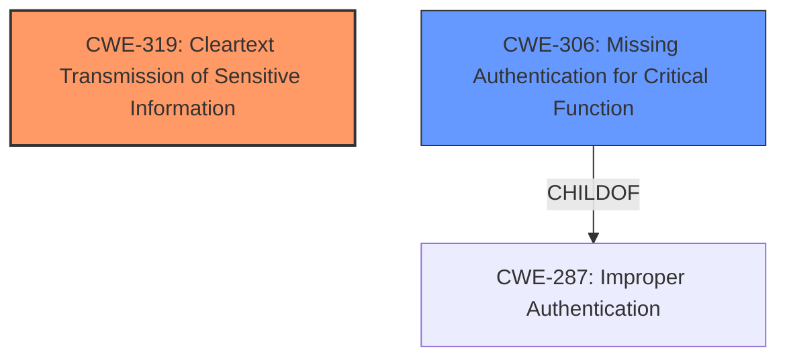

# Enhanced Analysis for CVE-2021-38142

# Summary
| CWE ID | CWE Name | Confidence | CWE Abstraction Level | CWE Vulnerability Mapping Label | CWE-Vulnerability Mapping Notes |
|---|---|---|---|---|---|
| CWE-319 | Cleartext Transmission of Sensitive Information | 1.0 | Base | Allowed | Primary CWE: The application uses **cleartext HTTP** for software upgrades, which transmits sensitive information without encryption. |
| CWE-306 | Missing Authentication for Critical Function | 0.7 | Base | Allowed | Secondary CWE: The upgrade mechanism **is not secured** (is not protected with TLS) implying a lack of authentication for a critical function.|

## Evidence and Confidence

*   **Confidence Score:** 0.9
*   **Evidence Strength:** HIGH

## Relationship Analysis
The primary relationship influencing the CWE selection is the parent-child relationship. CWE-319 (Cleartext Transmission of Sensitive Information) is a base-level CWE, which is the preferred level of abstraction.
CWE-306 (Missing Authentication for Critical Function) is a base-level CWE and a ChildOf CWE-287(Improper Authentication).



## Vulnerability Chain
The vulnerability chain starts with the use of **cleartext HTTP** (CWE-319) for software upgrades, leading to a lack of authentication (CWE-306) for the upgrade mechanism. This allows an attacker on the local network to perform remote code execution.

## Summary of Analysis
The initial assessment identified CWE-319 as the primary weakness due to the use of **cleartext HTTP**. The vulnerability description explicitly states that the upgrade mechanism **is not secured** (is not protected with TLS), implying a lack of authentication, making CWE-306 a relevant secondary weakness.
The final selection is based on direct evidence from the vulnerability description. CWE-319 is the most specific CWE to represent the use of cleartext HTTP, and CWE-306 supplements it by highlighting the missing authentication in the upgrade process.

Relevant CWE Information:

# Enhanced Context (25 CWEs)
The following CWEs were identified as potentially relevant to this vulnerability:

## CWE-266: Incorrect Privilege Assignment
**Abstraction Level**: Base
**Similarity Score**: 0.79
**Source**: dense

**Description**:
A product incorrectly assigns a privilege to a particular actor, creating an unintended sphere of control for that actor.
**NOT USED**: Irrelevant as privilege assignment is not the issue.

## CWE-280: Improper Handling of Insufficient Permissions or Privileges 
**Abstraction Level**: Base
**Similarity Score**: 0.78
**Source**: dense

**Description**:
The product does not handle or incorrectly handles when it has insufficient privileges to access resources or functionality as specified by their permissions. This may cause it to follow unexpected code paths that may leave the product in an invalid state.
**NOT USED**: Irrelevant as privilege handling is not the issue.

## CWE-668: Exposure of Resource to Wrong Sphere
**Abstraction Level**: Class
**Similarity Score**: 0.78
**Source**: dense

**Description**:
The product exposes a resource to the wrong control sphere, providing unintended actors with inappropriate access to the resource.
**NOT USED**: The issue is not the sphere to which the resource is exposed, but rather the use of cleartext and missing authentication.

## CWE-23: Relative Path Traversal
**Abstraction Level**: Base
**Similarity Score**: 0.78
**Source**: dense

**Description**:
The product uses external input to construct a pathname that should be within a restricted directory, but it does not properly neutralize sequences such as ".." that can resolve to a location that is outside of that directory.
**NOT USED**: Irrelevant, this is not a path traversal issue.

## CWE-59: Improper Link Resolution Before File Access ('Link Following')
**Abstraction Level**: Base
**Similarity Score**: 0.78
**Source**: dense

**Description**:
The product attempts to access a file based on the filename, but it does not properly prevent that filename from identifying a link or shortcut that resolves to an unintended resource.
**NOT USED**: Irrelevant, this is not a link resolution issue.

## CWE-267: Privilege Defined With Unsafe Actions
**Abstraction Level**: Base
**Similarity Score**: 0.78
**Source**: dense

**Description**:
A particular privilege, role, capability, or right can be used to perform unsafe actions that were not intended, even when it is assigned to the correct entity.
**NOT USED**: Irrelevant as unsafe actions via privilege are not mentioned in the description.

## CWE-41: Improper Resolution of Path Equivalence
**Abstraction Level**: Base
**Similarity Score**: 0.78
**Source**: dense

**Description**:
The product is vulnerable to file system contents disclosure through path equivalence. Path equivalence involves the use of special characters in file and directory names. The associated manipulations are intended to generate multiple names for the same object.
**NOT USED**: Irrelevant, this is not a path equivalence issue.

## CWE-73: External Control of File Name or Path
**Abstraction Level**: Base
**Similarity Score**: 0.78
**Source**: dense

**Description**:
The product allows user input to control or influence paths or file names that are used in filesystem operations.
**NOT USED**: Irrelevant, this is not a file name or path control issue.

## CWE-274: Improper Handling of Insufficient Privileges
**Abstraction Level**: Base
**Similarity Score**: 0.77
**Source**: dense

**Description**:
The product does not handle or incorrectly handles when it has insufficient privileges to perform an operation, leading to resultant weaknesses.
**NOT USED**: Irrelevant as privilege handling is not the root cause.

## CWE-732: Incorrect Permission Assignment for Critical Resource
**Abstraction Level**: Class
**Similarity Score**: 0.77
**Source**: dense

**Description**:
The product specifies permissions for a security-critical resource in a way that allows that resource to be read or modified by unintended actors.
**NOT USED**: Irrelevant as permission assignments are not explicitly the problem.

## CWE-79: Improper Neutralization of Input During Web Page Generation ('Cross-site Scripting')
**Abstraction Level**: Base
**Similarity Score**: 7005.75
**Source**: sparse

**Description**:
The product does not neutralize or incorrectly neutralizes user-controllable input before it is placed in output that is used as a web page that is served to other users.
**NOT USED**: Irrelevant, this is not a cross-site scripting issue.

## CWE-22: Improper Limitation of a Pathname to a Restricted Directory ('Path Traversal')
**Abstraction Level**: Base
**Similarity Score**: 6991.54
**Source**: sparse

**Description**:
The product uses external input to construct a pathname that is intended to identify a file or directory that is located underneath a restricted parent directory, but the product does not properly neutralize special elements within the pathname that can cause the pathname to resolve to a location that is outside of the restricted directory.
**NOT USED**: Irrelevant, this is not a path traversal issue.

## CWE-319: Cleartext Transmission of Sensitive Information
**Abstraction Level**: Base
**Similarity Score**: 6780.89
**Source**: sparse

**Description**:
The product transmits sensitive or security-critical data in cleartext in a communication channel that can be sniffed by unauthorized actors.
**USE**: The vulnerability states "**cleartext HTTP**" which is direct evidence for this.

## CWE-23: Relative Path Traversal
**Abstraction Level**: Base
**Similarity Score**: 6757.80
**Source**: sparse

**Description**:
The product uses external input to construct a pathname that should be within a restricted directory, but it does not properly neutralize sequences such as ".." that can resolve to a location that is outside of that directory.
**NOT USED**: Irrelevant, this is not a path traversal issue.

## CWE-923: Improper Restriction of Communication Channel to Intended Endpoints
**Abstraction Level**: Class
**Similarity Score**: 6757.27
**Source**: sparse

**Description**:
The product establishes a communication channel to (or from) an endpoint for privileged or protected operations, but it does not properly ensure that it is communicating with the correct endpoint.
**NOT USED**: Irrelevant, this is not about restriction of communication channel.

## CWE-79: Improper Neutralization of Input During Web Page Generation ('Cross-site Scripting')
**Abstraction Level**: base
**Similarity Score**: 5.03
**Source**: graph

**Description**:
CWE-79: Improper Neutralization of Input During


## CWE Relationship Analysis

Current CWEs represent these abstraction levels: .


### Vulnerability Chain Analysis

**Chain starting from CWE-732:**
- 732 (Incorrect Permission Assignment for Critical Resource) - ROOT


**Chain starting from CWE-306:**
- 306 (Missing Authentication for Critical Function) - ROOT


### CWE Relationship Diagram

```mermaid
graph TD
    classDef primary fill:#f96,stroke:#333,stroke-width:2px
    classDef secondary fill:#69f,stroke:#333
    classDef tertiary fill:#9e9,stroke:#333
```