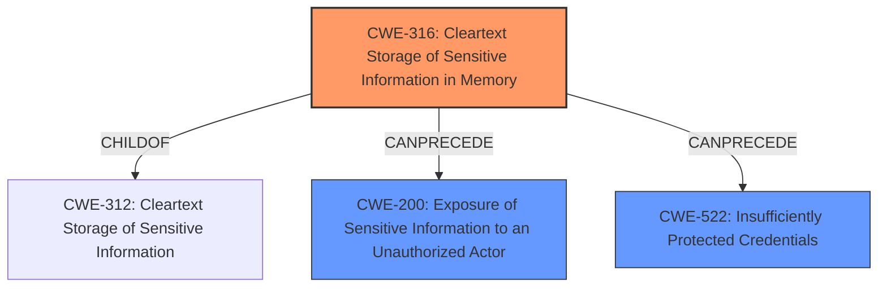

# Enhanced Analysis for CVE-2021-38150

# Summary
| CWE ID | CWE Name | Confidence | CWE Abstraction Level | CWE Vulnerability Mapping Label | CWE-Vulnerability Mapping Notes |
|---|---|---|---|---|---|
| CWE-316 | Cleartext Storage of Sensitive Information in Memory | 1.0 | Variant | Allowed | Primary CWE |
| CWE-200 | Exposure of Sensitive Information to an Unauthorized Actor | 0.5 | Class | Discouraged | Secondary Candidate |
| CWE-522 | Insufficiently Protected Credentials | 0.5 | Class | Allowed-with-Review | Secondary Candidate |

## Evidence and Confidence

*   **Confidence Score:** 0.8
*   **Evidence Strength:** MEDIUM

## Relationship Analysis
The primary CWE selected, CWE-316 [Cleartext Storage of Sensitive Information in Memory], is a Variant of CWE-312 [Cleartext Storage of Sensitive Information]. The analysis considered the broader Class CWE-200 [Exposure of Sensitive Information to an Unauthorized Actor] and CWE-522 [Insufficiently Protected Credentials] but determined CWE-316 was a more precise fit because the vulnerability specifically involves storing sensitive data, such as credentials, in cleartext within memory.



## Vulnerability Chain
The vulnerability chain begins with the **weakness** of storing credentials in cleartext in memory (CWE-316). An attacker gaining access to local memory or a memory dump can then read this sensitive data, leading to the exposure of credentials (CWE-200, CWE-522). This can then be used to compromise the backend systems.

## Summary of Analysis
The analysis is primarily based on the provided vulnerability description, which indicates that sensitive data, such as credentials, are stored in cleartext in memory. The description explicitly states that an attacker with access to local memory or a memory dump can read this data.

> When an attacker manages to get access to the local memory, or the memory dump of a victim, for example by a social engineering attack, SAP Business Client versions - 7.0, 7.70, will allow him to read extremely sensitive data, such as credentials.

This directly corresponds to the description of CWE-316 [Cleartext Storage of Sensitive Information in Memory]:
> The product stores sensitive information in cleartext in memory.

The graph relationships show that CWE-316 [Cleartext Storage of Sensitive Information in Memory] can precede CWE-200 [Exposure of Sensitive Information to an Unauthorized Actor] and CWE-522 [Insufficiently Protected Credentials], which aligns with the vulnerability's impact of exposing credentials.

CWE-316 [Cleartext Storage of Sensitive Information in Memory] is selected as the primary CWE because it is the most specific and accurate representation of the **root cause** of the vulnerability. It describes the core issue of storing sensitive data in cleartext, which enables the subsequent exposure of credentials.

CWE-200 [Exposure of Sensitive Information to an Unauthorized Actor] was considered but not selected as the primary CWE because it is a more general class that describes the impact of the vulnerability rather than the **root cause**. While the vulnerability does result in the exposure of sensitive information, the underlying issue is the cleartext storage. The mapping guidance for CWE-200 [Exposure of Sensitive Information to an Unauthorized Actor] states that it is discouraged because it is a technical impact, not a **root cause**.

CWE-522 [Insufficiently Protected Credentials] was also considered, but CWE-316 [Cleartext Storage of Sensitive Information in Memory] is a more precise fit. CWE-522 [Insufficiently Protected Credentials] describes a broader range of issues related to credential protection, while CWE-316 [Cleartext Storage of Sensitive Information in Memory] specifically addresses the storage of credentials in cleartext in memory.

The other CWEs listed in the Retriever Results, such as CWE-306 [Missing Authentication for Critical Function] and CWE-94 [Improper Control of Generation of Code ('Code Injection')], were not selected because they do not directly relate to the vulnerability description. The vulnerability does not involve missing authentication or code injection.

In summary, CWE-316 [Cleartext Storage of Sensitive Information in Memory] is the most appropriate CWE because it accurately represents the **root cause** of the vulnerability, which is the storage of sensitive data in cleartext in memory. The selection is based on the vulnerability description, the CWE descriptions, and the relationship analysis.


## CWE Relationship Analysis

Current CWEs represent these abstraction levels: .


### Vulnerability Chain Analysis

**Chain starting from CWE-306:**
- 306 (Missing Authentication for Critical Function) - ROOT


**Chain starting from CWE-312:**
- 312 (Cleartext Storage of Sensitive Information) - ROOT


### CWE Relationship Diagram

```mermaid
graph TD
    classDef primary fill:#f96,stroke:#333,stroke-width:2px
    classDef secondary fill:#69f,stroke:#333
    classDef tertiary fill:#9e9,stroke:#333
```