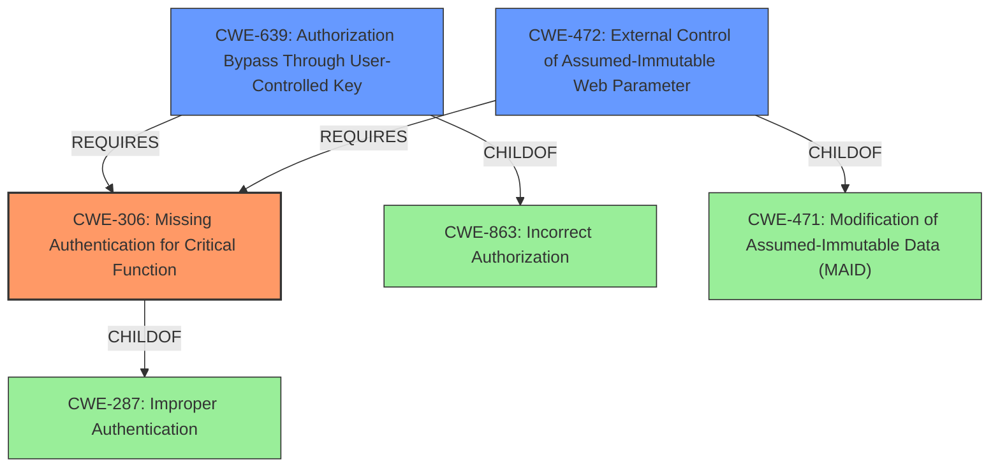

# Raw Analyzer Response for CVE-2021-38154

# Summary
| CWE ID | CWE Name | Confidence | CWE Abstraction Level | CWE Vulnerability Mapping Label | CWE-Vulnerability Mapping Notes |
|---|---|---|---|---|---|
| CWE-306 | Missing Authentication for Critical Function | 0.9 | Base | Primary | Allowed |
| CWE-639 | Authorization Bypass Through User-Controlled Key | 0.7 | Base | Secondary | Allowed |
| CWE-472 | External Control of Assumed-Immutable Web Parameter | 0.6 | Base | Secondary | Allowed |

## Evidence and Confidence

*   **Confidence Score:** 0.8
*   **Evidence Strength:** HIGH

## Relationship Analysis
The primary weakness, **CWE-306 (Missing Authentication for Critical Function)**, is a base-level CWE that directly addresses the **lack of authentication** for critical functionality, in this case, the general user mode. It is a child of **CWE-287 (Improper Authentication)**, a class-level CWE. Because the vulnerability description mentions a **missing PIN requirement**, **CWE-306** is a more precise match than its parent.

**CWE-639 (Authorization Bypass Through User-Controlled Key)** is related because the attacker can modify an e-mail address setting. This relies on a key value that identifies the data being user-controlled. It is a child of **CWE-863 (Incorrect Authorization)**. The relationship between **CWE-306** and **CWE-639** is that the **missing authentication** allows the **authorization bypass** to occur more easily.

**CWE-472 (External Control of Assumed-Immutable Web Parameter)** is related because the e-mail address setting is assumed to be immutable but is externally controllable.

## Vulnerability Chain
The vulnerability chain starts with the **lack of authentication (CWE-306)** for the general user mode. This allows a remote attacker to **modify an e-mail address setting (CWE-639, CWE-472)**, which in turn causes the device to send sensitive information through e-mail to the attacker. The **missing authentication** is the root cause, while the **modification of the e-mail address** and the **sending of sensitive information** are the impacts.

## Summary of Analysis
The initial analysis identified **CWE-306** as the primary weakness because the vulnerability description explicitly states that a **PIN is not required for General User Mode**, which is a clear indication of **missing authentication**. This is further supported by the retriever results, which lists **CWE-306** as a potential candidate.

The criticism of the initial analysis focuses on the possibility of other contributing factors, such as **authorization bypass** and **external control of assumed-immutable parameters**. While these factors are present, they are secondary to the **missing authentication**, which is the root cause that enables the attacker to exploit the other weaknesses.

The final conclusion is that **CWE-306** is the most appropriate primary CWE because it directly addresses the root cause of the vulnerability, which is the **lack of authentication** for critical functionality. The other CWEs, **CWE-639** and **CWE-472**, are secondary weaknesses that contribute to the overall vulnerability but are not the primary root cause. The selected CWEs are at the optimal level of specificity because they are base-level CWEs that accurately represent the weaknesses described in the vulnerability description.

The evidence from the vulnerability description that supports this conclusion is:

*   "**PIN is not required for General User Mode**" - This directly indicates the **missing authentication**.

The graph relationships influenced the final selection by highlighting the relationship between **CWE-306** and **CWE-639**, and **CWE-472**, showing that the **missing authentication** is a prerequisite for the other weaknesses.