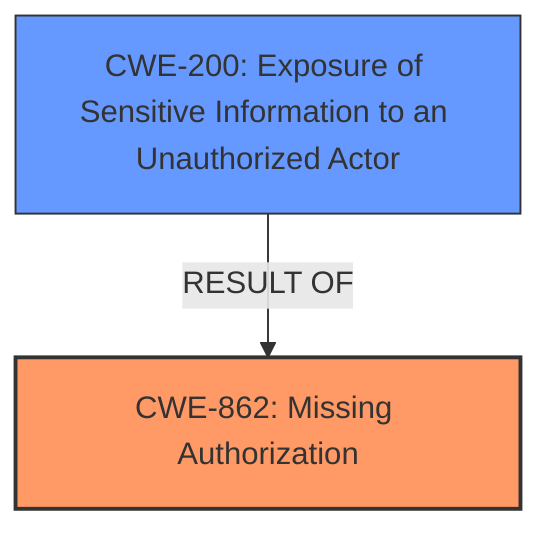

# Raw Analyzer Response for CVE-2021-38164

# Summary
| CWE ID | CWE Name | Confidence | CWE Abstraction Level | CWE Vulnerability Mapping Label | CWE-Vulnerability Mapping Notes |
|---|---|---|---|---|---|
| CWE-862 | Missing Authorization | 0.9 | Class | Primary | Allowed-with-Review |
| CWE-200 | Exposure of Sensitive Information to an Unauthorized Actor | 0.7 | Class | Secondary | Discouraged |

## Evidence and Confidence

*   **Confidence Score:** 0.8
*   **Evidence Strength:** MEDIUM

## Relationship Analysis
The primary relationship is that CWE-862 [CWE-862: Missing Authorization] is a class-level CWE that describes the **missing** authorization check. CWE-200 [CWE-200: Exposure of Sensitive Information to an Unauthorized Actor] is a class-level CWE which describes the impact of exposing sensitive information. CWE-862 [CWE-862: Missing Authorization] can lead to CWE-200 [CWE-200: Exposure of Sensitive Information to an Unauthorized Actor].

## Vulnerability Chain
The vulnerability chain starts with the **missing** authorization check (CWE-862 [CWE-862: Missing Authorization]), which leads to the exposure of sensitive financial data (CWE-200 [CWE-200: Exposure of Sensitive Information to an Unauthorized Actor]).

## Summary of Analysis
Initially, the analysis focused on identifying the root cause of the vulnerability. The description states that a "registered attacker can invoke certain functions that would otherwise be restricted to specific users." This indicates a **lack** of proper authorization checks, making CWE-862 [CWE-862: Missing Authorization] the most appropriate primary CWE.

The impact of this **missing** authorization is that the attacker "may be able to view and modify financial accounting data that only a specific user should have access to," leading to the exposure of sensitive information. Therefore, CWE-200 [CWE-200: Exposure of Sensitive Information to an Unauthorized Actor] is considered a secondary CWE representing the impact of the primary weakness.

The selection of CWE-862 [CWE-862: Missing Authorization] is based on the evidence that the system **fails to** perform authorization checks, allowing unauthorized access to restricted functions. This aligns directly with the definition of CWE-862 [CWE-862: Missing Authorization].

The graph relationships confirm that CWE-862 [CWE-862: Missing Authorization] can lead to CWE-200 [CWE-200: Exposure of Sensitive Information to an Unauthorized Actor], supporting the classification of CWE-200 [CWE-200: Exposure of Sensitive Information to an Unauthorized Actor] as a secondary CWE representing the impact.

The selected CWEs are at the appropriate level of specificity. While CWE-862 [CWE-862: Missing Authorization] is a Class-level CWE, it accurately represents the **missing** authorization check, and there isn't enough information to determine a more specific Base-level CWE. CWE-200 [CWE-200: Exposure of Sensitive Information to an Unauthorized Actor] is also a Class-level CWE representing the impact of the vulnerability.

CWE-668 [CWE-668: Exposure of Resource to Wrong Sphere] was considered, but ultimately deemed less appropriate than CWE-862 [CWE-862: Missing Authorization]. While CWE-668 [CWE-668: Exposure of Resource to Wrong Sphere] also deals with exposure of resources, it is a higher-level CWE and less specific to the **missing** authorization check. The mapping guidance for CWE-668 [CWE-668: Exposure of Resource to Wrong Sphere] also discourages its use as a catch-all when lower-level CWEs might be applicable.

CWE-306 [CWE-306: Missing Authentication for Critical Function] was also considered, but it focuses on **missing** authentication, whereas this vulnerability involves **missing** authorization after a user is already authenticated ("registered attacker").

CWE-863 [CWE-863: Incorrect Authorization] was also considered, but the description states the functions are "restricted to specific users." meaning it's not that the authorization is incorrect, but that the authorization is **missing** from the function.

Relevant CWE Information: