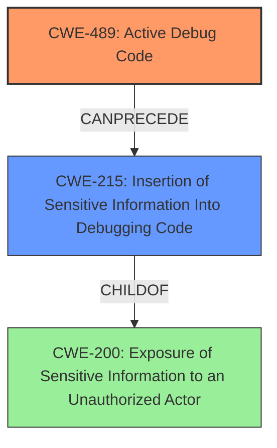

# Analysis Report for CVE-2021-38179

# Vulnerability Analysis Report: CVE-2021-38179

## Description


## Analysis (with Relationship Data)

# Summary
| CWE ID | CWE Name | Confidence | CWE Abstraction Level | CWE Vulnerability Mapping Label | CWE-Vulnerability Mapping Notes |
|---|---|---|---|---|---|
| CWE-489 | Active Debug Code | 0.9 | Base | Primary | Allowed |
| CWE-215 | Insertion of Sensitive Information Into Debugging Code | 0.7 | Base | Secondary | Allowed |
| CWE-200 | Exposure of Sensitive Information to an Unauthorized Actor | 0.5 | Class | Secondary | Discouraged |

## Evidence and Confidence

*   **Confidence Score:** 0.8
*   **Evidence Strength:** HIGH

## Relationship Analysis
The primary CWE is CWE-489, representing the root cause of having debug code enabled in a production environment. CWE-215 is a related weakness as it describes the insertion of sensitive information into the debugging code. CWE-200 is a high-level class that represents the impact of the vulnerability, which is the exposure of sensitive information.



## Vulnerability Chain
The vulnerability chain starts with the **rootcause** of having debug code enabled by default (CWE-489). This leads to the potential insertion of sensitive information into the debugging code (CWE-215), which ultimately results in the exposure of sensitive information to an unauthorized actor (CWE-200).

## Summary of Analysis
The initial analysis correctly identifies CWE-489 as the primary weakness due to the "**Debug function enabled by default**" rootcause. The vulnerability description explicitly states that the "**Debug function enabled by default**" allows an Admin User to see captured packet contents, which may include User credentials. This is a direct match for CWE-489: Active Debug Code, as it involves debug code being enabled in a production environment. The relationship graph shows that CWE-215 can follow CWE-489, which is the insertion of sensitive information into debugging code, ultimately leading to CWE-200, the exposure of sensitive information.

The retriever results listed CWE-489, CWE-215, and CWE-200. The selection of CWE-489 as the primary weakness is based on the root cause analysis and the fact that it is at the Base level of abstraction. CWE-215 is a secondary weakness because the captured packet contents may include User credentials. If the debug code includes sensitive information, CWE-215 would be an appropriate secondary mapping. CWE-200 is a tertiary mapping because it represents the impact of the vulnerability. The selected CWEs are at the optimal level of specificity, with CWE-489 representing the core issue and CWE-215 and CWE-200 representing related concerns.

Relevant CWE Information:

# Enhanced Context (25 CWEs)

## CWE-611: Improper Restriction of XML External Entity Reference
**Abstraction Level**: Base
**Similarity Score**: 0.81
**Source**: dense

**Description**:
The product processes an XML document that can contain XML entities with URIs that resolve to documents outside of the intended sphere of control, causing the product to embed incorrect documents into its output.

**Mapping Guidance**:
- Usage: Allowed
- Rationale: This CWE entry is at the Base level of abstraction, which is a preferred level of abstraction for mapping to the root causes of vulnerabilities.

**Why it was not selected**: There is no mention of XML in the vulnerability description.

## CWE-538: Insertion of Sensitive Information into Externally-Accessible File or Directory
**Abstraction Level**: Base
**Similarity Score**: 0.78
**Source**: dense

**Description**:
The product places sensitive information into files or directories that are accessible to actors who are allowed to have access to the files, but not to the sensitive information.

**Mapping Guidance**:
- Usage: Allowed
- Rationale: This CWE entry is at the Base level of abstraction, which is a preferred level of abstraction for mapping to the root causes of vulnerabilities.

**Why it was not selected**: The vulnerability description doesn't mention writing to externally accessible files or directories, so this CWE is not relevant.

## CWE-552: Files or Directories Accessible to External Parties
**Abstraction Level**: Base
**Similarity Score**: 0.76
**Source**: dense

**Description**:
The product makes files or directories accessible to unauthorized actors, even though they should not be.

**Mapping Guidance**:
- Usage: Allowed
- Rationale: This CWE entry is at the Base level of abstraction, which is a preferred level of abstraction for mapping to the root causes of vulnerabilities.

**Why it was not selected**: The vulnerability description doesn't explicitly state unauthorized access to files or directories.

## CWE-668: Exposure of Resource to Wrong Sphere
**Abstraction Level**: Class
**Similarity Score**: 0.76
**Source**: dense

**Description**:
The product exposes a resource to the wrong control sphere, providing unintended actors with inappropriate access to the resource.

**Mapping Guidance**:
- Usage: Discouraged
- Rationale: CWE-668 is high-level and is often misused as a catch-all when lower-level CWE IDs might be applicable. It is sometimes used for low-information vulnerability reports [REF-1287]. It is a level-1 Class (i.e., a child of a Pillar). It is not useful for trend analysis.

**Why it was not selected**: While technically applicable, CWE-668 is too generic and discouraged by MITRE.

## CWE-497: Exposure of Sensitive System Information to an Unauthorized Control Sphere
**Abstraction Level**: Base
**Similarity Score**: 0.76
**Source**: dense

**Description**:
The product does not properly prevent sensitive system-level information from being accessed by unauthorized actors who do not have the same level of access to the underlying system as the product does.

**Mapping Guidance**:
- Usage: Allowed
- Rationale: This CWE entry is at the Base level of abstraction, which is a preferred level of abstraction for mapping to the root causes of vulnerabilities.

**Why it was not selected**: This is similar to CWE-200, and the evidence suggests that CWE-200 is a better fit.

## CWE-610: Externally Controlled Reference to a Resource in Another Sphere
**Abstraction Level**: Class
**Similarity Score**: 0.76
**Source**: dense

**Description**:
The product uses an externally controlled name or reference that resolves to a resource that is outside of the intended control sphere.

**Mapping Guidance**:
- Usage: Discouraged
- Rationale: This CWE entry is a level-1 Class (i.e., a child of a Pillar). It might have lower-level children that would be more appropriate

**Why it was not selected**: This CWE doesn't fit, because there is no externally controlled name or reference to a resource.

## CWE-41: Improper Resolution of Path Equivalence
**Abstraction Level**: Base
**Similarity Score**: 0.75
**Source**: dense

**Description**:
The product is vulnerable to file system contents disclosure through path equivalence. Path equivalence involves the use of special characters in file and directory names. The associated manipulations are intended to generate multiple names for the same object.

**Mapping Guidance**:
- Usage: Allowed
- Rationale: This CWE entry is at the Base level of abstraction, which is a preferred level of abstraction for mapping to the root causes of vulnerabilities.

**Why it was not selected**: This CWE doesn't fit, because there is no manipulation of file paths or names.

## CWE-319: Cleartext Transmission of Sensitive Information
**Abstraction Level**: Base
**Similarity Score**: 0.75
**Source**: dense

**Description**:
The product transmits sensitive or security-critical data in cleartext in a communication channel that can be sniffed by unauthorized actors.

**Mapping Guidance**:
- Usage: Allowed
- Rationale: This CWE entry is at the Base level of abstraction, which is a preferred level of abstraction for mapping to the root causes of vulnerabilities.

**Why it was not selected**: While the credentials might be transmitted in cleartext, the root cause is the debug function being enabled, so CWE-489 is a better fit.

## CWE-212: Improper Removal of Sensitive Information Before Storage or Transfer
**Abstraction Level**: Base
**Similarity Score**: 0.75
**Source**: dense

**Description**:
The product stores, transfers, or shares a resource that contains sensitive information, but it does not properly remove that information before the product makes the resource available to unauthorized actors.


## CWE Relationship Analysis

Current CWEs represent these abstraction levels: .


### Vulnerability Chain Analysis

**Chain starting from CWE-497:**
- 497 (Exposure of Sensitive System Information to an Unauthorized Control Sphere) - ROOT


**Chain starting from CWE-41:**
- 41 (Improper Resolution of Path Equivalence) - ROOT


### CWE Relationship Diagram

```mermaid
graph TD
    classDef primary fill:#f96,stroke:#333,stroke-width:2px
    classDef secondary fill:#69f,stroke:#333
    classDef tertiary fill:#9e9,stroke:#333
```


*Report generated on 2025-04-02 08:16:37*
