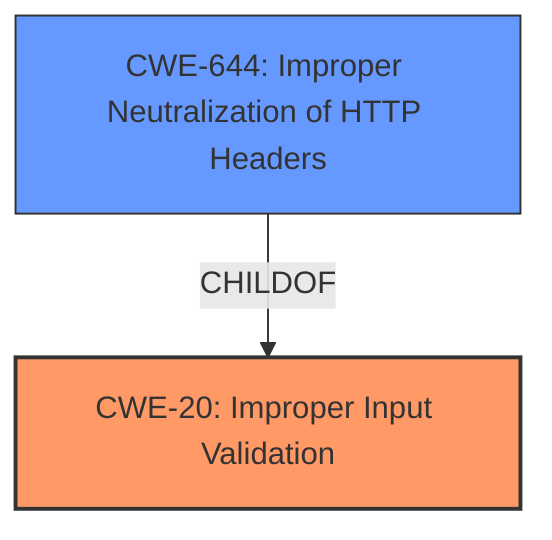

# Analysis Report for CVE-2021-38182

# Vulnerability Analysis Report: CVE-2021-38182

## Description


## Analysis (with Relationship Data)

# Summary
| CWE ID | CWE Name | Confidence | CWE Abstraction Level | CWE Vulnerability Mapping Label | CWE-Vulnerability Mapping Notes |
|---|---|---|---|---|---|
| CWE-20 | Improper Input Validation | 0.9 | Class | Primary | Discouraged |
| CWE-644 | Improper Neutralization of HTTP Headers | 0.7 | Base | Secondary | Allowed |

## Evidence and Confidence

*   **Confidence Score:** 0.8
*   **Evidence Strength:** HIGH

## Relationship Analysis
The primary CWE selected is CWE-20 **(Improper Input Validation)**, which is a Class-level CWE. While it is discouraged to map directly to this CWE due to its generality, the initial analysis strongly points to **insufficient input validation** as the root cause. Given the information at hand, it serves as a suitable starting point. It has potential child CWEs like CWE-1284 **(Improper Validation of Specified Quantity in Input)** or CWE-1285 **(Improper Validation of Specified Index, Position, or Offset in Input)**, but the description does not specify what type of input wasn't validated.

CWE-644 **(Improper Neutralization of HTTP Headers)** is a Base-level CWE and provides more specificity about the weakness.



## Vulnerability Chain
The vulnerability chain begins with **insufficient input validation**, specifically of the "Connection" header. This allows an attacker to inject arbitrary headers, leading to privilege escalation and potential compromise of the cluster.

*   **Root Cause:** Insufficient Input Validation (CWE-20) / Improper Neutralization of HTTP Headers (CWE-644)
*   **Impact:** Privilege Escalation, Cluster Compromise

## Summary of Analysis
Initially, the vulnerability description clearly points to "**insufficient input validation**" as the root cause. The description states: "Due to **insufficient input validation** of Kyma, authenticated users can pass a Header of their choice and escalate privileges which can completely compromise the cluster." This directly aligns with the definition of CWE-20 **(Improper Input Validation)**, which states: "The product receives input or data, but it does not validate or incorrectly validates that the input has the properties that are required to process the data safely and correctly."

However, CWE-20 is a high-level class, and the CVE Reference Links Content Summary provides more context, mentioning "Header Manipulation" and "CWE-644: Improper Neutralization of HTTP Headers". This indicates that the **insufficient input validation** relates specifically to HTTP headers.

Therefore, the primary CWE is CWE-20 **(Improper Input Validation)** because of the clear description of **insufficient input validation**, but CWE-644 **(Improper Neutralization of HTTP Headers)** is added to specify the type of input.

Relevant CWE Information:

# Enhanced Context (25 CWEs)

## CWE-1289: Improper Validation of Unsafe Equivalence in Input
**Abstraction Level**: Base
**Similarity Score**: 0.79
**Source**: dense

**Description**:
The product receives an input value that is used as a resource identifier or other type of reference, but it does not validate or incorrectly validates that the input is equivalent to a potentially-unsafe value.

**Mapping Guidance**:
- Usage: Allowed
- Rationale: This CWE entry is at the Base level of abstraction, which is a preferred level of abstraction for mapping to the root causes of vulnerabilities.

*   **Why Not Used:** There is no mention of resource identifiers or references. The vulnerability stems from header manipulation.

## CWE-274: Improper Handling of Insufficient Privileges
**Abstraction Level**: Base
**Similarity Score**: 0.76
**Source**: dense

**Description**:
The product does not handle or incorrectly handles when it has insufficient privileges to perform an operation, leading to resultant weaknesses.

**Mapping Guidance**:
- Usage: Discouraged
- Rationale: This CWE entry could be deprecated in a future version of CWE.

*   **Why Not Used:** The core issue is **insufficient input validation** leading to privilege escalation, not the handling of insufficient privileges.

## CWE-807: Reliance on Untrusted Inputs in a Security Decision
**Abstraction Level**: Base
**Similarity Score**: 0.76
**Source**: dense

**Description**:
The product uses a protection mechanism that relies on the existence or values of an input, but the input can be modified by an untrusted actor in a way that bypasses the protection mechanism.

**Mapping Guidance**:
- Usage: Allowed
- Rationale: This CWE entry is at the Base level of abstraction, which is a preferred level of abstraction for mapping to the root causes of vulnerabilities.

*   **Why Not Used:** The root cause is not about relying on untrusted inputs for security decisions, but rather failing to validate input, leading to header manipulation and privilege escalation.

## CWE-129: Improper Validation of Array Index
**Abstraction Level**: Variant
**Similarity Score**: 0.75
**Source**: dense

**Description**:
The product uses untrusted input when calculating or using an array index, but the product does not validate or incorrectly validates the index to ensure the index references a valid position within the array.

**Mapping Guidance**:
- Usage: Allowed
- Rationale: This CWE entry is at the Variant level of abstraction, which is a preferred level of abstraction for mapping to the root causes of vulnerabilities.

*   **Why Not Used:** The vulnerability does not involve array indices.

## CWE-703: Improper Check or Handling of Exceptional Conditions
**Abstraction Level**: Pillar
**Similarity Score**: 0.75
**Source**: dense

**Description**:
The product does not properly anticipate or handle exceptional conditions that rarely occur during normal operation of the product.

**Mapping Guidance**:
- Usage: Discouraged
- Rationale: This CWE entry is extremely high-level, a Pillar.

*   **Why Not Used:** Too generic and doesn't capture the specific weakness of **insufficient input validation**.

## CWE-1288: Improper Validation of Consistency within Input
**Abstraction Level**: Base
**Similarity Score**: 0.75
**Source**: dense

**Description**:
The product receives a complex input with multiple elements or fields that must be consistent with each other, but it does not validate or incorrectly validates that the input is actually consistent.

**Mapping Guidance**:
- Usage: Allowed
- Rationale: This CWE entry is at the Base level of abstraction, which is a preferred level of abstraction for mapping to the root causes of vulnerabilities.

*   **Why Not Used:** The provided information doesn't describe a consistency issue within the input.

## CWE-41: Improper Resolution of Path Equivalence
**Abstraction Level**: Base
**Similarity Score**: 0.75
**Source**: dense

**Description**:
The product is vulnerable to file system contents disclosure through path equivalence. Path equivalence involves the use of special characters in file and directory names. The associated manipulations are intended to generate multiple names for the same object.

**Mapping Guidance**:
- Usage: Allowed
- Rationale: This CWE entry is at the Base level of abstraction, which is a preferred level of abstraction for mapping to the root causes of vulnerabilities.

*   **Why Not Used:** This vulnerability is related to HTTP header manipulation, not file path equivalence.

## CWE-252: Unchecked Return Value
**Abstraction Level**: Base
**Similarity Score**: 0.75
**Source**: dense

**Description**:
The product does not check the return value from a method or function, which can prevent it from detecting unexpected states and conditions.

**Mapping Guidance**:
- Usage: Allowed
- Rationale: This CWE entry is at the Base level of abstraction, which is a preferred level of abstraction for mapping to the root causes of vulnerabilities.

*   **Why Not Used:** The description doesn't indicate anything about unchecked return values.

## CWE-138: Improper Neutralization of Special Elements
**Abstraction Level**: Class
**Similarity Score**: 0.75
**Source**: dense

**Description**:
The product receives input from an upstream component, but it does not neutralize or incorrectly neutralizes special elements that could be interpreted as control elements or syntactic markers when they are sent to a downstream component.

**Mapping Guidance**:
- Usage: Discouraged
- Rationale: This CWE entry is a level-1 Class (i.e., a child of a Pillar). It might have lower-level children that would be more appropriate

*   **Why Not Used:** While this is related to neutralization, CWE-644 **(Improper Neutralization of HTTP Headers)** is a better fit.

## CWE-184: Incomplete List of Disallowed Inputs
**Abstraction Level**: Base
**Similarity Score**: 0.75
**Source**: dense

**Description**:
The product implements a protection mechanism that relies on a


## CWE Relationship Analysis

Current CWEs represent these abstraction levels: .


### Vulnerability Chain Analysis

**Chain starting from CWE-41:**
- 41 (Improper Resolution of Path Equivalence) - ROOT


**Chain starting from CWE-807:**
- 807 (Reliance on Untrusted Inputs in a Security Decision) - ROOT


### CWE Relationship Diagram

```mermaid
graph TD
    classDef primary fill:#f96,stroke:#333,stroke-width:2px
    classDef secondary fill:#69f,stroke:#333
    classDef tertiary fill:#9e9,stroke:#333
```


*Report generated on 2025-04-02 00:59:58*
