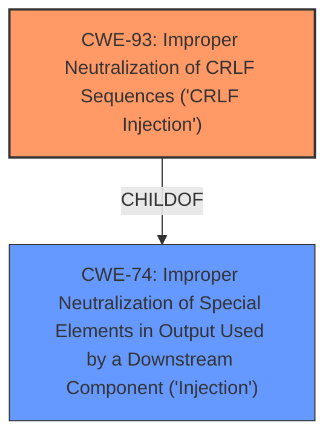

# Analysis for CVE-2021-38189

# Summary
| CWE ID | CWE Name | Confidence | CWE Abstraction Level | CWE Vulnerability Mapping Label | CWE-Vulnerability Mapping Notes |
|---|---|---|---|---|---|
| CWE-93 | Improper Neutralization of CRLF Sequences ('CRLF Injection') | 1 | Base | Primary | Allowed |
| CWE-74 | Improper Neutralization of Special Elements in Output Used by a Downstream Component ('Injection') | 0.5 | Class | Secondary | Discouraged |

## Evidence and Confidence

*   **Confidence Score:** 1
*   **Evidence Strength:** HIGH

## Relationship Analysis
The primary CWE is CWE-93, which focuses on the specific issue of **improper neutralization of CRLF sequences**. This is a base-level CWE.

CWE-74 is a parent Class of CWE-93, representing a more general form of injection.

## Vulnerability Chain
The chain of events for this vulnerability is as follows:
1.  **Root Cause:** The `lettre` crate **fails to properly neutralize CRLF sequences** in email message bodies.
2.  **Weakness:** This allows an attacker to inject arbitrary SMTP commands.
3.  **Impact:** The attacker could execute unauthorized actions on the mail server.

## Summary of Analysis
The initial analysis identified CWE-93 as the primary candidate due to the vulnerability involving the **improper handling of CRLF sequences**, which directly leads to SMTP command injection. The "CVE Reference Links Content Summary" section explicitly states that the `lettre` library **failed to properly handle** a period (`.`) following a double CRLF sequence (`\r\n\r\n`) in the message body. This failure to neutralize allows the **injection of arbitrary SMTP commands**, thus causing an impact.

The evidence strongly supports CWE-93 as the primary CWE. The "CVE Reference Links Content Summary" section includes:
-   **Root cause of vulnerability:** The `lettre` library's SMTP transport mechanism **failed to properly handle** a period (`.`) following a double CRLF sequence (`\r\n\r\n`) in the message body.
-   **Weaknesses/vulnerabilities present:** **SMTP Command Injection:** By inserting `\r\n\r\n.\r\n` followed by arbitrary SMTP commands in the message body, an attacker could inject and execute commands.

CWE-74 was considered because the ability to inject SMTP commands can be viewed as a form of injection. However, since the root cause involves **specific CRLF sequences**, CWE-93 is a more precise and appropriate classification. Furthermore, CWE-74 is discouraged.

Therefore, I am highly confident in selecting CWE-93 as the primary CWE, with CWE-74 as a secondary consideration. The selection is based on the provided evidence and adheres to MITRE's mapping guidance.

Relevant CWE Information:

# Enhanced Context (25 CWEs)
The following CWEs were identified as potentially relevant to this vulnerability:

## CWE-74: Improper Neutralization of Special Elements in Output Used by a Downstream Component ('Injection')
**Abstraction Level**: Class
**Similarity Score**: 0.78
**Source**: dense

**Description**:
The product constructs all or part of a command, data structure, or record using externally-influenced input from an upstream component, but it does not neutralize or incorrectly neutralizes special elements that could modify how it is parsed or interpreted when it is sent to a downstream component.

**Mapping Guidance**:
- Usage: Discouraged
- Rationale: CWE-74 is high-level and often misused when lower-level weaknesses are more appropriate.

## CWE-93: Improper Neutralization of CRLF Sequences ('CRLF Injection')
**Abstraction Level**: Base
**Similarity Score**: 6803.33
**Source**: sparse

**Description**:
The product uses CRLF (carriage return line feeds) as a special element, e.g. to separate lines or records, but it does not neutralize or incorrectly neutralizes CRLF sequences from inputs.

**Mapping Guidance**:
- Usage: Allowed
- Rationale: This CWE entry is at the Base level of abstraction, which is a preferred level of abstraction for mapping to the root causes of vulnerabilities.