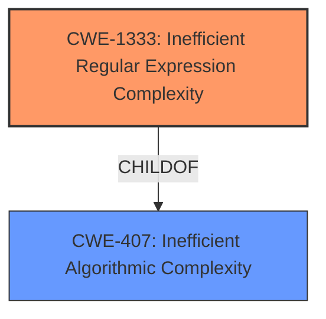

# Enhanced Analysis for CVE-2021-3820

# Summary
| CWE ID | CWE Name | Confidence | CWE Abstraction Level | CWE Vulnerability Mapping Label | CWE-Vulnerability Mapping Notes |
|---|---|---|---|---|---|
| CWE-1333 | Inefficient Regular Expression Complexity | 1.0 | Base | Allowed | Primary CWE |

## Evidence and Confidence

*   **Confidence Score:** 1.0
*   **Evidence Strength:** HIGH

## Relationship Analysis
The primary relationship impacting the decision is that CWE-1333 is a child of CWE-407 (Inefficient Algorithmic Complexity). While CWE-407 is a broader class, CWE-1333 specifically addresses the case of inefficient regular expressions, making it a more precise fit for the vulnerability. No other relationships significantly influenced the decision.



## Vulnerability Chain
The vulnerability chain starts with the **inefficient regular expression complexity** (CWE-1333) leading directly to a denial-of-service (DoS) impact. The chain is:

1.  **Inefficient Regular Expression (CWE-1333)**: The root cause is the use of a poorly designed regular expression.
2.  **Denial of Service (DoS)**: The impact is the application becoming unresponsive due to excessive CPU consumption.

## Summary of Analysis
The initial assessment and final conclusion both strongly point to CWE-1333 as the most appropriate classification.

The vulnerability description clearly states: "inflect is vulnerable to **Inefficient Regular Expression Complexity**." The CVE Reference Links Content Summary confirms this: "The vulnerability stems from an inefficient regular expression used within the `inflect` library...leading to a potential ReDoS attack." The summary also identifies the vulnerable code and provides details about the fix.

The graph relationships reinforce this by showing that CWE-1333 is a specific type of inefficient algorithmic complexity (CWE-407).

CWE-1333 is at the optimal level of specificity because it directly addresses the root cause: the inefficient regular expression. More general classifications like CWE-407 would not capture the specific nature of the weakness.

Relevant CWE Information:

# Enhanced Context (25 CWEs)
The following CWEs were identified as potentially relevant to this vulnerability:

## CWE-407: Inefficient Algorithmic Complexity
**Abstraction Level**: Class
**Similarity Score**: 0.77
**Source**: dense

**Description**:
An algorithm in a product has an inefficient worst-case computational complexity that may be detrimental to system performance and can be triggered by an attacker, typically using crafted manipulations that ensure that the worst case is being reached.

**Mapping Guidance**:
- Usage: Allowed-with-Review
- Rationale: This CWE entry is a Class and might have Base-level children that would be more appropriate

## CWE-1333: Inefficient Regular Expression Complexity
**Abstraction Level**: Base
**Similarity Score**: 5310.72
**Source**: sparse

**Description**:
The product uses a regular expression with an inefficient, possibly exponential worst-case computational complexity that consumes excessive CPU cycles.

**Mapping Guidance**:
- Usage: Allowed
- Rationale: This CWE entry is at the Base level of abstraction, which is a preferred level of abstraction for mapping to the root causes of vulnerabilities.

### Explanation of why CWE-1333 was chosen:

CWE-1333 (Inefficient Regular Expression Complexity): This is the primary CWE because the vulnerability description explicitly mentions **inefficient regular expression complexity**. The CVE details confirm that a specific regular expression in the `inflect` library is vulnerable to ReDoS, leading to potential denial-of-service. This aligns perfectly with the CWE-1333 description. The suggested usage is "Allowed" and it is a Base level CWE which is a preferred level of abstraction.

### Explanation of why other CWEs were not chosen:

CWE-407 (Inefficient Algorithmic Complexity): While this is a parent of CWE-1333 and broadly applicable, it is a Class level CWE and less specific. The vulnerability is clearly related to a regular expression, making CWE-1333 a better fit.

CWE-186 (Overly Restrictive Regular Expression): This CWE describes a regular expression that is *too* restrictive, preventing dangerous values from being detected. This is the opposite of the described vulnerability, where the regular expression is inefficient.

CWE-185 (Incorrect Regular Expression): This is a Class level CWE and less specific. While the regular expression is technically incorrect in that it leads to inefficiency, CWE-1333 captures the specific nature of the problem better.

CWE-777 (Regular Expression without Anchors): This CWE describes a regular expression that lacks anchors, potentially allowing malicious data to slip through. This is not the issue described in the vulnerability.

CWE-624 (Executable Regular Expression Error): This CWE describes a regular expression that allows execution of user-controlled inputs. This is not applicable to the vulnerability description.


## CWE Relationship Analysis

Current CWEs represent these abstraction levels: .


### Vulnerability Chain Analysis

**Chain starting from CWE-186:**
- 186 (Overly Restrictive Regular Expression) - ROOT


**Chain starting from CWE-185:**
- 185 (Incorrect Regular Expression) - ROOT


### CWE Relationship Diagram

```mermaid
graph TD
    classDef primary fill:#f96,stroke:#333,stroke-width:2px
    classDef secondary fill:#69f,stroke:#333
    classDef tertiary fill:#9e9,stroke:#333
```