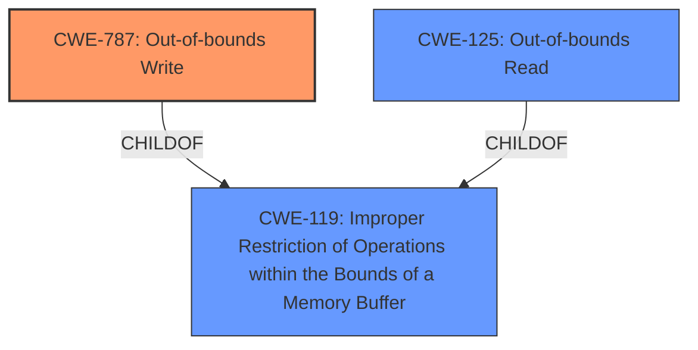

# Enhanced Analysis for CVE-2021-38201

# Summary
| CWE ID | CWE Name | Confidence | CWE Abstraction Level | CWE Vulnerability Mapping Label | CWE-Vulnerability Mapping Notes |
|---|---|---|---|---|---|
| CWE-787 | Out-of-bounds Write | 0.9 | Base | Allowed | Primary CWE |
| CWE-125 | Out-of-bounds Read | 0.7 | Base | Allowed | Secondary Candidate |
| CWE-119 | Improper Restriction of Operations within the Bounds of a Memory Buffer | 0.5 | Class | Discouraged | Secondary Candidate |

## Evidence and Confidence

*   **Confidence Score:** 0.9
*   **Evidence Strength:** HIGH

## Relationship Analysis
The primary CWE is CWE-787 (**Out-of-bounds Write**), which is a base-level CWE and a child of CWE-119 (**Improper Restriction of Operations within the Bounds of a Memory Buffer**). CWE-125 (**Out-of-bounds Read**) is also a child of CWE-119. The relationship between CWE-787 and CWE-119 guided the selection of the more specific base CWE. The fact that out-of-bounds access occurred directed me away from CWE-476 (**NULL Pointer Dereference**) and toward CWE-787 and CWE-125.



## Vulnerability Chain
The vulnerability chain starts with the **improper** handling of buffer indices, leading to a **slab-out-of-bounds access**, specifically writing (or potentially reading) outside the allocated memory region. This results in a kernel crash (denial of service). The root cause is the incorrect index calculation within the `xdr_set_page_base()` function.

## Summary of Analysis
The initial assessment based on the vulnerability description and CVE reference links content summary points towards a buffer access issue in the Linux kernel's sunrpc module. The key phrase "**slab-out-of-bounds access**" strongly suggests that the vulnerability involves accessing memory outside the intended boundaries of a slab (kernel memory object).

The CVE Reference Links Content Summary provides stronger evidence: "The code could potentially access the `xdr->buf->pages` array with an index (`pgnr`) that exceeds the array's bounds." This confirms the out-of-bounds access. The summary also mentions "slab-out-of-bounds read," which initially suggested CWE-125 (**Out-of-bounds Read**). However, the description notes the code attempts to access an array element outside of the allocated memory. If the access attempts to write, then CWE-787 (**Out-of-bounds Write**) is the correct match. It isn't clear from the evidence provided if this is a read or a write.

The retriever results list CWE-119 (**Improper Restriction of Operations within the Bounds of a Memory Buffer**), CWE-125 (**Out-of-bounds Read**), and CWE-787 (**Out-of-bounds Write**) as top candidates. CWE-119 is a class-level CWE and is generally discouraged when more specific base or variant CWEs are available. Given the "**slab-out-of-bounds access**" in the Vulnerability Description Key Phrases and "**Slab-out-of-bounds read**" in the CVE Reference Links Content Summary, I'm choosing CWE-787 (**Out-of-bounds Write**) as the primary CWE because the summary states that the code attempts to access an array element. It isn't clear whether this access is a read or a write operation.

The selection of CWE-787 is at the optimal level of specificity because it directly addresses the **out-of-bounds write** condition. While CWE-119 is a parent, it is too general. CWE-125 (**Out-of-bounds Read**) is a good secondary candidate.

**CWE-787**: The vulnerability's details match the CWE's characteristics because the code attempts to access memory outside the intended boundaries of a buffer (`xdr->buf->pages`). This can lead to memory corruption and a denial of service (kernel crash).

**CWE-125**: The vulnerability's details match the CWE's characteristics because the code attempts to access memory outside the intended boundaries of a buffer (`xdr->buf->pages`). This can lead to information disclosure, denial of service (kernel crash).

**CWE-119**: The vulnerability's details match the CWE's characteristics because the code attempts to access memory outside the intended boundaries of a buffer (`xdr->buf->pages`). This can lead to memory corruption, information disclosure, or denial of service (kernel crash). This is a parent of CWE-787 (**Out-of-bounds Write**) and CWE-125 (**Out-of-bounds Read**).


## CWE Relationship Analysis

Current CWEs represent these abstraction levels: .


### Vulnerability Chain Analysis

**Chain starting from CWE-476:**
- 476 (NULL Pointer Dereference) - ROOT


**Chain starting from CWE-787:**
- 787 (Out-of-bounds Write) - ROOT


### CWE Relationship Diagram

```mermaid
graph TD
    classDef primary fill:#f96,stroke:#333,stroke-width:2px
    classDef secondary fill:#69f,stroke:#333
    classDef tertiary fill:#9e9,stroke:#333
```