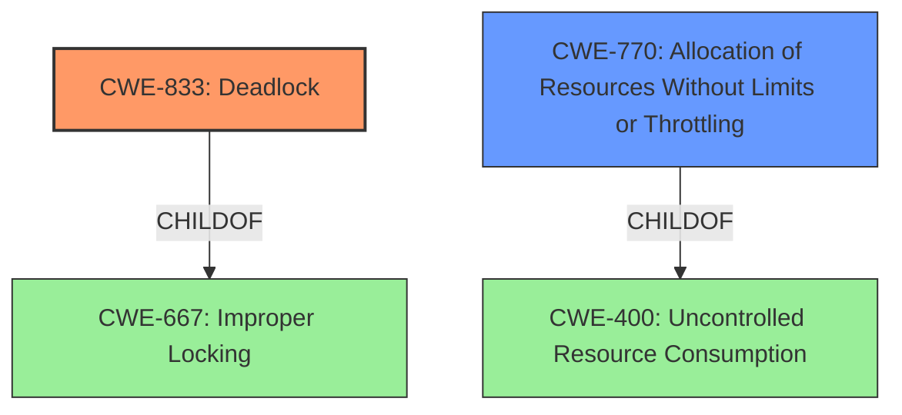

# Analysis Report for CVE-2021-38203

# Vulnerability Analysis Report: CVE-2021-38203

## Description


## Analysis (with Relationship Data)

# Summary
| CWE ID | CWE Name | Confidence | CWE Abstraction Level | CWE Vulnerability Mapping Label | CWE-Vulnerability Mapping Notes |
|---|---|---|---|---|---|
| CWE-833 | Deadlock | 0.8 | Base | Allowed | Primary CWE. The vulnerability description clearly states a deadlock occurs. |
| CWE-770 | Allocation of Resources Without Limits or Throttling | 0.6 | Base | Allowed | Secondary CWE. The deadlock is triggered during chunk allocation, which suggests a potential lack of limits on resource allocation. |

## Evidence and Confidence

*   **Confidence Score:** 0.7
*   **Evidence Strength:** MEDIUM

## Relationship Analysis
The primary CWE is CWE-833 (Deadlock), which is at the Base level. It is related to CWE-667 (Improper Locking) and CWE-662 (Operation on Resource in Wrong Phase of Lifetime). The secondary CWE considered is CWE-770 (Allocation of Resources Without Limits or Throttling), which could contribute to the deadlock.



## Vulnerability Chain
The vulnerability chain starts with processes triggering allocation of new system chunks, potentially without proper limits (CWE-770), leading to a shortage of free space and ultimately resulting in a deadlock (CWE-833).

## Summary of Analysis
The initial analysis focused on the **deadlock** condition described in the vulnerability. The key phrase "denial of service (deadlock)" strongly suggests CWE-833. The description also mentions processes triggering allocation of new system chunks. This allocation aspect, coupled with a shortage of free space, led to the consideration of resource allocation issues.

The "CVE Reference Links Content Summary" section provides further evidence: "The code introduced a **deadlock** scenario where one task waiting on another to finish a system block group creation, could prevent that other task from completing due to chunk allocation issues."

CWE-833 (Deadlock) is the most appropriate primary CWE because the vulnerability description explicitly states that a **deadlock** occurs. CWE-770 (Allocation of Resources Without Limits or Throttling) is a plausible secondary CWE because the deadlock is related to chunk allocation during a shortage of free space.

The retriever results support these choices, with CWE-833 and CWE-770 appearing in the top combined results. The graph relationships show that CWE-833 is a child of CWE-667 (Improper Locking), which is a reasonable relationship given that deadlocks often involve locking issues. CWE-770 is a child of CWE-400 (Uncontrolled Resource Consumption), reflecting the potential for excessive resource allocation.

Other CWEs considered but not used:

*   CWE-667: Improper Locking - While deadlocks often involve locking issues, the description focuses on the deadlock itself, making CWE-833 a better fit.
*   CWE-789: Memory Allocation with Excessive Size Value - While related to memory allocation, the vulnerability is more about the overall allocation process and the resulting deadlock than the size of individual allocations.
* CWE-362: Concurrent Execution using Shared Resource with Improper Synchronization ('Race Condition') - While concurrency is part of the vulnerability, a deadlock is more than a race condition because the tasks are blocked forever.

The selected CWEs are at the optimal level of specificity because they directly address the core issues described in the vulnerability: a **deadlock** and a potential lack of resource allocation limits that contributed to the **deadlock**.


## CWE Relationship Analysis

Current CWEs represent these abstraction levels: .


### Vulnerability Chain Analysis

**Chain starting from CWE-667:**
- 667 (Improper Locking) - ROOT


**Chain starting from CWE-662:**
- 662 (Improper Synchronization) - ROOT


### CWE Relationship Diagram

```mermaid
graph TD
    classDef primary fill:#f96,stroke:#333,stroke-width:2px
    classDef secondary fill:#69f,stroke:#333
    classDef tertiary fill:#9e9,stroke:#333
```


*Report generated on 2025-04-02 06:51:40*
