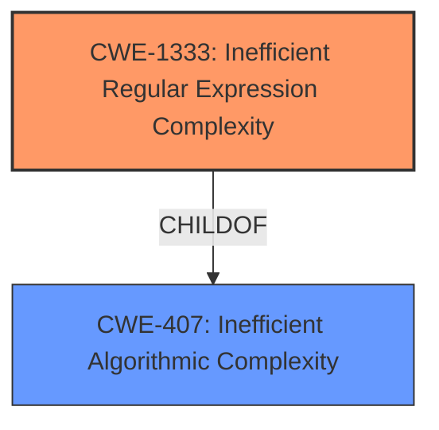

# Analysis for CVE-2021-3822

# Summary
| CWE ID | CWE Name | Confidence | CWE Abstraction Level | CWE Vulnerability Mapping Label | CWE-Vulnerability Mapping Notes |
|---|---|---|---|---|---|
| CWE-1333 | Inefficient Regular Expression Complexity | 1.0 | Base | Allowed | Primary CWE |

## Evidence and Confidence

*   **Confidence Score:** 1.0
*   **Evidence Strength:** HIGH

## Relationship Analysis
The primary relationship that influenced my decision was the ChildOf relationship between CWE-1333 and CWE-407. While CWE-407 (Inefficient Algorithmic Complexity) is a broader class, CWE-1333 (Inefficient Regular Expression Complexity) is a more specific base level weakness that directly addresses the vulnerability of inefficient regular expressions. I chose CWE-1333 because the description specifically mentions an inefficient regular expression causing high CPU consumption.

## Vulnerability Chain
The vulnerability chain is relatively straightforward:

1.  **Root Cause:** **Inefficient Regular Expression** (CWE-1333)
2.  **Impact:** Denial of Service due to high CPU consumption

## Summary of Analysis
The analysis is based on the provided evidence, specifically the "Vulnerability Description Key Phrases" and the "CVE Reference Links Content Summary." The key phrases identify "**Inefficient Regular Expression**" as the root cause and "**Regular Expression Complexity**" as the weakness. The CVE reference summary confirms that the vulnerability stems from an inefficient regular expression in the `getInnerText` function, potentially leading to denial of service and resource exhaustion.

The retriever results also strongly support CWE-1333 as the primary candidate, with a high-relevance score and a base level of abstraction. The relationship analysis further solidifies this decision, as CWE-1333 is a specific type of inefficient algorithmic complexity.

I selected CWE-1333 because it directly addresses the root cause of the vulnerability, which is an inefficient regular expression that can lead to denial of service. This aligns with the principle of choosing the most specific CWE that accurately represents the weakness.

Relevant CWE Information:

# Enhanced Context (25 CWEs)
The following CWEs were identified as potentially relevant to this vulnerability:

## CWE-407: Inefficient Algorithmic Complexity
**Abstraction Level**: Class
**Similarity Score**: 0.75
**Source**: dense

**Description**:
An algorithm in a product has an inefficient worst-case computational complexity that may be detrimental to system performance and can be triggered by an attacker, typically using crafted manipulations that ensure that the worst case is being reached.

**Mapping Guidance**:
- Usage: Allowed-with-Review
- Rationale: This CWE entry is a Class and might have Base-level children that would be more appropriate

## CWE-1333: Inefficient Regular Expression Complexity
**Abstraction Level**: Base
**Similarity Score**: 5690.18
**Source**: sparse

**Description**:
The product uses a regular expression with an inefficient, possibly exponential worst-case computational complexity that consumes excessive CPU cycles.

**Mapping Guidance**:
- Usage: Allowed
- Rationale: This CWE entry is at the Base level of abstraction, which is a preferred level of abstraction for mapping to the root causes of vulnerabilities.

**Considered but not used:**

*   **CWE-407 (Inefficient Algorithmic Complexity):** While related, this is a broader class. The vulnerability is specifically related to regular expression complexity, making CWE-1333 a more precise fit.
*   **CWE-625 (Permissive Regular Expression):** This CWE relates to regular expressions that do not sufficiently restrict allowed values. The described vulnerability is about the inefficiency of the regular expression, not its permissiveness.
*   **CWE-185 (Incorrect Regular Expression):** Similar to CWE-625, this focuses on the correctness of the regular expression in terms of matching intended patterns, rather than its efficiency.
*   **CWE-186 (Overly Restrictive Regular Expression):** This is the inverse of CWE-625. The description is about an overly restrictive regular expression, which is not the case here.
*   **CWE-626 (Null Byte Interaction Error (Poison Null Byte)):** This is unrelated to the regular expression complexity issue.
*   **CWE-777 (Regular Expression without Anchors):** This weakness occurs when the regular expression is not anchored and may allow malicious or malformed data to slip through. The description does not provide enough information to confirm that the lack of anchors caused the issue.