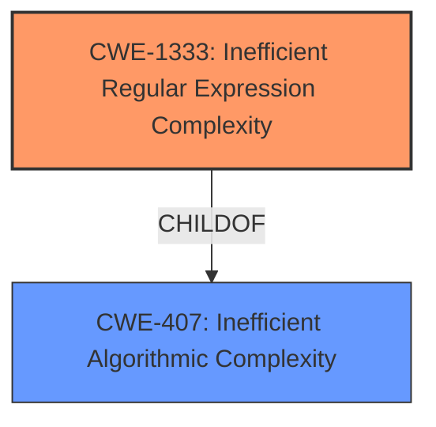

# Analysis for CVE-2021-38244

# Summary
| CWE ID    | CWE Name                                     | Confidence | CWE Abstraction Level | CWE Vulnerability Mapping Label | CWE-Vulnerability Mapping Notes |
| :-------- | :------------------------------------------- | :--------- | :---------------------- | :------------------------------ | :----------------------------- |
| CWE-1333  | Inefficient Regular Expression Complexity    | 1.0        | Base                    | Allowed                         | Primary CWE                    |

## Evidence and Confidence

*   **Confidence Score:** 1.0
*   **Evidence Strength:** HIGH

## Relationship Analysis
The primary relationship influencing the decision is the direct match of the vulnerability description to the definition of CWE-1333. CWE-1333 is a child of CWE-407, Inefficient Algorithmic Complexity, representing a more specific instance of the general algorithmic inefficiency. Since there's no other more specific match, CWE-1333 is most appropriate.

## Vulnerability Chain
The vulnerability chain starts with user-controlled input being used to construct regular expressions without proper sanitization. This leads to a **regular expression denial of service** (ReDoS), where a malicious `alteration` string causes catastrophic backtracking, leading to excessive CPU consumption and DoS.
  - Root Cause: **Regular Expression Denial of Service** due to user-controlled input.
  - Impact: Excessive CPU consumption leading to Denial of Service.

## Summary of Analysis
The analysis strongly points to CWE-1333 as the primary weakness. The vulnerability description explicitly mentions a **"regular expression denial of service"**, which aligns perfectly with CWE-1333's definition of using a regular expression with inefficient complexity leading to excessive CPU cycles. The evidence from "CVE Reference Links Content Summary" further supports this, highlighting how user-controlled input is used to construct regex patterns, allowing attackers to cause catastrophic backtracking. The retriever results also rank CWE-1333 as the top match with a score of 1.0.

The selection is based on the provided evidence, especially the root cause description and the details in the CVE reference.
Evidence includes:
- **Vulnerability Description Key Phrases:** **rootcause:** **regular expression denial of service**
- **CVE Reference Links Content Summary:**  The vulnerability stems from the use of user-controlled input (`heat_map`, `gene`, and `alteration` parameters) to construct regular expressions without proper sanitization. Specifically, the `alteration` parameter is used directly within a regular expression matching operation.

The hierarchical relationship between CWE-1333 and CWE-407 reinforces the selection. While CWE-407 (Inefficient Algorithmic Complexity) is a broader category, CWE-1333 provides a more specific characterization of the issue.

CWE-1333 is chosen as the most specific and accurate representation of the vulnerability.

Relevant CWE Information:

# Enhanced Context (25 CWEs)

## CWE-404: Improper Resource Shutdown or Release
**Abstraction Level**: Class
**Similarity Score**: 0.77
**Source**: dense

**Description**:
The product does not release or incorrectly releases a resource before it is made available for re-use.
*Not selected* because the issue is about CPU consumption from an inefficient algorithm, not resource management.

## CWE-789: Memory Allocation with Excessive Size Value
**Abstraction Level**: Variant
**Similarity Score**: 0.77
**Source**: dense

**Description**:
The product allocates memory based on an untrusted, large size value, but it does not ensure that the size is within expected limits, allowing arbitrary amounts of memory to be allocated.
*Not selected* because the vulnerability is not directly related to memory allocation size. It's about CPU consumption due to regex complexity.

## CWE-405: Asymmetric Resource Consumption (Amplification)
**Abstraction Level**: Class
**Similarity Score**: 0.76
**Source**: dense

**Description**:
The product does not properly control situations in which an adversary can cause the product to consume or produce excessive resources without requiring the adversary to invest equivalent work or otherwise prove authorization, i.e., the adversary's influence is "asymmetric."
*Not selected* because while the vulnerability does involve resource consumption, the root cause is the inefficient regex, not a general lack of resource control.

## CWE-407: Inefficient Algorithmic Complexity
**Abstraction Level**: Class
**Similarity Score**: 0.76
**Source**: dense

**Description**:
An algorithm in a product has an inefficient worst-case computational complexity that may be detrimental to system performance and can be triggered by an attacker, typically using crafted manipulations that ensure that the worst case is being reached.
*Not selected* because CWE-1333 is a child (more specific) of this CWE, and is a more precise mapping.

## CWE-668: Exposure of Resource to Wrong Sphere
**Abstraction Level**: Class
**Similarity Score**: 0.76
**Source**: dense

**Description**:
The product exposes a resource to the wrong control sphere, providing unintended actors with inappropriate access to the resource.
*Not selected* because the issue is not about access control.

## CWE-799: Improper Control of Interaction Frequency
**Abstraction Level**: Class
**Similarity Score**: 0.76
**Source**: dense

**Description**:
The product does not properly limit the number or frequency of interactions that it has with an actor, such as the number of incoming requests.
*Not selected* because the issue is not about limiting request frequency, but about the inefficiency of a specific regex operation.

## CWE-226: Sensitive Information in Resource Not Removed Before Reuse
**Abstraction Level**: Base
**Similarity Score**: 0.75
**Source**: dense

**Description**:
The product releases a resource such as memory or a file so that it can be made available for reuse, but it does not clear or "zeroize" the information contained in the resource before the product performs a critical state transition or makes the resource available for reuse by other entities.
*Not selected* because this vulnerability is not about releasing resources.

## CWE-617: Reachable Assertion
**Abstraction Level**: Base
**Similarity Score**: 0.75
**Source**: dense

**Description**:
The product contains an assert() or similar statement that can be triggered by an attacker, which leads to an application exit or other behavior that is more severe than necessary.
*Not selected* because the vulnerability does not involve assertions.

## CWE-1289: Improper Validation of Unsafe Equivalence in Input
**Abstraction Level**: Base
**Similarity Score**: 0.75
**Source**: dense

**Description**:
The product receives an input value that is used as a resource identifier or other type of reference, but it does not validate or incorrectly validates that the input is equivalent to a potentially-unsafe value.
*Not selected* because the vulnerability is about regex complexity, not validation of equivalence.

## CWE-252: Unchecked Return Value
**Abstraction Level**: Base
**Similarity Score**: 0.75
**Source**: dense

**Description**:
The product does not check the return value from a method or function, which can prevent it from detecting unexpected states and conditions.
*Not selected* because the vulnerability is not about unchecked return values.

## CWE-1333: Inefficient Regular Expression Complexity
**Abstraction Level**: Base
**Similarity Score**: 5335.35
**Source**: sparse

**Description**:
The product uses a regular expression with an inefficient, possibly exponential worst-case computational complexity that consumes excessive CPU cycles.
*Selected* because this perfectly matches the vulnerability description.

## CWE-617: Reachable Assertion
**Abstraction Level**: Base
**Similarity Score**: 4947.25
**Source**: sparse

**Description**:
The product contains an assert() or similar statement that can be triggered by an attacker, which leads to an application exit or other behavior that is more severe than necessary.
*Not selected* because the vulnerability does not involve assertions.

## CWE-770: Allocation of Resources Without Limits or Throttling
**Abstraction Level**: Base
**Similarity Score**: 4764.10
**Source**: sparse

**Description**:
The product allocates a reusable resource or group of resources on behalf of an actor without imposing any restrictions on the size or number of resources that can be allocated, in violation of the intended security policy for that actor.
*Not selected* because while the vulnerability can lead to resource exhaustion, the root cause is regex complexity, not a lack of resource limits in general.

## CWE-625: Permissive Regular Expression
**Abstraction Level**: Base
**Similarity Score**: 4673.57
**Source**: sparse

**Description**:
The product uses a regular expression that does not sufficiently restrict the set