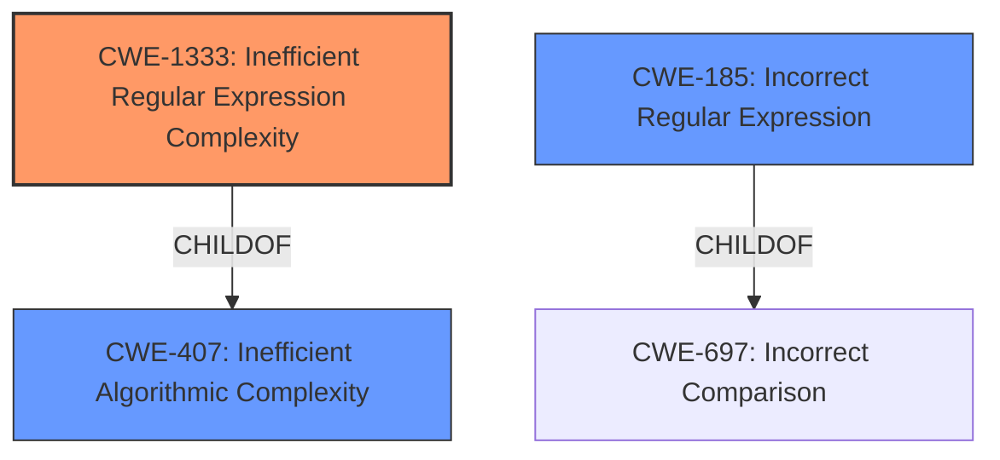

# Analysis for CVE-2021-3828

# Summary
| CWE ID  | CWE Name   | Confidence | CWE Abstraction Level | CWE Vulnerability Mapping Label | CWE-Vulnerability Mapping Notes |
|------------------|----------------------------------------------------|------------|-----------------------|-------------------------------------|---------------------------------------------------------------------------------------------------------------------------------------------------|
| CWE-1333 | Inefficient Regular Expression Complexity | 1  | Base  | Allowed  | Primary CWE |
| CWE-407 | Inefficient Algorithmic Complexity  | 0.7 | Class | Allowed-with-Review | Secondary candidate |
| CWE-185 | Incorrect Regular Expression | 0.6  | Class | Allowed-with-Review  | Secondary candidate |

## Evidence and Confidence

*   **Confidence Score:** 0.9
*   **Evidence Strength:** HIGH

## Relationship Analysis
The primary CWE is CWE-1333 **Inefficient Regular Expression Complexity** which is a child of CWE-407 **Inefficient Algorithmic Complexity**. While CWE-407 is broader, CWE-1333 specifically addresses the use of regular expressions. Since the vulnerability is related to regular expression complexity, CWE-1333 is a more specific and appropriate choice. CWE-185 **Incorrect Regular Expression** is a class level CWE.

## Vulnerability Chain
The vulnerability chain starts with an **inefficient regular expression complexity** (CWE-1333) that leads to excessive CPU consumption, resulting in a denial-of-service.

## Summary of Analysis
The primary weakness is the **inefficient regular expression complexity** (CWE-1333). The vulnerability description clearly states that the `KEYWORD` regular expression within the `comparative_sents.py` file of the `nltk` library is vulnerable to ReDoS. The description also mentions the regex `r"\((?!.\*\()(.\*)\)$"` was susceptible to long processing times when provided with a crafted input. This aligns perfectly with CWE-1333, which describes a regular expression with an inefficient worst-case computational complexity.

The "CVE Reference Links Content Summary" section provides additional evidence, stating that the original regular expression `r"\((?!.\*\()(.\*)\)$"` was vulnerable to ReDoS due to the nested repetition of `.*` combined with lookaheads, which causes exponential backtracking on specific inputs. This reinforces the selection of CWE-1333.

The evidence supports the selection of CWE-1333 because the **root cause** of the vulnerability is directly related to the inefficient complexity of the regular expression.

CWE-407 was considered but not chosen as the primary CWE because it is a more general class that encompasses inefficiencies in algorithms, whereas CWE-1333 is specific to regular expressions.

CWE-185 was also considered but it is about regular expressions that are written incorrectly, and thus cause data to be improperly matched. This is not the case here, where the regular expression matches, but does so inefficiently.

Relevant CWE Information:

# Enhanced Context (25 CWEs)
The following CWEs were identified as potentially relevant to this vulnerability:

## CWE-625: Permissive Regular Expression
**Abstraction Level**: Base
**Similarity Score**: 0.74
**Source**: dense

**Description**:
The product uses a regular expression that does not sufficiently restrict the set of allowed values.

**Mapping Guidance**:
- Usage: Allowed
- Rationale: This CWE entry is at the Base level of abstraction, which is a preferred level of abstraction for mapping to the root causes of vulnerabilities.

## CWE-1176: Inefficient CPU Computation
**Abstraction Level**: Class
**Similarity Score**: 0.74
**Source**: dense

**Description**:
The product performs CPU computations using
         algorithms that are not as efficient as they could be for the
         needs of the developer, i.e., the computations can be
         optimized further.

**Mapping Guidance**:
- Usage: Allowed-with-Review
- Rationale: This CWE entry is a Class and might have Base-level children that would be more appropriate

## CWE-637: Unnecessary Complexity in Protection Mechanism (Not Using 'Economy of Mechanism')
**Abstraction Level**: Class
**Similarity Score**: 0.74
**Source**: dense

**Description**:
The product uses a more complex mechanism than necessary, which could lead to resultant weaknesses when the mechanism is not correctly understood, modeled, configured, implemented, or used.

**Mapping Guidance**:
- Usage: Allowed-with-Review
- Rationale: This CWE entry is a Class and might have Base-level children that would be more appropriate

## CWE-407: Inefficient Algorithmic Complexity
**Abstraction Level**: Class
**Similarity Score**: 0.73
**Source**: dense

**Description**:
An algorithm in a product has an inefficient worst-case computational complexity that may be detrimental to system performance and can be triggered by an attacker, typically using crafted manipulations that ensure that the worst case is being reached.

**Mapping Guidance**:
- Usage: Allowed-with-Review
- Rationale: This CWE entry is a Class and might have Base-level children that would be more appropriate

## CWE-186: Overly Restrictive Regular Expression
**Abstraction Level**: Base
**Similarity Score**: 0.73
**Source**: dense

**Description**:
A regular expression is overly restrictive, which prevents dangerous values from being detected.

**Mapping Guidance**:
- Usage: Allowed
- Rationale: This CWE entry is at the Base level of abstraction, which is a preferred level of abstraction for mapping to the root causes of vulnerabilities.

## CWE-185: Incorrect Regular Expression
**Abstraction Level**: Class
**Similarity Score**: 0.73
**Source**: dense

**Description**:
The product specifies a regular expression in a way that causes data to be improperly matched or compared.

**Mapping Guidance**:
- Usage: Allowed-with-Review
- Rationale: This CWE entry is a Class and might have Base-level children that would be more appropriate

## CWE-799: Improper Control of Interaction Frequency
**Abstraction Level**: Class
**Similarity Score**: 0.70
**Source**: dense

**Description**:
The product does not properly limit the number or frequency of interactions that it has with an actor, such as the number of incoming requests.

**Mapping Guidance**:
- Usage: Allowed-with-Review
- Rationale: This CWE entry is a Class and might have Base-level children that would be more appropriate

## CWE-405: Asymmetric Resource Consumption (Amplification)
**Abstraction Level**: Class
**Similarity Score**: 0.70
**Source**: dense

**Description**:
The product does not properly control situations in which an adversary can cause the product to consume or produce excessive resources without requiring the adversary to invest equivalent work or otherwise prove authorization, i.e., the adversary's influence is "asymmetric."

**Mapping Guidance**:
- Usage: Allowed-with-Review
- Rationale: This CWE entry is a Class and might have Base-level children that would be more appropriate

## CWE-1289: Improper Validation of Unsafe Equivalence in Input
**Abstraction Level**: Base
**Similarity Score**: 0.69
**Source**: dense

**Description**:
The product receives an input value that is used as a resource identifier or other type of reference, but it does not validate or incorrectly validates that the input is equivalent to a potentially-unsafe value.

**Mapping Guidance**:
- Usage: Allowed
- Rationale: This CWE entry is at the Base level of abstraction, which is a preferred level of abstraction for mapping to the root causes of vulnerabilities.

## CWE-41: Improper Resolution of Path Equivalence
**Abstraction Level**: Base
**Similarity Score**: 0.69
**Source**: dense

**Description**:
The product is vulnerable to file system contents disclosure through path equivalence. Path equivalence involves the use of special characters in file and directory names. The associated manipulations are intended to generate multiple names for the same object.

**Mapping Guidance**:
- Usage: Allowed
- Rationale: This CWE entry is at the Base level of abstraction, which is a preferred level of abstraction for mapping to the root causes of vulnerabilities.

## CWE-1333: Inefficient Regular Expression Complexity
**Abstraction Level**: Base
**Similarity Score**: 5248.29
**Source**: sparse

**Description**:
The product uses a regular expression with an inefficient, possibly exponential worst-case computational complexity