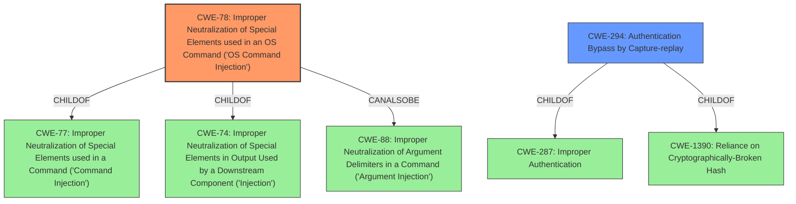

# Analysis for CVE-2021-38294

# Summary
| CWE ID | CWE Name | Confidence | CWE Abstraction Level | CWE Vulnerability Mapping Label | CWE-Vulnerability Mapping Notes |
|---|---|---|---|---|---|
| CWE-78 | Improper Neutralization of Special Elements used in an OS Command ('OS Command Injection') | 1.0 | Base | Primary | Allowed |
| CWE-294 | Authentication Bypass by Capture-replay | 0.7 | Base | Secondary | Allowed |

## Evidence and Confidence

*   **Confidence Score:** 0.9
*   **Evidence Strength:** HIGH

## Relationship Analysis
The primary relationship is that CWE-78 "Improper Neutralization of Special Elements used in an OS Command ('OS Command Injection')" is a child of CWE-77 "Improper Neutralization of Special Elements used in a Command ('Command Injection')" and CWE-74 "Improper Neutralization of Special Elements in Output Used by a Downstream Component ('Injection')", making CWE-78 a more specific classification. CWE-78 is also related to CWE-88 "Improper Neutralization of Argument Delimiters in a Command ('Argument Injection')" via the CanAlsoBe relationship. CWE-294 "Authentication Bypass by Capture-replay" is related to CWE-287 "Improper Authentication" and CWE-1390 "Reliance on Cryptographically-Broken Hash".

## Vulnerability Chain
The vulnerability chain starts with the **Command Injection** (**CWE-78**). This is possible due to the **lack of authentication** that allows a crafted thrift request to reach the vulnerable service. The impact is **Remote Code Execution (RCE)**. The vulnerability chain can be viewed as:

1.  **CWE-294: Authentication Bypass by Capture-replay** (Initial flaw, prior to authentication)
2.  **CWE-78: Improper Neutralization of Special Elements used in an OS Command ('OS Command Injection')** (Root cause, leading to command execution)
3.  **Impact: Remote Code Execution (RCE)** (Resulting impact)

## Summary of Analysis
The initial assessment identified **CWE-78** as the primary weakness, based on the explicit mention of "**Command Injection**" in the vulnerability description and the CVE Reference Links Content Summary. The description clearly states that a specially crafted thrift request allows Remote Code Execution (RCE) prior to authentication due to a command injection vulnerability. The Retriever Results also listed **CWE-78** as a strong candidate.

The analysis considered the lack of authentication and included **CWE-294** as a secondary weakness because the vulnerability can be exploited prior to authentication, thus allowing an attacker to inject commands without needing credentials.

The selection of **CWE-78** is at the optimal level of specificity because it accurately describes the root cause of the vulnerability, which is the improper neutralization of special elements used in an OS command. The evidence from the "CVE Reference Links Content Summary" explicitly mentions the "**Command Injection**" flaw and its impact, reinforcing the choice of **CWE-78** as the primary weakness. The relationships between CWEs also support this decision, as **CWE-78** is a more specific child of **CWE-77** and **CWE-74**.

**CWE-77** was considered but not used as the primary because **CWE-78** is a more specific Base level CWE that refers to OS commands and the vulnerability clearly states command injection.

**CWE-74** was considered but not used as the primary because **CWE-74** is a more generic class that encompasses various types of injections. Since the vulnerability is specifically a command injection, **CWE-78** is more appropriate.

Other CWEs like **CWE-94** and **CWE-1336** were considered, but deemed less relevant because they focus on code injection and template injection, respectively, which are not the primary issues in this vulnerability.

**CWE-20** was not selected because the vulnerability summary doesn't include a general input validation issue, but rather a specific command injection.

The final assessment is based on the provided evidence, the relationships between CWEs, and the official MITRE mapping guidance.