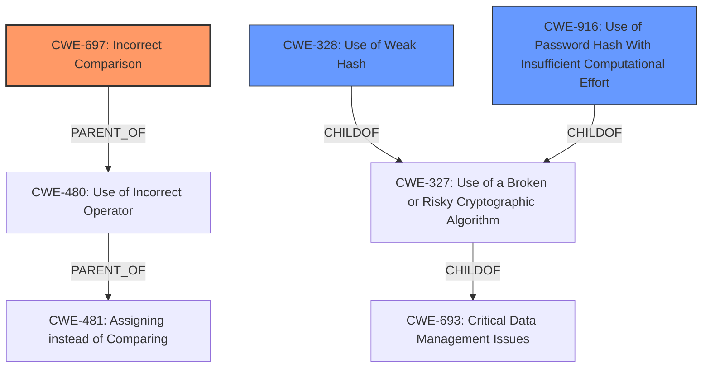

# Enhanced Analysis for CVE-2021-3833

# Summary
| CWE ID | CWE Name | Confidence | CWE Abstraction Level | CWE Vulnerability Mapping Label | CWE-Vulnerability Mapping Notes |
|---|---|---|---|---|---|
| CWE-697 | Incorrect Comparison | 0.9 | Pillar | Allowed | Primary CWE |
| CWE-328 | Use of Weak Hash | 0.7 | Base | Allowed | Secondary Candidate |
| CWE-916 | Use of Password Hash With Insufficient Computational Effort | 0.6 | Base | Allowed | Secondary Candidate |

## Evidence and Confidence

*   **Confidence Score:** 0.8
*   **Evidence Strength:** HIGH

## Relationship Analysis
The primary CWE selected is CWE-697 (Incorrect Comparison), which is a high-level Pillar. The retriever results also suggest CWE-328 (Use of Weak Hash) and CWE-916 (Use of Password Hash With Insufficient Computational Effort) as related, more specific weaknesses. The relationship between CWE-697 and more specific weaknesses illustrates the hierarchical nature of CWE classifications. In this case, the loose comparison is the root cause, and the use of MD5 contributes to the exploitability of the vulnerability.



## Vulnerability Chain
The vulnerability chain starts with the **incorrect comparison** using a **loose comparator (==)**, which leads to the possibility of bypassing authentication. The use of MD5, while not directly the root cause, contributes to the exploitability, forming a chain where a weak hash combined with an incorrect comparison allows an attacker to login with different passwords.
  - Root Cause: Incorrect Comparison
  - Contributing Factor: Use of Weak Hash (MD5)
  - Impact: Authentication Bypass

## Summary of Analysis
The initial assessment pointed towards CWE-697 as the primary weakness due to the **incorrect comparison** in the login check. While the **use of MD5 hash** is a contributing factor, the root cause is the **loose comparator (==)**. The final decision is based on the evidence from the vulnerability description and the CVE Reference Links Content Summary, both of which highlight the **incorrect comparison** as the primary flaw.

The selection of CWE-697 is at a higher level (Pillar) because the description states an **incorrect comparison** without specifying the exact operator, which means that a more specific comparison error cannot be confirmed.

Relevant CWE Information:

# Enhanced Context (25 CWEs)

## CWE-916: Use of Password Hash With Insufficient Computational Effort
**Abstraction Level**: Base
**Similarity Score**: 0.80
**Source**: dense

**Description**:
The product generates a hash for a password, but it uses a scheme that does not provide a sufficient level of computational effort that would make password cracking attacks infeasible or expensive.

**Mapping Guidance**:
- Usage: Allowed
- Rationale: This CWE entry is at the Base level of abstraction, which is a preferred level of abstraction for mapping to the root causes of vulnerabilities.

**Analysis:**
This CWE is considered because the vulnerability description involves password hashing. However, the root cause is the **incorrect comparison**, not the hashing algorithm itself. Therefore, this CWE is a secondary consideration.

## CWE-328: Use of Weak Hash
**Abstraction Level**: Base
**Similarity Score**: 0.79
**Source**: dense

**Description**:
The product uses an algorithm that produces a digest (output value) that does not meet security expectations for a hash function that allows an adversary to reasonably determine the original input (preimage attack), find another input that can produce the same hash (2nd preimage attack), or find multiple inputs that evaluate to the same hash (birthday attack).

**Mapping Guidance**:
- Usage: Allowed
- Rationale: This CWE entry is at the Base level of abstraction, which is a preferred level of abstraction for mapping to the root causes of vulnerabilities.

**Analysis:**
This CWE is considered because the vulnerability description mentions the use of MD5. The fact that MD5 is considered a weak hash contributes to the exploitability of the vulnerability. Therefore, this CWE is a secondary consideration.

## CWE-1391: Use of Weak Credentials
**Abstraction Level**: Class
**Similarity Score**: 0.79
**Source**: dense

**Description**:
The product uses weak credentials (such as a default key or hard-coded password) that can be calculated, derived, reused, or guessed by an attacker.

**Mapping Guidance**:
- Usage: Allowed-with-Review
- Rationale: This CWE entry is a Class and might have Base-level children that would be more appropriate

**Analysis:**
This CWE is not appropriate because the vulnerability is not about the credentials themselves being weak, but rather the way they are compared.

## CWE-1240: Use of a Cryptographic Primitive with a Risky Implementation
**Abstraction Level**: Base
**Similarity Score**: 0.79
**Source**: dense

**Description**:
To fulfill the need for a cryptographic primitive, the product implements a cryptographic algorithm using a non-standard, unproven, or disallowed/non-compliant cryptographic implementation.

**Mapping Guidance**:
- Usage: Allowed
- Rationale: This CWE entry is at the Base level of abstraction, which is a preferred level of abstraction for mapping to the root causes of vulnerabilities.

**Analysis:**
This CWE is not the primary weakness, although MD5 is used. The root cause is the comparison.

## CWE-798: Use of Hard-coded Credentials
**Abstraction Level**: Base
**Similarity Score**: 0.77
**Source**: dense

**Description**:
The product contains hard-coded credentials, such as a password or cryptographic key.

**Mapping Guidance**:
- Usage: Allowed
- Rationale: This CWE entry is at the Base level of abstraction, which is a preferred level of abstraction for mapping to the root causes of vulnerabilities.

**Analysis:**
This CWE is not appropriate because the vulnerability is not about the credentials being hard-coded, but rather the way they are compared.

## CWE-303: Incorrect Implementation of Authentication Algorithm
**Abstraction Level**: Base
**Similarity Score**: 0.77
**Source**: dense

**Description**:
The requirements for the product dictate the use of an established authentication algorithm, but the implementation of the algorithm is incorrect.

**Mapping Guidance**:
- Usage: Allowed
- Rationale: This CWE entry is at the Base level of abstraction, which is a preferred level of abstraction for mapping to the root causes of vulnerabilities.

**Analysis:**
While there is an incorrect implementation, the specific issue is with the comparison.

## CWE-330: Use of Insufficiently Random Values
**Abstraction Level**: Class
**Similarity Score**: 0.77
**Source**: dense

**Description**:
The product uses insufficiently random numbers or values in a security context that depends on unpredictable numbers.

**Mapping Guidance**:
- Usage: Discouraged
- Rationale: This CWE entry is a level-1 Class (i.e., a child of a Pillar). It might have lower-level children that would be more appropriate

**Analysis:**
This CWE is not relevant to the described vulnerability.

## CWE-312: Cleartext Storage of Sensitive Information
**Abstraction Level**: Base
**Similarity Score**: 0.77
**Source**: dense

**Description**:
The product stores sensitive information in cleartext within a resource that might be accessible to another control sphere.

**Mapping Guidance**:
- Usage: Allowed
- Rationale: This CWE entry is at the Base level of abstraction, which is a preferred level of abstraction for mapping to the root causes of vulnerabilities.

**Analysis:**
This CWE is not relevant to the described vulnerability.

## CWE-836: Use of Password Hash Instead of Password for Authentication
**Abstraction Level**: Base
**Similarity Score**: 0.77
**Source**: dense

**Description**:
The product records password hashes in a data store, receives a hash of a password from a client, and compares the supplied hash to the hash obtained from the data store.

**Mapping Guidance**:
- Usage: Allowed
- Rationale: This CWE entry is at the Base level of abstraction, which


## CWE Relationship Analysis

Current CWEs represent these abstraction levels: .


### Vulnerability Chain Analysis

**Chain starting from CWE-480:**
- 480 (Use of Incorrect Operator) - ROOT


**Chain starting from CWE-916:**
- 916 (Use of Password Hash With Insufficient Computational Effort) - ROOT


### CWE Relationship Diagram

```mermaid
graph TD
    classDef primary fill:#f96,stroke:#333,stroke-width:2px
    classDef secondary fill:#69f,stroke:#333
    classDef tertiary fill:#9e9,stroke:#333
```