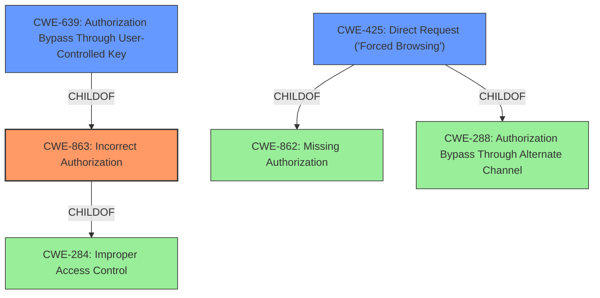

# Enhanced Analysis for CVE-2021-38345

# Summary
| CWE ID | CWE Name | Confidence | CWE Abstraction Level | CWE Vulnerability Mapping Label | CWE-Vulnerability Mapping Notes |
|---|---|---|---|---|---|
| CWE-863 | Incorrect Authorization | 1.0 | Class | Allowed-with-Review | Primary CWE |
| CWE-639 | Authorization Bypass Through User-Controlled Key | 0.7 | Base | Allowed | Secondary Candidate |
| CWE-425 | Direct Request ('Forced Browsing') | 0.6 | Base | Allowed | Secondary Candidate |

## Evidence and Confidence

*   **Confidence Score:** 0.9
*   **Evidence Strength:** HIGH

## Relationship Analysis
The primary CWE identified is CWE-863, "Incorrect Authorization," which is a Class-level CWE. Several Base-level CWEs are children of CWE-863, offering more specific classifications. CWE-639, "Authorization Bypass Through User-Controlled Key," and CWE-425 "Direct Request ('Forced Browsing')" are potential candidates due to the vulnerability's nature. The relationships between these CWEs helped refine the selection towards the most accurate representation of the vulnerability.



## Vulnerability Chain
The vulnerability chain starts with an **incorrect authorization check**. This allows logged-in users to bypass intended capability checks, leading to the ability to modify content. The chain can be summarized as:

1.  **Incorrect Authorization Check**: The Brizy plugin uses a flawed logic in its `is_administrator` functions (**ROOT CAUSE**).
2.  **Bypass Authorization**: Logged-in users are incorrectly granted administrator privileges.
3.  **Modify Content**: Users can modify any post or page created with the Brizy editor (**IMPACT**).

## Summary of Analysis
The initial assessment focused on identifying the root cause and impact of the vulnerability based on the provided evidence. The key phrase "**incorrect authorization check**" strongly suggests an authorization-related CWE. The provided information in "CVE Reference Links Content Summary" confirms that the vulnerability stems from flawed authorization logic within the `Brizy_Editor::is_administrator` and `Brizy_Editor_User:is_administrator` functions. Specifically, the use of the `is_admin()` function incorrectly grants administrator privileges based on whether a user is logged in and accessing the `wp-admin` area.

The Retriever Results listed CWE-863 "Incorrect Authorization" as a strong candidate. CWE-863 is a Class-level CWE, and its description aligns well with the vulnerability: "The product performs an authorization check when an actor attempts to access a resource or perform an action, but it does not correctly perform the check." The vulnerability description explicitly states an "**incorrect authorization check**," making CWE-863 a relevant and appropriate choice.

CWE-639 "Authorization Bypass Through User-Controlled Key" was also considered. Although the vulnerability allows bypassing authorization, it doesn't directly involve modification of a user-controlled key. The core issue is the flawed authorization logic, not the manipulation of keys. However, since any logged-in user can access any endpoint, it can be seen as bypassing the authorization using the logged-in state (a user-controlled state) which leads to the inclusion of CWE-639 as a secondary candidate.

CWE-425 "Direct Request ('Forced Browsing')" was considered because logged-in users could directly modify content without proper authorization.

CWE-284 "Improper Access Control" was considered but ultimately deemed too high-level. The mapping guidance for CWE-284 explicitly discourages its use and recommends more specific CWEs related to authorization.

Therefore, the primary mapping is CWE-863 because it directly addresses the **incorrect authorization check** that allows logged-in users to modify content without proper authorization. CWE-639 and CWE-425 are included as secondary candidates because they represent the means by which the authorization is bypassed.

Relevant CWE Information:

# Enhanced Context (25 CWEs)
The following CWEs were identified as potentially relevant to this vulnerability:

## CWE-639: Authorization Bypass Through User-Controlled Key
**Abstraction Level**: Base
**Similarity Score**: 0.78
**Source**: dense

**Description**:
The system's authorization functionality does not prevent one user from gaining access to another user's data or record by modifying the key value identifying the data.

**Mapping Guidance**:
- Usage: Allowed
- Rationale: This CWE entry is at the Base level of abstraction, which is a preferred level of abstraction for mapping to the root causes of vulnerabilities.

## CWE-472: External Control of Assumed-Immutable Web Parameter
**Abstraction Level**: Base
**Similarity Score**: 0.77
**Source**: dense

**Description**:
The web application does not sufficiently verify inputs that are assumed to be immutable but are actually externally controllable, such as hidden form fields.

**Mapping Guidance**:
- Usage: Allowed
- Rationale: This CWE entry is at the Base level of abstraction, which is a preferred level of abstraction for mapping to the root causes of vulnerabilities.

## CWE-1390: Weak Authentication
**Abstraction Level**: Class
**Similarity Score**: 0.76
**Source**: dense

**Description**:
The product uses an authentication mechanism to restrict access to specific users or identities, but the mechanism does not sufficiently prove that the claimed identity is correct.

**Mapping Guidance**:
- Usage: Allowed-with-Review
- Rationale: This CWE entry is a Class and might have Base-level children that would be more appropriate

## CWE-807: Reliance on Untrusted Inputs in a Security Decision
**Abstraction Level**: Base
**Similarity Score**: 0.76
**Source**: dense

**Description**:
The product uses a protection mechanism that relies on the existence or values of an input, but the input can be modified by an untrusted actor in a way that bypasses the protection mechanism.

**Mapping Guidance**:
- Usage: Allowed
- Rationale: This CWE entry is at the Base level of abstraction, which is a preferred level of abstraction for mapping to the root causes of vulnerabilities.

## CWE-425: Direct Request ('Forced Browsing')
**Abstraction Level**: Base
**Similarity Score**: 0.76
**Source**: dense

**Description**:
The web application does not adequately enforce appropriate authorization on all restricted URLs, scripts, or files.

**Mapping Guidance**:
- Usage: Allowed
- Rationale: This CWE entry is at the Base level of abstraction, which is a preferred level of abstraction for mapping to the root causes of vulnerabilities.

## CWE-668: Exposure of Resource to Wrong Sphere
**Abstraction Level**: Class
**Similarity Score**: 0.75
**Source**: dense

**Description**:
The product exposes a resource to the wrong control sphere, providing unintended actors with inappropriate access to the resource.

**Mapping Guidance**:
- Usage: Discouraged
- Rationale: CWE-668 is high-level and is often misused as a catch-all when lower-level CWE IDs might be applicable. It is sometimes used for low-information vulnerability reports [REF-1287]. It is a level-1 Class (i.e., a child of a Pillar). It is not useful for trend analysis.

## CWE-41: Improper Resolution of Path Equivalence
**Abstraction Level**: Base
**Similarity Score**: 0.75
**Source**: dense

**Description**:
The product is vulnerable to file system contents disclosure through path equivalence. Path equivalence involves the use of special characters in file and directory names. The associated manipulations are intended to generate multiple names for the same object.

**Mapping Guidance**:
- Usage: Allowed
- Rationale: This CWE entry is at the Base level of abstraction, which is a preferred level of abstraction for mapping to the root causes of vulnerabilities.

## CWE-74: Improper Neutralization of Special Elements in Output Used by a Downstream Component ('Injection')
**Abstraction Level**: Class
**Similarity Score**: 0.75
**Source**: dense

**Description**:


## CWE Relationship Analysis

Current CWEs represent these abstraction levels: .


### Vulnerability Chain Analysis

**Chain starting from CWE-288:**
- 288 (Authentication Bypass Using an Alternate Path or Channel) - ROOT


**Chain starting from CWE-862:**
- 862 (Missing Authorization) - ROOT


### CWE Relationship Diagram

```mermaid
graph TD
    classDef primary fill:#f96,stroke:#333,stroke-width:2px
    classDef secondary fill:#69f,stroke:#333
    classDef tertiary fill:#9e9,stroke:#333
```