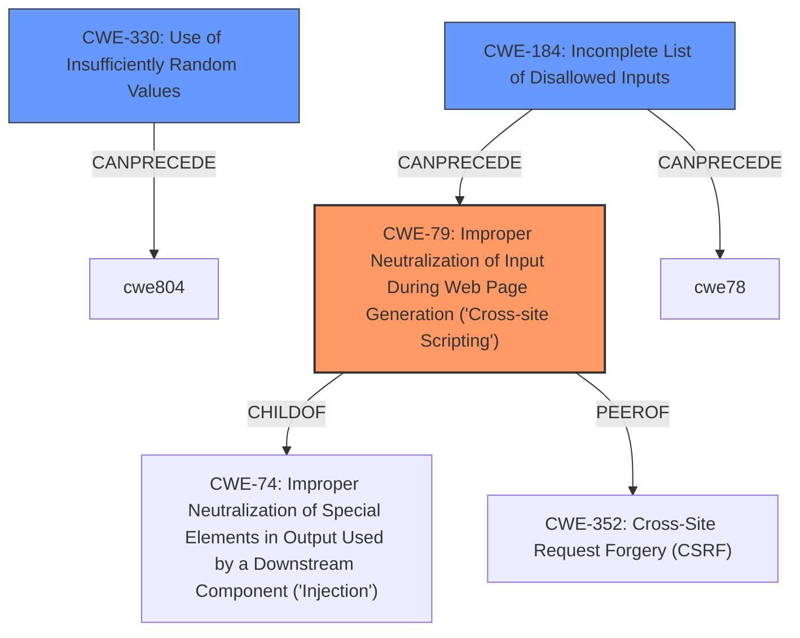

# Analysis for CVE-2021-38377

# Summary
| CWE ID | CWE Name | Confidence | CWE Abstraction Level | CWE Vulnerability Mapping Label | CWE-Vulnerability Mapping Notes |
|---|---|---|---|---|---|
| CWE-79 | Improper Neutralization of Input During Web Page Generation ('Cross-site Scripting') | 1.0 | Base | Allowed | Primary CWE: The vulnerability description explicitly mentions **XSS** and JavaScript injection, aligning with the core characteristics of this CWE. |
| CWE-330 | Use of Insufficiently Random Values | 0.7 | Class | Discouraged | Secondary CWE: The CVE Reference mentions "Predictable UUID Generation" which aligns with the description of this CWE, however, it is a Class level CWE and we have an option to assign CWE-79 which is a Base level. |
| CWE-184 | Incomplete List of Disallowed Inputs | 0.6 | Base | Allowed | Secondary CWE: The description includes "**anchor** HTML comment" which may have not been added to the disallowed list. |

## Evidence and Confidence

*   **Confidence Score:** 0.9
*   **Evidence Strength:** HIGH

## Relationship Analysis
The primary CWE, CWE-79 [Improper Neutralization of Input During Web Page Generation ('Cross-site Scripting')], is a base-level CWE that accurately reflects the root cause of the vulnerability. It has a child-parent relationship with CWE-74 and peer relationship with CWE-352. The secondary CWE, CWE-330 [Use of Insufficiently Random Values], is a class-level CWE and represents the predictable UUID generation. The third CWE CWE-184 [Incomplete List of Disallowed Inputs] is a base-level CWE and represents the incomplete list of disallowed inputs.

## Vulnerability Chain
The vulnerability chain starts with the **improper sanitization** of input within truncated emails, specifically within **anchor** HTML comments. This leads to **XSS** because JavaScript code can be injected. The predictable UUID generation further exacerbates the issue.

CWE-184 (Incomplete List of Disallowed Inputs) -> CWE-79 (Improper Neutralization of Input During Web Page Generation)

## Summary of Analysis
The initial assessment identified **XSS** as the primary weakness, supported by the vulnerability description and CVE details. The reference to predictable UUIDs led to the consideration of CWE-330. The inclusion of the **anchor** HTML comment led to the consideration of CWE-184.

The final decision is based on the evidence from the vulnerability description and CVE Reference Links Content Summary.
The vulnerability details explicitly state that the root cause is the use of predictable UUIDs for anchor comments without sanitization, leading to **XSS**.

CWE-79 is selected as the primary CWE because it directly addresses the **XSS** vulnerability resulting from **improper neutralization** of input. This decision is supported by the high retriever score and the MITRE mapping guidance, which allows for the use of base-level CWEs.

CWE-330 is a secondary CWE because the "Predictable UUID Generation" aligns with the CWE Description, but the **XSS** is the more concerning issue to highlight.

CWE-184 is a secondary CWE because the **anchor** HTML comment may not have been added to the list of disallowed inputs.