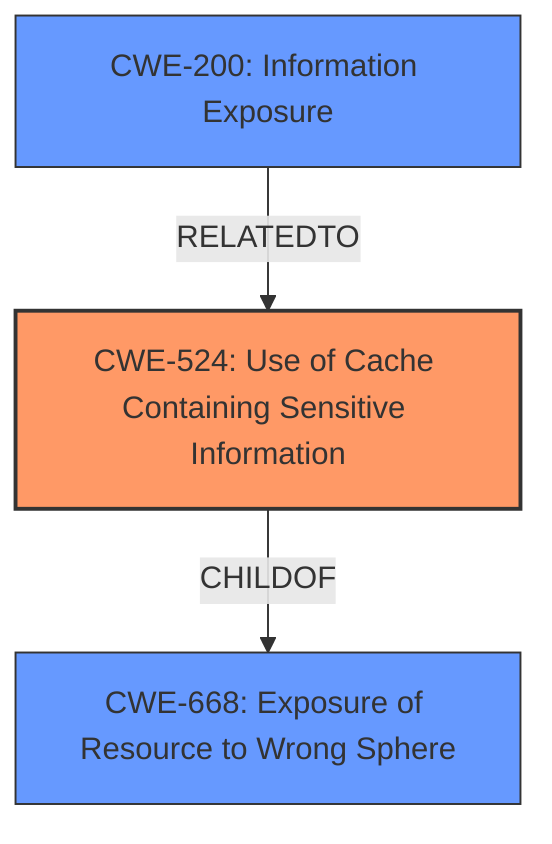

# Enhanced Analysis for CVE-2021-38378

# Summary
| CWE ID | CWE Name | Confidence | CWE Abstraction Level | CWE Vulnerability Mapping Label | CWE-Vulnerability Mapping Notes |
|---|---|---|---|---|---|
| CWE-524 | Use of Cache Containing Sensitive Information | 0.8 | Base | Allowed | Primary CWE |
| CWE-200 | Information Exposure | 0.6 | Class | Allowed | Secondary CWE |

## Evidence and Confidence

*   **Confidence Score:** 0.7
*   **Evidence Strength:** MEDIUM

## Relationship Analysis
The primary relationship that influenced the decision was the ChildOf relationship between CWE-524 (Use of Cache Containing Sensitive Information) and CWE-668 (Exposure of Resource to Wrong Sphere). Although CWE-668 is a parent, CWE-524 provides a more specific description of the vulnerability related to caching. Also, CWE-524 is related to the final impact which is the leakage of information.



## Vulnerability Chain
The vulnerability chain starts with the **caching mechanism** (**rootcause**) which leads to the exposure of sensitive information (**impact**).
  - **Root Cause**: **Caching Mechanism**
  - **Weakness**: **Use of Cache Containing Sensitive Information (CWE-524)**
  - **Impact**: **Information Exposure (CWE-200)**

## Summary of Analysis
The initial analysis focused on identifying the root cause and the resulting impact. The vulnerability description clearly states that a **caching mechanism** is the **rootcause** and that this leads to Information Exposure as the impact. The retriever results and similar CVE descriptions suggested CWE-524 (Use of Cache Containing Sensitive Information), which aligns well with the **caching mechanism** **rootcause** and the fact that the cache contains sensitive information.

The **CVE Reference Links Content Summary** confirms that the **root cause** is a caching mechanism.

> "A caching mechanism for files in OX Drive did not consider the context identifier of a specific object."

The "Weaknesses" section of the CVE summary mentions Information Disclosure (CWE-200), which is a general information exposure CWE.

> "Weaknesses": [ "Information Disclosure (CWE-200)" ]

Therefore, the primary CWE is CWE-524 (Use of Cache Containing Sensitive Information), and a secondary CWE is CWE-200 (Information Exposure).

CWE-524 is at the Base level of abstraction, which is preferred, and the mapping guidance indicates that it is ALLOWED. CWE-200 is a class level, so it will be secondary.

Other CWEs Considered but Not Used:

*   CWE-330 (Use of Insufficiently Random Values): This CWE was not chosen because the vulnerability is not related to random number generation.
*   CWE-319 (Cleartext Transmission of Sensitive Information): This CWE was not chosen because the vulnerability is not related to transmitting data in cleartext.
*   CWE-113 (Improper Neutralization of CRLF Sequences in HTTP Headers ('HTTP Request/Response Splitting')): This CWE was not chosen because the vulnerability is not related to HTTP request/response splitting.
*   CWE-79 (Improper Neutralization of Input During Web Page Generation ('Cross-site Scripting')): This CWE was not chosen because the vulnerability is not related to cross-site scripting.
*   CWE-444 (Inconsistent Interpretation of HTTP Requests ('HTTP Request/Response Smuggling')): This CWE was not chosen because the vulnerability is not related to HTTP request smuggling.

Relevant CWE Information:

# Enhanced Context (25 CWEs)

## CWE-524: Use of Cache Containing Sensitive Information
**CWE-524 (Use of Cache Containing Sensitive Information)** accurately describes the vulnerability, as the **caching mechanism** stores sensitive information (a person's name) that is exposed due to improper access controls or context identifiers. This directly aligns with the vulnerability description. The security implication is that unauthorized users may gain access to confidential information. The mapping guidance indicates that CWE-524 is at the Base level of abstraction and is ALLOWED.

## CWE-200: Information Exposure
**CWE-200 (Information Exposure)** describes the impact of the vulnerability. Due to the caching mechanism, sensitive information (a person's name) is exposed to unauthorized users. This aligns with the impact described in the vulnerability description. This is a class level CWE and therefore will be a secondary mapping.


## CWE Relationship Analysis

Current CWEs represent these abstraction levels: .


### Vulnerability Chain Analysis

**Chain starting from CWE-113:**
- 113 (Improper Neutralization of CRLF Sequences in HTTP Headers ('HTTP Request/Response Splitting')) - ROOT


**Chain starting from CWE-79:**
- 79 (Improper Neutralization of Input During Web Page Generation ('Cross-site Scripting')) - ROOT


### CWE Relationship Diagram

```mermaid
graph TD
    classDef primary fill:#f96,stroke:#333,stroke-width:2px
    classDef secondary fill:#69f,stroke:#333
    classDef tertiary fill:#9e9,stroke:#333
```