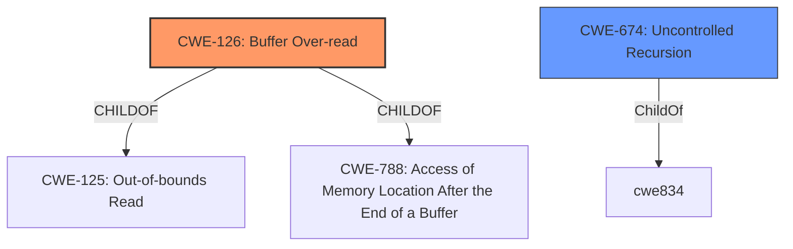

# Enhanced Analysis for CVE-2021-38380

# Summary
| CWE ID  | CWE Name  | Confidence | CWE Abstraction Level | CWE Vulnerability Mapping Label | CWE-Vulnerability Mapping Notes |
|---|---|---|---|---|---|
| CWE-126 | Buffer Over-read | 0.9 | Variant | Allowed | Primary CWE |
| CWE-674 | Uncontrolled Recursion | 0.6 | Class | Allowed-with-Review | Secondary Candidate |

## Evidence and Confidence

*   **Confidence Score:** 0.75
*   **Evidence Strength:** MEDIUM

## Relationship Analysis
The primary relationship influencing the decision is the hierarchical one. CWE-126 is a variant of CWE-125 (Out-of-bounds Read) and CWE-788 (Access of Memory Location After the End of a Buffer). The description mentions a "**stack-based buffer over-read**", indicating the read happens beyond the buffer's boundary. CWE-674 (Uncontrolled Recursion) is considered because the vulnerability description mentions "recursion".



## Vulnerability Chain
The vulnerability chain involves a huge request causing recursion, which leads to a **stack-based buffer over-read**.

## Summary of Analysis
The initial analysis focused on the "**stack-based buffer over-read**" and "recursion" aspects of the vulnerability description. The evidence from the vulnerability description key phrases directly supports the selection of CWE-126. While the CVE Reference Links Content Summary is unrelated, the vulnerability description itself provides sufficient information. The "recursion" aspect suggests CWE-674, but the primary issue is clearly the buffer over-read on the stack. Therefore, CWE-126 is the primary CWE, and CWE-674 is a secondary consideration.

Relevant CWE Information:

*   **CWE-126: Buffer Over-read:** The vulnerability description states "**stack-based buffer over-read**," which aligns directly with CWE-126's description: "The product reads from a buffer using buffer access mechanisms such as indexes or pointers that reference memory locations after the targeted buffer."
*   **CWE-674: Uncontrolled Recursion:** The vulnerability description mentions "recursion," which is directly related to CWE-674: "The product does not properly control the amount of recursion that takes place, consuming excessive resources, such as allocated memory or the program stack." This is a possible secondary factor as the recursion leads to the over-read.

CWEs considered but not used:

*   CWE-121 (Stack-based Buffer Overflow): While the issue is stack-based, the vulnerability is an over-read, not an overflow (write).
*   CWE-770 (Allocation of Resources Without Limits or Throttling), CWE-1284 (Improper Validation of Specified Quantity in Input), CWE-1325 (Improperly Controlled Sequential Memory Allocation), CWE-789 (Memory Allocation with Excessive Size Value), CWE-401 (Missing Release of Memory after Effective Lifetime), CWE-122 (Heap-based Buffer Overflow), and CWE-193 (Off-by-one Error): These were considered but deemed less relevant than CWE-126 as they do not directly address the **buffer over-read** issue.


## CWE Relationship Analysis

Current CWEs represent these abstraction levels: .


### Vulnerability Chain Analysis

**Chain starting from CWE-121:**
- 121 (Stack-based Buffer Overflow) - ROOT


**Chain starting from CWE-674:**
- 674 (Uncontrolled Recursion) - ROOT


### CWE Relationship Diagram

```mermaid
graph TD
    classDef primary fill:#f96,stroke:#333,stroke-width:2px
    classDef secondary fill:#69f,stroke:#333
    classDef tertiary fill:#9e9,stroke:#333
```