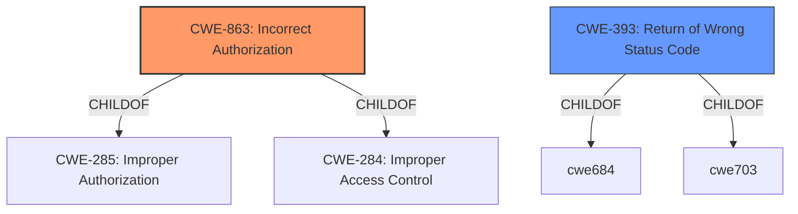

# Analysis for CVE-2021-38384

# Summary
| CWE ID | CWE Name | Confidence | CWE Abstraction Level | CWE Vulnerability Mapping Label | CWE-Vulnerability Mapping Notes |
|---|---|---|---|---|---|
| CWE-863 | Incorrect Authorization | 0.9 | Class | Primary | Allowed-with-Review |
| CWE-393 | Return of Wrong Status Code | 0.7 | Base | Secondary | Allowed |

## Evidence and Confidence

*   **Confidence Score:** 0.8
*   **Evidence Strength:** HIGH

## Relationship Analysis
The primary CWE is CWE-863 (Incorrect Authorization), which is a Class-level CWE. This is related to the fact that the serverless-offline plugin incorrectly handles routes with trailing slashes, leading to a discrepancy in authorization behavior. CWE-863 has child-of relationships to CWE-285 (Improper Authorization) and CWE-284 (Improper Access Control). However, the provided information doesn't give sufficient details to use a more specific child CWE. CWE-393 (Return of Wrong Status Code) is a base-level CWE and a candidate to consider.

## Vulnerability Chain
The vulnerability chain starts with the **incorrect handling of routes** by the serverless-offline plugin. This leads to a **discrepancy in authorization** between the local development environment and the actual AWS environment. The final impact is that developers might implement **incorrect access controls** due to the misleading 403 status code.

## Summary of Analysis
The primary weakness is **incorrect authorization** (CWE-863) because the serverless-offline plugin's **incorrect handling of routes** with trailing slashes leads to a discrepancy in authorization behavior between local and production environments. The CVE reference clearly states that the plugin "incorrectly handles routes" which results in "incorrect authorization implementation".

The retriever results suggested several potential CWEs. CWE-863 (Incorrect Authorization) was selected because the root cause of the vulnerability lies in the plugin's **incorrect authorization** mechanism related to routes with trailing slashes.

CWE-393 (Return of Wrong Status Code) was considered as a secondary CWE because the plugin returns a 403 status code when it should return a 200 status code. This **incorrect status code** can mislead developers into implementing incorrect access controls.

The provided information indicates that the serverless-offline plugin's **incorrect handling of routes** with trailing slashes leads to a discrepancy in authorization behavior between local and production environments. The plugin returns a 403 status code locally, while AWS returns a 200 status code. This discrepancy can mislead developers into implementing **incorrect access controls**.

Relevant CWE Information:

# Enhanced Context (25 CWEs)

## CWE-130: Improper Handling of Length Parameter Inconsistency
**Abstraction Level**: Base
**Similarity Score**: 0.80
**Source**: dense

**Description**:
The product parses a formatted message or structure, but it does not handle or incorrectly handles a length field that is inconsistent with the actual length of the associated data.
## CWE-393: Return of Wrong Status Code
**Abstraction:** Base
**Status:** Draft

### Description
A function or operation returns an incorrect return value or status code that does not indicate an error, but causes the product to modify its behavior based on the incorrect result.

### Extended Description
This can lead to unpredictable behavior. If the function is used to make security-critical decisions or provide security-critical information, then the wrong status code can cause the product to assume that an action is safe, even when it is not.
## CWE-863: Incorrect Authorization
**Abstraction:** Class
**Status:** Incomplete

### Description
The product performs an authorization check when an actor attempts to access a resource or perform an action, but it does not correctly perform the check.

### Extended Description
Not provided

### Alternative Terms
AuthZ: "AuthZ" is typically used as an abbreviation of "authorization" within the web application security community. It is distinct from "AuthN" (or, sometimes, "AuthC") which is an abbreviation of "authentication." The use of "Auth" as an abbreviation is discouraged, since it could be used for either authentication or authorization.