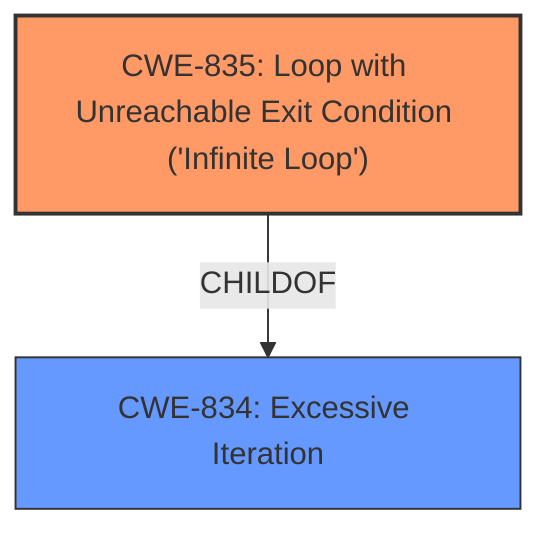

# Enhanced Analysis for CVE-2021-38387

# Summary
| CWE ID  | CWE Name                                         | Confidence | CWE Abstraction Level | CWE Vulnerability Mapping Label | CWE-Vulnerability Mapping Notes |
| :-------- | :----------------------------------------------- | :--------- | :---------------------- | :------------------------------ | :----------------------------- |
| CWE-835   | Loop with Unreachable Exit Condition ('Infinite Loop') | 0.9      | Base                    | Primary                         | Allowed                      |

## Evidence and Confidence

*   **Confidence Score:** 0.9
*   **Evidence Strength:** HIGH

## Relationship Analysis

The primary CWE is CWE-835, which is a Base level CWE. It is related to CWE-834 (Excessive Iteration) as a ChildOf. This relationship suggests that an unreachable exit condition is a specific type of excessive iteration. There are no other relationships that heavily influence the selection in this case.



## Vulnerability Chain

The vulnerability chain starts with the Telnet server silently quitting (before disconnection with clients), leading to clients entering an infinite loop, and finally resulting in excessive CPU consumption.

## Summary of Analysis

The analysis is based on the provided vulnerability description and the supporting information extracted from the CVE reference links. The root cause of the vulnerability is a **lack of proper error handling** in the Telnet server, which leads to an infinite loop in the client.

The vulnerability description states: "In Contiki 3.0, a Telnet server that silently quits (before disconnection with clients) leads to connected clients entering an infinite loop and waiting forever, which may cause excessive CPU consumption."

The **CVE Reference Links Content Summary** states:
"The root cause of the issue is that when a telnet server in Contiki OS is unexpectedly interrupted, it quits without sending an alert to the connected client."
"The impact is that the telnet client gets stuck waiting indefinitely, consuming CPU resources until they run out."

Based on this evidence, CWE-835 (Loop with Unreachable Exit Condition ('Infinite Loop')) is the most appropriate CWE because the Telnet client enters a loop with no way to exit when the server quits silently. The evidence explicitly mentions "infinite loop."

CWE-835 is at the optimal level of specificity, as it directly describes the **infinite loop** condition triggered by the server's silent exit.

Relevant CWE Information:

# Enhanced Context (25 CWEs)

## CWE-835: Loop with Unreachable Exit Condition ('Infinite Loop')
**Abstraction:** Base
**Similarity Score**: 5608.28
**Source**: sparse

**Description**:
The product contains an iteration or loop with an exit condition that cannot be reached, i.e., an infinite loop.

**Mapping Guidance**:
- Usage: Allowed
- Rationale: This CWE entry is at the Base level of abstraction, which is a preferred level of abstraction for mapping to the root causes of vulnerabilities.

## CWE-834: Excessive Iteration
**Abstraction:** Class
**Similarity Score**: 5320.65
**Source**: sparse

**Description**:
The product performs an iteration or loop without sufficiently limiting the number of times that the loop is executed.

**Mapping Guidance**:
- Usage: Discouraged
- Rationale: This CWE entry is a level-1 Class (i.e., a child of a Pillar). It might have lower-level children that would be more appropriate

### CWEs Considered but Not Used:

*   **CWE-834 (Excessive Iteration):** While the vulnerability involves a loop, the key aspect is that the loop has an unreachable exit condition, making CWE-835 a more precise fit. CWE-834 is a more general class and not as descriptive as CWE-835.
*   **CWE-400 (Uncontrolled Resource Consumption):** This CWE describes the impact of the vulnerability (excessive CPU consumption) but not the root cause (the infinite loop). Therefore, it is not the primary CWE.
*   **CWE-770 (Allocation of Resources Without Limits or Throttling):** Not applicable as the vulnerability does not involve resource allocation.
*   **CWE-394 (Unexpected Status Code or Return Value):** This CWE is more focused on improper error handling related to return values. While the Telnet server's silent quit could be considered an unexpected event, the resulting infinite loop is more directly captured by CWE-835.
*   **CWE-1322 (Use of Blocking Code in Single-threaded, Non-blocking Context):** Although related to resource consumption, this is not relevant as there is no blocking code.
*   **CWE-789 (Memory Allocation with Excessive Size Value):** There is no indication of memory allocation issues.
*   **CWE-130 (Improper Handling of Length Parameter Inconsistency):** There is no length parameter handling involved.
*   **CWE-407 (Inefficient Algorithmic Complexity):** While excessive CPU usage is a consequence, the core issue is an infinite loop due to a missing exit condition, not algorithmic inefficiency.


## CWE Relationship Analysis

Current CWEs represent these abstraction levels: .


### Vulnerability Chain Analysis

**Chain starting from CWE-394:**
- 394 (Unexpected Status Code or Return Value) - ROOT


**Chain starting from CWE-1322:**
- 1322 (Use of Blocking Code in Single-threaded, Non-blocking Context) - ROOT


### CWE Relationship Diagram

```mermaid
graph TD
    classDef primary fill:#f96,stroke:#333,stroke-width:2px
    classDef secondary fill:#69f,stroke:#333
    classDef tertiary fill:#9e9,stroke:#333
```