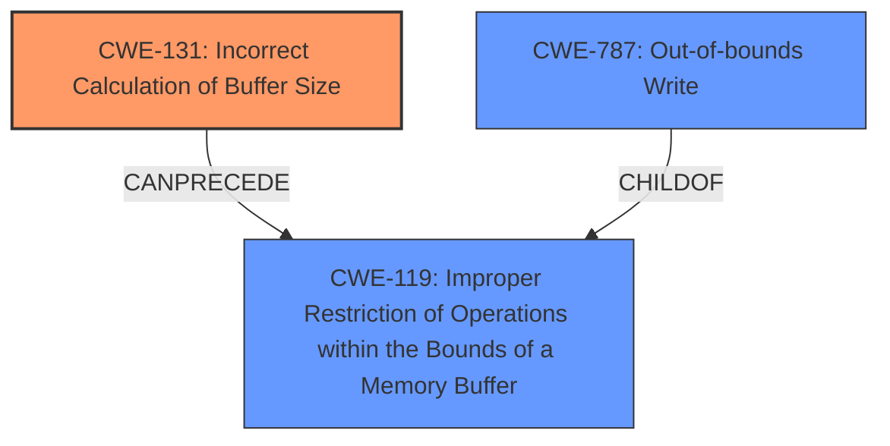

# Enhanced Analysis for CVE-2021-38423

# Summary
| CWE ID | CWE Name | Confidence | CWE Abstraction Level | CWE Vulnerability Mapping Label | CWE-Vulnerability Mapping Notes |
|---|---|---|---|---|---|
| CWE-131 | Incorrect Calculation of Buffer Size | 0.9 | Base | Allowed | Primary CWE |
| CWE-119 | Improper Restriction of Operations within the Bounds of a Memory Buffer | 0.6 | Class | Discouraged | Secondary Candidate |
| CWE-787 | Out-of-bounds Write | 0.5 | Base | Allowed | Secondary Candidate |

## Evidence and Confidence

*   **Confidence Score:** 0.8
*   **Evidence Strength:** HIGH

## Relationship Analysis
The primary CWE selected is CWE-131 (Incorrect Calculation of Buffer Size), a **Base** level CWE that directly addresses the **root cause** identified in the vulnerability description: the product **improperly calculates the size to be used when allocating the buffer**. It `CanPrecede` CWE-119.

CWE-119 (Improper Restriction of Operations within the Bounds of a Memory Buffer) is a **Class** level CWE and a parent of CWE-131. It is considered because a buffer overflow, which is a consequence of the incorrect calculation, falls under the broader category of improper memory buffer restrictions. However, CWE-119 is `Discouraged` when more specific information is available.

CWE-787 (Out-of-bounds Write) is also considered as a potential consequence of the incorrect buffer size calculation leading to writing outside the allocated memory.



## Vulnerability Chain
The vulnerability chain starts with:
1.  **CWE-131 (Incorrect Calculation of Buffer Size):** The software incorrectly calculates the required buffer size during allocation.
2.  This leads to a buffer that is too small.
3.  When data is written to this undersized buffer, it overflows:
4.  Potentially resulting in **CWE-787 (Out-of-bounds Write)**.

## Summary of Analysis
The initial assessment focused on the **root cause** of the vulnerability, which is the incorrect calculation of the buffer size. This aligned well with CWE-131. While the vulnerability description mentions a "buffer overflow," directly mapping to a buffer overflow CWE (like CWE-120) would be less precise as it describes the symptom rather than the cause.

The CISA advisory explicitly states the **root cause** as "Incorrect calculation of buffer size when allocating memory" and links it to CWE-131. This provides strong evidence for selecting CWE-131 as the primary mapping.

The relationships between CWEs further solidify this decision. CWE-131 `CanPrecede` CWE-119, indicating that an incorrect buffer size calculation can lead to improper memory restrictions. This chain of events is precisely what the vulnerability description outlines.

The final decision is to assign CWE-131 as the primary CWE because it directly addresses the **root cause** of the vulnerability. CWE-119 and CWE-787 are considered as secondary candidates as they represent potential consequences of the primary weakness. This approach ensures a precise and comprehensive classification of the vulnerability.

Relevant CWE Information:

# Enhanced Context (25 CWEs)
The following CWEs were identified as potentially relevant to this vulnerability:

## CWE-131: Incorrect Calculation of Buffer Size
**Abstraction Level**: Base
**Similarity Score**: 0.78
**Source**: dense

**Description**:
The product does not correctly calculate the size to be used when allocating a buffer, which could lead to a buffer overflow.

**Mapping Guidance**:
- Usage: Allowed
- Rationale: This CWE entry is at the Base level of abstraction, which is a preferred level of abstraction for mapping to the root causes of vulnerabilities.

## CWE-119: Improper Restriction of Operations within the Bounds of a Memory Buffer
**Abstraction Level**: Class
**Similarity Score**: 0.75
**Source**: dense

**Description**:
The product performs operations on a memory buffer, but it reads from or writes to a memory location outside the buffer's intended boundary. This may result in read or write operations on unexpected memory locations that could be linked to other variables, data structures, or internal program data.

**Mapping Guidance**:
- Usage: Discouraged
- Rationale:** CWE-119 is commonly misused in low-information vulnerability reports when lower-level CWEs could be used instead, or when more details about the vulnerability are available.

## CWE-787: Out-of-bounds Write
**Abstraction Level**: base
**Similarity Score**: 3.30
**Source**: graph

**Description**:
CWE-787: Out-of-bounds Write

**Mapping Guidance**:
- Usage: Allowed
- Rationale: This CWE entry is at the Base level of abstraction, which is a preferred level of abstraction for mapping to the root causes of vulnerabilities.


## CWE Relationship Analysis

Current CWEs represent these abstraction levels: .


### Vulnerability Chain Analysis

**Chain starting from CWE-787:**
- 787 (Out-of-bounds Write) - ROOT


**Chain starting from CWE-131:**
- 131 (Incorrect Calculation of Buffer Size) - ROOT


### CWE Relationship Diagram

```mermaid
graph TD
    classDef primary fill:#f96,stroke:#333,stroke-width:2px
    classDef secondary fill:#69f,stroke:#333
    classDef tertiary fill:#9e9,stroke:#333
```