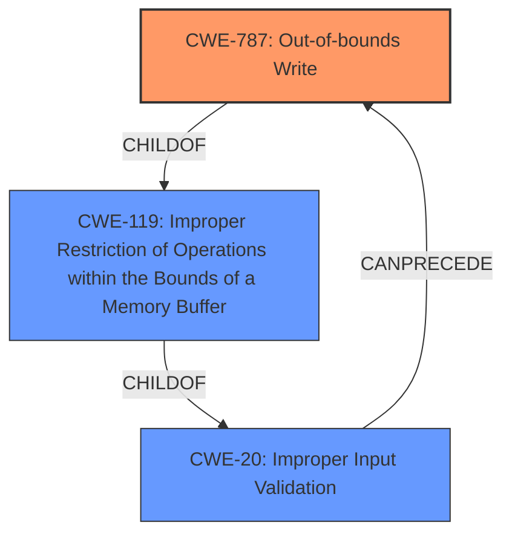

# Analysis Report for CVE-2021-38436

# Vulnerability Analysis Report: CVE-2021-38436

## Description


## Analysis (with Relationship Data)

# Summary
| CWE ID    | CWE Name                                                                     | Confidence | CWE Abstraction Level | CWE Vulnerability Mapping Label | CWE-Vulnerability Mapping Notes |
| :-------- | :--------------------------------------------------------------------------- | :--------- | :-------------------- | :------------------------------ | :------------------------------ |
| CWE-787   | Out-of-bounds Write                                                          | 0.9        | Base                  | Primary                         | Allowed                       |
| CWE-119   | Improper Restriction of Operations within the Bounds of a Memory Buffer   | 0.7        | Class                 | Secondary                       | Discouraged                    |
| CWE-20    | Improper Input Validation                                                   | 0.6        | Class                 | Secondary                       | Discouraged                     |

## Evidence and Confidence

*   **Confidence Score:** 0.8
*   **Evidence Strength:** HIGH

## Relationship Analysis
The primary weakness is **CWE-787 (Out-of-bounds Write)**, which is a child of **CWE-119 (Improper Restriction of Operations within the Bounds of a Memory Buffer)**. The vulnerability description indicates a **lack of proper validation of user-supplied data**, which can be classified as **CWE-20 (Improper Input Validation)**, and can lead to memory corruption. Since **CWE-787 (Out-of-bounds Write)** is a more specific weakness, it is chosen as the primary CWE. **CWE-119 (Improper Restriction of Operations within the Bounds of a Memory Buffer)** is a Class-level CWE and is too general, and is discouraged according to MITRE mapping guidance.



## Vulnerability Chain
The vulnerability chain starts with **CWE-20 (Improper Input Validation)**, as the application **lacks proper validation of user-supplied data**. This leads to **CWE-787 (Out-of-bounds Write)**, resulting in a memory corruption condition and ultimately enabling arbitrary code execution.

## Summary of Analysis
The initial assessment identifies the primary weakness as **CWE-787 (Out-of-bounds Write)**, supported by the evidence: "FATEK Automation WinProladder versions 3.30 and prior **lacks proper validation of user-supplied data** when parsing project files, which could result in a memory-corruption condition." The **lack of proper validation of user-supplied data** (CWE-20) when parsing project files leads to a memory corruption condition (CWE-787).

The graph relationships clearly show the chain from **CWE-20 (Improper Input Validation)** leading to **CWE-787 (Out-of-bounds Write)** through **CWE-119 (Improper Restriction of Operations within the Bounds of a Memory Buffer)**. **CWE-787 (Out-of-bounds Write)** is a Base-level CWE, which is the optimal level of specificity for this vulnerability.

The selection of **CWE-787 (Out-of-bounds Write)** is based on the evidence provided, the retriever results, and the MITRE mapping guidance. It accurately represents the vulnerability where the application writes data past the end or before the beginning of the intended buffer due to **lack of proper validation of user-supplied data**.

Other CWEs Considered:

*   CWE-20: Improper Input Validation - Considered but classified as a contributing factor rather than the primary weakness.
*   CWE-119: Improper Restriction of Operations within the Bounds of a Memory Buffer - Considered, but **CWE-787 (Out-of-bounds Write)** is a more specific child, and the mapping guidance discourages using this CWE.
*   CWE-120: Buffer Copy without Checking Size of Input ('Classic Buffer Overflow') - Considered, but the description doesn't explicitly state that the vulnerability is due to a buffer copy operation.
*   CWE-121: Stack-based Buffer Overflow and CWE-122: Heap-based Buffer Overflow - These are variants of buffer overflows, but the description doesn't specify whether the overflow occurs on the stack or heap. Therefore, it's more accurate to classify it as a general out-of-bounds write (CWE-787).


## CWE Relationship Analysis

Current CWEs represent these abstraction levels: .


### Vulnerability Chain Analysis

**Chain starting from CWE-787:**
- 787 (Out-of-bounds Write) - ROOT


**Chain starting from CWE-121:**
- 121 (Stack-based Buffer Overflow) - ROOT


### CWE Relationship Diagram

```mermaid
graph TD
    classDef primary fill:#f96,stroke:#333,stroke-width:2px
    classDef secondary fill:#69f,stroke:#333
    classDef tertiary fill:#9e9,stroke:#333
```


*Report generated on 2025-04-01 22:26:09*
