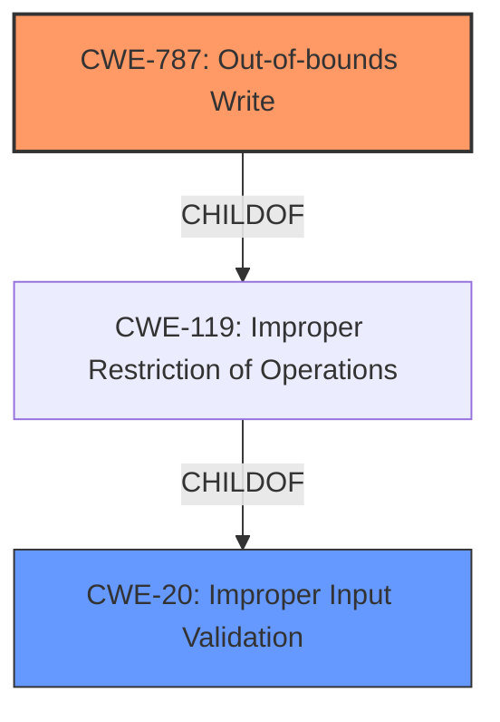

# Enhanced Analysis for CVE-2021-38442

# Summary
| CWE ID | CWE Name | Confidence | CWE Abstraction Level | CWE Vulnerability Mapping Label | CWE-Vulnerability Mapping Notes |
|---|---|---|---|---|---|
| CWE-787 | Out-of-bounds Write | 1.0 | Base | Primary | Allowed |
| CWE-20 | Improper Input Validation | 0.6 | Class | Secondary | Discouraged |

## Evidence and Confidence

*   **Confidence Score:** 0.9
*   **Evidence Strength:** HIGH

## Relationship Analysis
The primary CWE, CWE-787, is a child of CWE-119 (Improper Restriction of Operations within the Bounds of a Memory Buffer). CWE-787 directly addresses the **out-of-bounds write** condition resulting from **lack of validation of user-supplied data**. CWE-20, a class-level CWE, is too general but relevant as the root cause is **lack of input validation**.



## Vulnerability Chain
The vulnerability chain starts with the **lack of proper validation of user-supplied data** (CWE-20), leading to an **out-of-bounds write** (CWE-787), and ultimately causing a heap-corruption condition, which can be exploited for arbitrary code execution.

## Summary of Analysis
The initial analysis correctly identified CWE-787 as a strong candidate based on the vulnerability description and similar CVEs. The retriever results also supported this choice, with CWE-787 having a high score.

The provided evidence clearly states: "FATEK Automation WinProladder versions 3.30 and prior **lacks proper validation of user-supplied data** when parsing project files, which could result in an **heap-corruption condition**." This aligns perfectly with CWE-787 which describes writing data past the end or before the beginning of the intended buffer.

CWE-20 was also considered because the **root cause** is the **lack of proper validation of user-supplied data**. However, CWE-20 is a class-level CWE and the guidance recommends against its use when more specific CWEs are available. Since CWE-787 accurately describes the **out-of-bounds write** condition, it is the more appropriate choice.

Other CWEs like integer overflow/underflow (CWE-190/CWE-191) and buffer copy without checking size (CWE-120) were considered but discarded as the primary issue isn't about integer manipulation or unchecked buffer copies, but rather the **lack of validation** leading to the **out-of-bounds write**.

The selection of CWE-787 is at the optimal level of specificity because it directly addresses the technical weakness (**out-of-bounds write**) caused by the **lack of input validation**. While CWE-20 represents the **root cause**, CWE-787 describes the specific coding error that leads to the vulnerability.

Relevant CWE Information:

# Enhanced Context (25 CWEs)
The following CWEs were identified as potentially relevant to this vulnerability:

## CWE-805: Buffer Access with Incorrect Length Value
**Abstraction Level**: Base
**Similarity Score**: 0.76
**Source**: dense

**Description**:
The product uses a sequential operation to read or write a buffer, but it uses an incorrect length value that causes it to access memory that is outside of the bounds of the buffer.

**Mapping Guidance**:
- Usage: Allowed
- Rationale: This CWE entry is at the Base level of abstraction, which is a preferred level of abstraction for mapping to the root causes of vulnerabilities.

I considered this CWE but it was not selected because it is more focused on **incorrect length value** and not as relevant as **lack of input validation** leading to an **out-of-bounds write**.

## CWE-131: Incorrect Calculation of Buffer Size
**Abstraction Level**: Base
**Similarity Score**: 0.76
**Source**: dense

**Description**:
The product does not correctly calculate the size to be used when allocating a buffer, which could lead to a buffer overflow.

**Mapping Guidance**:
- Usage: Allowed
- Rationale: This CWE entry is at the Base level of abstraction, which is a preferred level of abstraction for mapping to the root causes of vulnerabilities.

I considered this CWE but it was not selected because it is more focused on **incorrect buffer size calculation** and not as relevant as **lack of input validation** leading to an **out-of-bounds write**.

## CWE-191: Integer Underflow (Wrap or Wraparound)
**Abstraction Level**: Base
**Similarity Score**: 0.76
**Source**: dense

**Description**:
The product subtracts one value from another, such that the result is less than the minimum allowable integer value, which produces a value that is not equal to the correct result.

**Mapping Guidance**:
- Usage: Allowed
- Rationale: This CWE entry is at the Base level of abstraction, which is a preferred level of abstraction for mapping to the root causes of vulnerabilities.

I considered this CWE but it was not selected because it is more focused on **integer underflow** and not as relevant as **lack of input validation** leading to an **out-of-bounds write**.

## CWE-124: Buffer Underwrite ('Buffer Underflow')
**Abstraction Level**: Base
**Similarity Score**: 0.76
**Source**: dense

**Description**:
The product writes to a buffer using an index or pointer that references a memory location prior to the beginning of the buffer.

**Mapping Guidance**:
- Usage: Allowed
- Rationale: This CWE entry is at the Base level of abstraction, which is a preferred level of abstraction for mapping to the root causes of vulnerabilities.

I considered this CWE but it was not selected because it is more focused on **buffer underwrite** and not as relevant as **lack of input validation** leading to an **out-of-bounds write**.

## CWE-1289: Improper Validation of Unsafe Equivalence in Input
**Abstraction Level**: Base
**Similarity Score**: 0.75
**Source**: dense

**Description**:
The product receives an input value that is used as a resource identifier or other type of reference, but it does not validate or incorrectly validates that the input is equivalent to a potentially-unsafe value.

**Mapping Guidance**:
- Usage: Allowed
- Rationale: This CWE entry is at the Base level of abstraction, which is a preferred level of abstraction for mapping to the root causes of vulnerabilities.

I considered this CWE but it was not selected because it is more focused on **unsafe equivalence** and not as relevant as **lack of input validation** leading to an **out-of-bounds write**.

## CWE-126: Buffer Over-read
**Abstraction Level**: Variant
**Similarity Score**: 0.74
**Source**: dense

**Description**:
The product reads from a buffer using buffer access mechanisms such as indexes or pointers that reference memory locations after the targeted buffer.

**Mapping Guidance**:
- Usage: Allowed
- Rationale: This CWE entry is at the Variant level of abstraction, which is a preferred level of abstraction for mapping to the root causes of vulnerabilities.

I considered this CWE but it was not selected because it is more focused on **buffer over-read** and not as relevant as **lack of input validation** leading to an **out-of-bounds write**.

## CWE-125: Out-of-bounds Read
**Abstraction Level**: Base
**Similarity Score**: 0.74
**Source**: dense

**Description**:
The product reads data past the end, or before the beginning, of the intended buffer.

**Mapping Guidance**:
- Usage: Allowed
- Rationale: This CWE entry is at the Base level of abstraction, which is a preferred level of abstraction for mapping to the root causes of vulnerabilities.

I considered this CWE but it was not selected because it is more focused on **out-of-bounds read** and not as relevant as **lack of input validation** leading to an **out-of-bounds write**.

## CWE-681: Incorrect Conversion between Numeric Types
**Abstraction Level**: Base
**Similarity Score**: 0.74
**Source**: dense

**Description**:
When converting from one data type to another, such as long to integer, data can be omitted or translated in a way that produces unexpected values. If the resulting values are used in a sensitive context, then dangerous behaviors may occur.

**Mapping Guidance**:
- Usage: Allowed
- Rationale: This CWE entry is at the Base level of abstraction, which is a preferred level of abstraction for mapping to the root causes of vulnerabilities.

I considered this CWE but it was not selected


## CWE Relationship Analysis

Current CWEs represent these abstraction levels: .


### Vulnerability Chain Analysis

**Chain starting from CWE-787:**
- 787 (Out-of-bounds Write) - ROOT


**Chain starting from CWE-805:**
- 805 (Buffer Access with Incorrect Length Value) - ROOT


### CWE Relationship Diagram

```mermaid
graph TD
    classDef primary fill:#f96,stroke:#333,stroke-width:2px
    classDef secondary fill:#69f,stroke:#333
    classDef tertiary fill:#9e9,stroke:#333
```