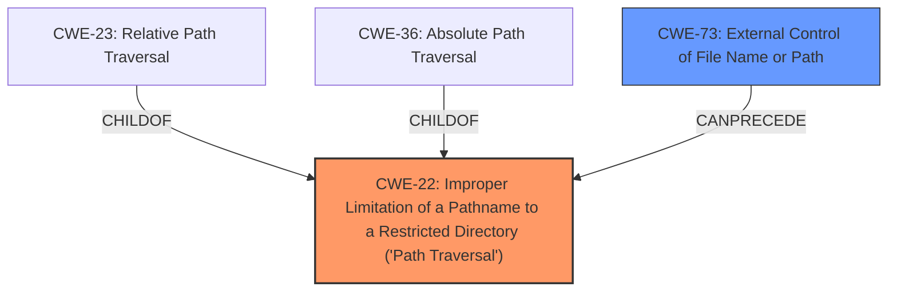

# Enhanced Analysis for CVE-2021-38458

# Summary
| CWE ID | CWE Name | Confidence | CWE Abstraction Level | CWE Vulnerability Mapping Label | CWE-Vulnerability Mapping Notes |
|---|---|---|---|---|---|
| CWE-22 | Improper Limitation of a Pathname to a Restricted Directory ('Path Traversal') | 1.0 | Base | Allowed | Primary CWE |
| CWE-73 | External Control of File Name or Path | 0.7 | Base | Allowed | Secondary Candidate |

## Evidence and Confidence

*   **Confidence Score:** 0.9
*   **Evidence Strength:** HIGH

## Relationship Analysis
The primary CWE is CWE-22, which is a base-level CWE that describes the **improper limitation of a pathname to a restricted directory**. This is a parent of CWE-23 (Relative Path Traversal) and CWE-36 (Absolute Path Traversal), which are more specific variants. CWE-73 (External Control of File Name or Path) is a related CWE, as it describes the broader issue of allowing user input to control file names or paths. It can precede CWE-22. Choosing CWE-22 provides a balance between specificity and generality, accurately representing the vulnerability.



## Vulnerability Chain
The vulnerability chain starts with the **path traversal** weakness (CWE-22) allowing an attacker to create or overwrite critical files. This control over file paths enables the attacker to manipulate files used to execute code.

## Summary of Analysis
The vulnerability description clearly indicates a **path traversal** issue, where an attacker can create or overwrite critical files. The primary CWE match from similar CVE descriptions is CWE-22. The retriever results also prioritize CWE-22.

The vulnerability description states: "A **path traversal** vulnerability in the Moxa MXview Network Management software Versions 3.x to 3.2.2 may allow an attacker to create or overwrite critical files used to execute code, such as programs or libraries."

CWE-22 (Improper Limitation of a Pathname to a Restricted Directory ('Path Traversal')) accurately describes this vulnerability, as it involves using external input to construct a pathname without proper neutralization of special elements, allowing access to locations outside the restricted directory.

CWE-73 (External Control of File Name or Path) was considered as a secondary CWE, as the attacker's control over the file path is a key element of the vulnerability. It can precede CWE-22.

CWE-23 (Relative Path Traversal) and CWE-36 (Absolute Path Traversal) are more specific variants of CWE-22. While the description doesn't explicitly state whether the traversal is relative or absolute, CWE-22 is the more general and appropriate choice.

CWE-74 (Improper Neutralization of Special Elements in Output Used by a Downstream Component ('Injection')) and CWE-78 (Improper Neutralization of Special Elements used in an OS Command ('OS Command Injection')) were considered, but they are not directly applicable as the primary issue is related to path manipulation rather than command injection.

CWE-427 (Uncontrolled Search Path Element) and CWE-732 (Incorrect Permission Assignment for Critical Resource) were also considered but deemed less relevant as they focus on different aspects of security misconfiguration.

The final selection of CWE-22 and CWE-73 offers the most accurate and comprehensive representation of the vulnerability. CWE-22 is at the optimal level of specificity, covering the root cause of the **path traversal**, while CWE-73 acknowledges the attacker's control over the file path.


## CWE Relationship Analysis

Current CWEs represent these abstraction levels: .


### Vulnerability Chain Analysis

**Chain starting from CWE-732:**
- 732 (Incorrect Permission Assignment for Critical Resource) - ROOT


**Chain starting from CWE-36:**
- 36 (Absolute Path Traversal) - ROOT


### CWE Relationship Diagram

```mermaid
graph TD
    classDef primary fill:#f96,stroke:#333,stroke-width:2px
    classDef secondary fill:#69f,stroke:#333
    classDef tertiary fill:#9e9,stroke:#333
```