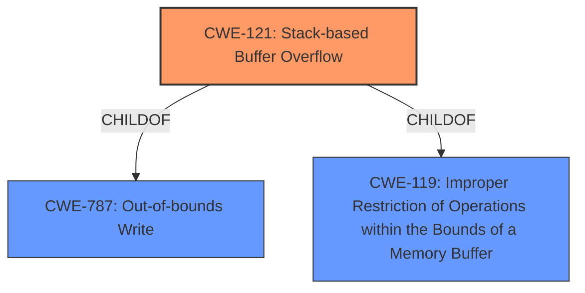

# Analysis for CVE-2021-38473

# Summary
| CWE ID | CWE Name | Confidence | CWE Abstraction Level | CWE Vulnerability Mapping Label | CWE-Vulnerability Mapping Notes |
|---|---|---|---|---|---|
| CWE-121 | Stack-based Buffer Overflow | 1.0 | Variant | Allowed | Primary CWE |
| CWE-119 | Improper Restriction of Operations within the Bounds of a Memory Buffer | 0.7 | Class | Allowed | Secondary CWE |

## Evidence and Confidence

*   **Confidence Score:** 0.9
*   **Evidence Strength:** HIGH

## Relationship Analysis
The primary CWE, CWE-121, is a variant of CWE-788 and CWE-787, both of which are types of out-of-bounds write. CWE-121 is specifically related to stack-based overflows, aligning directly with the vulnerability description, making it a specific and fitting choice. CWE-119 is a parent of CWE-121 and represents the broader issue of improper memory boundary handling. Choosing CWE-121 provides a more precise classification of the vulnerability.

## Vulnerability Chain
The vulnerability chain starts with **improper argument control**, leading to a **stack overflow**. The final impact is remote code execution.

## Summary of Analysis
The initial assessment identified a **stack overflow** due to **improper argument control**. The retriever results strongly suggested CWE-121 (Stack-based Buffer Overflow) as the primary candidate. The vulnerability description explicitly mentions a **stack overflow**, and the CVE reference links content summary indicates that the vulnerability stems from **improper restriction of operations** within the bounds of a memory buffer, potentially leading to remote code execution.

The relationship analysis confirms that CWE-121 is a variant of the more general CWE-119 (Improper Restriction of Operations within the Bounds of a Memory Buffer) and CWE-787 (Out-of-bounds Write). Choosing CWE-121 provides a more specific and accurate classification, as it directly addresses the stack-based nature of the overflow.

The final selection of CWE-121 is based on the explicit mention of **stack overflow** in the vulnerability description and the identification of **improper argument control** as the root cause. The CWE's description perfectly aligns with the vulnerability's characteristics. The evidence is strong, and the confidence in the mapping is high.

Other CWEs considered but not used:

*   CWE-190 (Integer Overflow or Wraparound): While integer overflows can sometimes lead to buffer overflows, there's no specific evidence suggesting an integer overflow in this case.
*   CWE-120 (Buffer Copy without Checking Size of Input): This CWE is for cases when a buffer is copied without checking its size. The description mentions "improper argument control," but does not specify buffer copying. Therefore, this CWE is not as accurate as CWE-121.
*   CWE-787 (Out-of-bounds Write): Although relevant, it is less specific than CWE-121, which explicitly identifies the stack-based nature of the buffer overflow.
*   CWE-1325 (Improperly Controlled Sequential Memory Allocation): This CWE is about uncontrolled memory allocation in a sequence of operations, which is not indicated by the current description.
*   CWE-1284 (Improper Validation of Specified Quantity in Input): This CWE describes a lack of validation of size or length inputs. The description mentions "improper argument control," but not specifically related to size or length.
*   CWE-770 (Allocation of Resources Without Limits or Throttling): This CWE is about allocating resources without limits. The description mentions "improper argument control" but not specifically related to resource allocation.
*   CWE-674 (Uncontrolled Recursion): This CWE is about uncontrolled recursion, which is not indicated by the vulnerability description.

Relevant CWE Information:

# Enhanced Context (25 CWEs)
The following CWEs were identified as potentially relevant to this vulnerability:

## CWE-1325: Improperly Controlled Sequential Memory Allocation
**Abstraction Level**: Base
**Similarity Score**: 0.79
**Source**: dense

**Description**:
The product manages a group of objects or resources and performs a separate memory allocation for each object, but it does not properly limit the total amount of memory that is consumed by all of the combined objects.

**Mapping Guidance**:
- Usage: Allowed
- Rationale: This CWE entry is at the Base level of abstraction, which is a preferred level of abstraction for mapping to the root causes of vulnerabilities.

## CWE-789: Memory Allocation with Excessive Size Value
**Abstraction Level**: Variant
**Similarity Score**: 0.77
**Source**: dense

**Description**:
The product allocates memory based on an untrusted, large size value, but it does not ensure that the size is within expected limits, allowing arbitrary amounts of memory to be allocated.

**Mapping Guidance**:
- Usage: Allowed
- Rationale: This CWE entry is at the Variant level of abstraction, which is a preferred level of abstraction for mapping to the root causes of vulnerabilities.

## CWE-191: Integer Underflow (Wrap or Wraparound)
**Abstraction Level**: Base
**Similarity Score**: 0.76
**Source**: dense

**Description**:
The product subtracts one value from another, such that the result is less than the minimum allowable integer value, which produces a value that is not equal to the correct result.

**Mapping Guidance**:
- Usage: Allowed
- Rationale: This CWE entry is at the Base level of abstraction, which is a preferred level of abstraction for mapping to the root causes of vulnerabilities.

## CWE-131: Incorrect Calculation of Buffer Size
**Abstraction Level**: Base
**Similarity Score**: 0.76
**Source**: dense

**Description**:
The product does not correctly calculate the size to be used when allocating a buffer, which could lead to a buffer overflow.

**Mapping Guidance**:
- Usage: Allowed
- Rationale: This CWE entry is at the Base level of abstraction, which is a preferred level of abstraction for mapping to the root causes of vulnerabilities.

## CWE-404: Improper Resource Shutdown or Release
**Abstraction Level**: Class
**Similarity Score**: 0.76
**Source**: dense

**Description**:
The product does not release or incorrectly releases a resource before it is made available for re-use.

**Mapping Guidance**:
- Usage: Allowed-with-Review
- Rationale: This CWE entry is a Class and might have Base-level children that would be more appropriate

## CWE-405: Asymmetric Resource Consumption (Amplification)
**Abstraction Level**: Class
**Similarity Score**: 0.76
**Source**: dense

**Description**:
The product does not properly control situations in which an adversary can cause the product to consume or produce excessive resources without requiring the adversary to invest equivalent work or otherwise prove authorization, i.e., the adversary's influence is "asymmetric."

**Mapping Guidance**:
- Usage: Allowed-with-Review
- Rationale: This CWE entry is a Class and might have Base-level children that would be more appropriate

## CWE-226: Sensitive Information in Resource Not Removed Before Reuse
**Abstraction Level**: Base
**Similarity Score**: 0.76
**Source**: dense

**Description**:
The product releases a resource such as memory or a file so that it can be made available for reuse, but it does not clear or "zeroize" the information contained in the resource before the product performs a critical state transition or makes the resource available for reuse by other entities.

**Mapping Guidance**:
- Usage: Allowed
- Rationale: This CWE entry is at the Base level of abstraction, which is a preferred level of abstraction for mapping to the root causes of vulnerabilities.

## CWE-664: Improper Control of a Resource Through its Lifetime
**Abstraction Level**: Pillar
**Similarity Score**: 0.75
**Source**: dense

**Description**:
The product does not maintain or incorrectly maintains control over a resource throughout its lifetime of creation, use, and release.

**Mapping Guidance**:
- Usage: Discouraged
- Rationale: This CWE entry is high-level when lower-level children are available.

## CWE-805: Buffer Access with Incorrect Length Value
**Abstraction Level**: Base
**Similarity Score**: 0.75
**Source**: dense

**Description**:
The product uses a sequential operation to read or write a buffer, but it uses an incorrect length value that causes it to access memory that is outside of the bounds of the buffer.

**Mapping Guidance**:
- Usage: Allowed
- R