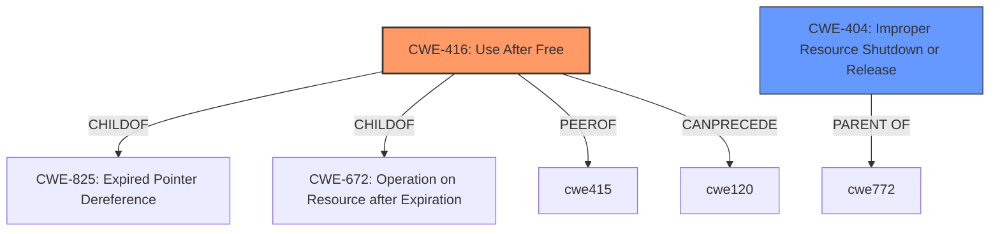

# Enhanced Analysis for CVE-2021-38498

# Summary
| CWE ID | CWE Name | Confidence | CWE Abstraction Level | CWE Vulnerability Mapping Label | CWE-Vulnerability Mapping Notes |
|---|---|---|---|---|---|
| CWE-416 | Use After Free | 1.0 | Variant | Allowed | Primary CWE |
| CWE-404 | Improper Resource Shutdown or Release | 0.6 | Class | Allowed-with-Review | Secondary Candidate |

## Evidence and Confidence

*   **Confidence Score:** 0.9
*   **Evidence Strength:** HIGH

## Relationship Analysis
The primary relationship influencing the CWE selection is the hierarchical structure. CWE-416 (Use After Free) is a Variant of CWE-825 (Expired Pointer Dereference) and CWE-672 (Operation on Resource after Expiration). The choice of CWE-416 is favored because it's a lower-level, more specific classification than its parents. CWE-404 (Improper Resource Shutdown or Release) is considered as a related issue because the vulnerability occurs during process shutdown due to incorrect release of resources, however it's a Class level and thus less specific.



## Vulnerability Chain
The vulnerability chain starts with the **incorrect shutdown order** of components, leading to the **use-after-free** of the `nsLanguageAtomService` object, which results in **memory corruption** and a **potentially exploitable crash**.

## Summary of Analysis
The initial analysis strongly points to CWE-416 (Use After Free) due to the explicit mention of "use-after-free of a languages service object" in the Vulnerability Description Key Phrases and the CVE Reference Links Content Summary.

> **Vulnerability Description Key Phrases**
> - **rootcause:** **use-after-free of a languages service object**
>
> **CVE Reference Links Content Summary**
> - **Use-after-free:** The core weakness is that the `nsLanguageAtomService` object is accessed after it has been freed from memory.

The Retriever Results also list CWE-416 as the top candidate with a score of 0.800. The supporting evidence is strong, and the variant level of abstraction is appropriate for this specific vulnerability.

CWE-404 (Improper Resource Shutdown or Release) was considered because the vulnerability occurs during process shutdown, but it's less specific than CWE-416 and represents a higher-level class of issues. The root cause is the use of a resource after it has been freed, not merely the improper shutdown.

CWE-787 (Out-of-bounds Write) was considered because memory corruption is a consequence of the use-after-free. However, the root cause is not an out-of-bounds write, but rather the use of memory that has already been freed.

CWE-457 (Use of Uninitialized Variable) and CWE-908 (Use of Uninitialized Resource) are not appropriate because the issue is not the use of an uninitialized variable or resource, but the use of a resource after it has been freed.

The final decision is to assign CWE-416 as the primary CWE, with a confidence score of 1.0.

Relevant CWE Information:
- CWE-416: Use After Free
- CWE-404: Improper Resource Shutdown or Release


## CWE Relationship Analysis

Current CWEs represent these abstraction levels: .


### Vulnerability Chain Analysis

**Chain starting from CWE-787:**
- 787 (Out-of-bounds Write) - ROOT


**Chain starting from CWE-416:**
- 416 (Use After Free) - ROOT


### CWE Relationship Diagram

```mermaid
graph TD
    classDef primary fill:#f96,stroke:#333,stroke-width:2px
    classDef secondary fill:#69f,stroke:#333
    classDef tertiary fill:#9e9,stroke:#333
```