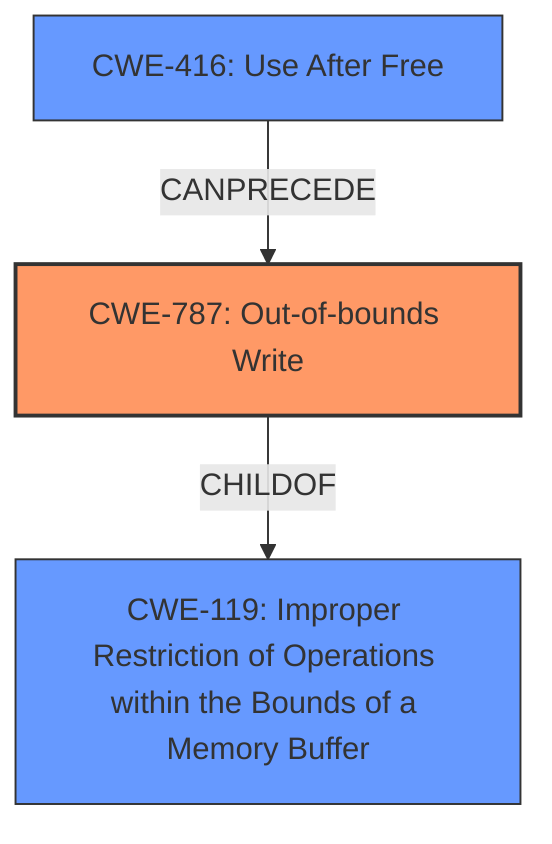

# Analysis for CVE-2021-38500

# Summary
| CWE ID | CWE Name | Confidence | CWE Abstraction Level | CWE Vulnerability Mapping Label | CWE-Vulnerability Mapping Notes |
|---|---|---|---|---|---|
| **CWE-787** | **Out-of-bounds Write** | 0.8 | Base | Allowed | Primary CWE. This CWE accurately reflects the **memory corruption** described in the vulnerability. |
| CWE-416 | Use After Free | 0.6 | Variant | Allowed | Secondary CWE. The description mentions a "use-after-free," indicating this CWE might also apply. |
| CWE-119 | Improper Restriction of Operations within the Bounds of a Memory Buffer | 0.5 | Class | Discouraged | Secondary CWE. While related to **memory safety bugs**, it's a more general category. |

## Evidence and Confidence

*   **Confidence Score:** 0.7
*   **Evidence Strength:** MEDIUM

## Relationship Analysis
The primary CWE, CWE-787, is a child of CWE-119, indicating a hierarchical relationship where CWE-787 is a specific type of buffer error. CWE-416, Use After Free, is related to memory management issues and can sometimes precede out-of-bounds writes. The choice of CWE-787 as primary is due to the explicit mention of **memory corruption** in the vulnerability description, aligning directly with the nature of an out-of-bounds write.

## Vulnerability Chain
The vulnerability chain involves **memory safety bugs** leading to **memory corruption**, which can then be exploited to run arbitrary code.
  - Root Cause: **Memory safety bugs**
  - Weakness: **Memory corruption** (Out-of-bounds Write)
  - Impact: Arbitrary code execution

## Summary of Analysis
The initial assessment identified **memory safety bugs** and **memory corruption** as key indicators. The retriever results suggested CWE-787 (Out-of-bounds Write) and CWE-416 (Use After Free) as potential matches.

The decision to prioritize CWE-787 was based on the evidence from the vulnerability description: "Some of these bugs showed evidence of **memory corruption** and we presume that with enough effort some of these could have been exploited to run arbitrary code." This statement directly implies an out-of-bounds write scenario, where data is written to an unintended memory location, causing corruption.

CWE-416 was considered due to the mention of a "use-after-free" bug in the CVE Reference Links Content Summary. However, since the primary concern is the **memory corruption** itself, CWE-787 is the more direct and appropriate classification.

CWE-119 was also considered but ultimately deemed too general. While it encompasses buffer overflows, CWE-787 provides a more precise description of the vulnerability.

The final selection of CWE-787 as the primary CWE is justified by its direct alignment with the observed **memory corruption** and its base-level abstraction, which provides sufficient specificity for this vulnerability.

Relevant CWE Information:

# Enhanced Context (25 CWEs)

## CWE-668: Exposure of Resource to Wrong Sphere
**Abstraction Level**: Class
**Similarity Score**: 0.77
**Source**: dense

**Description**:
The product exposes a resource to the wrong control sphere, providing unintended actors with inappropriate access to the resource.

**Mapping Guidance**:
- Usage: Discouraged
- Rationale: CWE-668 is high-level and is often misused as a catch-all when lower-level CWE IDs might be applicable. It is sometimes used for low-information vulnerability reports [REF-1287]. It is a level-1 Class (i.e., a child of a Pillar). It is not useful for trend analysis.

*Not selected*: While this could be a consequence of the vulnerability, it is not the root cause.

## CWE-610: Externally Controlled Reference to a Resource in Another Sphere
**Abstraction Level**: Class
**Similarity Score**: 0.76
**Source**: dense

**Description**:
The product uses an externally controlled name or reference that resolves to a resource that is outside of the intended control sphere.

**Mapping Guidance**:
- Usage: Discouraged
- Rationale: This CWE entry is a level-1 Class (i.e., a child of a Pillar). It might have lower-level children that would be more appropriate

*Not selected*: There is no evidence to suggest that an externally controlled reference is involved.

## CWE-664: Improper Control of a Resource Through its Lifetime
**Abstraction Level**: Pillar
**Similarity Score**: 0.76
**Source**: dense

**Description**:
The product does not maintain or incorrectly maintains control over a resource throughout its lifetime of creation, use, and release.

**Mapping Guidance**:
- Usage: Discouraged
- Rationale: This CWE entry is high-level when lower-level children are available.

*Not selected*: Too abstract. The vulnerability is more specifically related to out-of-bounds writes.

## CWE-404: Improper Resource Shutdown or Release
**Abstraction Level**: Class
**Similarity Score**: 0.75
**Source**: dense

**Description**:
The product does not release or incorrectly releases a resource before it is made available for re-use.

**Mapping Guidance**:
- Usage: Allowed-with-Review
- Rationale: This CWE entry is a Class and might have Base-level children that would be more appropriate

*Not selected*: Although resource release issues can be related, this doesn't directly address the memory corruption aspect.

## CWE-653: Improper Isolation or Compartmentalization
**Abstraction Level**: Class
**Similarity Score**: 0.75
**Source**: dense

**Description**:
The product does not properly compartmentalize or isolate functionality, processes, or resources that require different privilege levels, rights, or permissions.

**Mapping Guidance**:
- Usage: Allowed
- Rationale: This CWE entry is at the Base level of abstraction, which is a preferred level of abstraction for mapping to the root causes of vulnerabilities.

*Not selected*: Not directly related to the described vulnerability.

## CWE-669: Incorrect Resource Transfer Between Spheres
**Abstraction Level**: Class
**Similarity Score**: 0.75
**Source**: dense

**Description**:
The product does not properly transfer a resource/behavior to another sphere, or improperly imports a resource/behavior from another sphere, in a manner that provides unintended control over that resource.

**Mapping Guidance**:
- Usage: Allowed-with-Review
- Rationale: This CWE entry is a Class and might have Base-level children that would be more appropriate

*Not selected*: This CWE is not applicable to the vulnerability description.

## CWE-226: Sensitive Information in Resource Not Removed Before Reuse
**Abstraction Level**: Base
**Similarity Score**: 0.75
**Source**: dense

**Description**:
The product releases a resource such as memory or a file so that it can be made available for reuse, but it does not clear or "zeroize" the information contained in the resource before the product performs a critical state transition or makes the resource available for reuse by other entities.

**Mapping Guidance**:
- Usage: Allowed
- Rationale: This CWE entry is at the Base level of abstraction, which is a preferred level of abstraction for mapping to the root causes of vulnerabilities.

*Not selected*: This is not the primary issue described in the vulnerability.

## CWE-405: Asymmetric Resource Consumption (Amplification)
**Abstraction Level**: Class
**Similarity Score**: 0.73
**Source**: dense

**Description**:
The product does not properly control situations in which an adversary can cause the product to consume or produce excessive resources without requiring the adversary to invest equivalent work or otherwise prove authorization, i.e., the adversary's influence is "asymmetric."

**Mapping Guidance**:
- Usage: Allowed-with-Review
- Rationale: This CWE entry is a Class and might have Base-level children that would be more appropriate

*Not selected*: Not relevant to this vulnerability.

## CWE-41: Improper Resolution of Path Equivalence
**Abstraction Level**: Base
**Similarity Score**: 0.73
**Source**: dense

**Description**:
The product is vulnerable to file system contents disclosure through path equivalence. Path equivalence involves the use of special characters in file and directory names. The associated manipulations are intended to generate multiple names for the same object.

**Mapping Guidance**:
- Usage: Allowed
- Rationale: This CWE entry