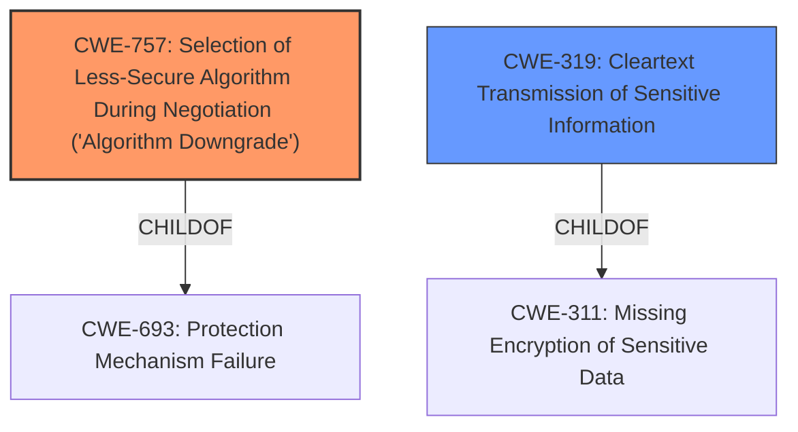

# Analysis for CVE-2021-38502

# Summary
| CWE ID  | CWE Name                                                                     | Confidence | CWE Abstraction Level | CWE Vulnerability Mapping Label | CWE-Vulnerability Mapping Notes |
| :-------- | :--------------------------------------------------------------------------- | :--------- | :---------------------- | :------------------------------ | :------------------------------ |
| CWE-757   | Selection of Less-Secure Algorithm During Negotiation ('Algorithm Downgrade') | 0.9        | Base                    | Allowed                       | Primary CWE                     |
| CWE-319   | Cleartext Transmission of Sensitive Information                              | 0.7        | Base                    | Allowed                       | Secondary Candidate             |

## Evidence and Confidence

*   **Confidence Score:** 0.8
*   **Evidence Strength:** HIGH

## Relationship Analysis
The primary relationship that influenced the selection was the parent-child relationship between CWE-693 (Protection Mechanism Failure) and CWE-757 (Selection of Less-Secure Algorithm During Negotiation ('Algorithm Downgrade')). CWE-757 is a more specific case of a protection mechanism failure, where the failure is due to the selection of a weaker algorithm. There is also a child relationship between CWE-311 (Missing Encryption of Sensitive Data) and CWE-319 (Cleartext Transmission of Sensitive Information). There is no relationship between CWE-757 and CWE-319. The relationship analysis showed that selecting CWE-757 is more appropriate as it explains the **downgrade attack** mechanism more specifically than the more general CWE-319.

## Vulnerability Chain
The vulnerability chain starts with the **Thunderbird ignoring the configuration to require STARTTLS security** (CWE-757). This allows a Man-in-the-Middle attack, which results in the interception of transmitted messages, control of authenticated sessions, and potential extraction of authentication credentials. If no encryption were attempted, then it would simply be a case of transmitting sensitive information in clear text (CWE-319).

## Summary of Analysis
The analysis is based on the vulnerability description and the provided CVE reference links content summary. The vulnerability arises because Thunderbird **ignored the configuration to require STARTTLS security** for SMTP connections. This allows for a downgrade attack by a MITM, leading to interception of messages and control of the authenticated session.

The primary CWE selected is CWE-757, as it accurately describes the **root cause** of the vulnerability, i.e., the selection of a less-secure algorithm (or no encryption at all) due to the **ignored configuration**. The selection is also supported by the high similarity score from the retriever results.

CWE-319 was considered as a secondary CWE because the impact involves cleartext transmission of sensitive information if the attacker successfully downgrades the connection. However, the **root cause** is the failure to enforce STARTTLS, making CWE-757 the primary and more accurate mapping.

The selected CWEs are at the optimal level of specificity, with CWE-757 being a Base level CWE and directly addressing the vulnerability's root cause.

Relevant CWE Information:

# Enhanced Context (25 CWEs)
The following CWEs were identified as potentially relevant to this vulnerability:

## CWE-1240: Use of a Cryptographic Primitive with a Risky Implementation
**Abstraction Level**: Base
**Similarity Score**: 0.79
**Source**: dense
**Description**:
To fulfill the need for a cryptographic primitive, the product implements a cryptographic algorithm using a non-standard, unproven, or disallowed/non-compliant cryptographic implementation.
**Mapping Guidance**:
- Usage: Allowed
- Rationale: This CWE entry is at the Base level of abstraction, which is a preferred level of abstraction for mapping to the root causes of vulnerabilities.
*Not selected because the issue is not about the risky implementation of a cryptographic algorithm but rather the downgrade to a less secure algorithm.*

## CWE-1391: Use of Weak Credentials
**Abstraction Level**: Class
**Similarity Score**: 0.78
**Source**: dense
**Description**:
The product uses weak credentials (such as a default key or hard-coded password) that can be calculated, derived, reused, or guessed by an attacker.
**Mapping Guidance**:
- Usage: Allowed-with-Review
- Rationale: This CWE entry is a Class and might have Base-level children that would be more appropriate
*Not selected because the core vulnerability isn't the use of weak credentials directly, but rather the ability to intercept and obtain credentials due to the lack of encryption.*

## CWE-303: Incorrect Implementation of Authentication Algorithm
**Abstraction Level**: Base
**Similarity Score**: 0.77
**Source**: dense
**Description**:
The requirements for the product dictate the use of an established authentication algorithm, but the implementation of the algorithm is incorrect.
**Mapping Guidance**:
- Usage: Allowed
- Rationale: This CWE entry is at the Base level of abstraction, which is a preferred level of abstraction for mapping to the root causes of vulnerabilities.
*Not selected because the vulnerability is not in the incorrect implementation of an authentication algorithm, but the downgrade to no encryption.*

## CWE-319: Cleartext Transmission of Sensitive Information
**Abstraction Level**: Base
**Similarity Score**: 0.77
**Source**: dense
**Description**:
The product transmits sensitive or security-critical data in cleartext in a communication channel that can be sniffed by unauthorized actors.
**Mapping Guidance**:
- Usage: Allowed
- Rationale: This CWE entry is at the Base level of abstraction, which is a preferred level of abstraction for mapping to the root causes of vulnerabilities.
*Selected as secondary candidate because the vulnerability leads to cleartext transmission, but the primary weakness is the downgrade.*

## CWE-807: Reliance on Untrusted Inputs in a Security Decision
**Abstraction Level**: Base
**Similarity Score**: 0.76
**Source**: dense
**Description**:
The product uses a protection mechanism that relies on the existence or values of an input, but the input can be modified by an untrusted actor in a way that bypasses the protection mechanism.
**Mapping Guidance**:
- Usage: Allowed
- Rationale: This CWE entry is at the Base level of abstraction, which is a preferred level of abstraction for mapping to the root causes of vulnerabilities.
*Not selected because the issue is not about relying on untrusted inputs but about failing to enforce encryption.*

## CWE-1390: Weak Authentication
**Abstraction Level**: Class
**Similarity Score**: 0.75
**Source**: dense
**Description**:
The product uses an authentication mechanism to restrict access to specific users or identities, but the mechanism does not sufficiently prove that the claimed identity is correct.
**Mapping Guidance**:
- Usage: Allowed-with-Review
- Rationale: This CWE entry is a Class and might have Base-level children that would be more appropriate
*Not selected because the core issue is not weak authentication itself, but the ability to bypass encryption, which then exposes the authentication process.*

## CWE-757: Selection of Less-Secure Algorithm During Negotiation ('Algorithm Downgrade')
**Abstraction Level**: Base
**Similarity Score**: 0.75
**Source**: dense
**Description**:
A protocol or its implementation supports interaction between multiple actors and allows those actors to negotiate which algorithm should be used as a protection mechanism such as encryption or authentication, but it does not select the strongest algorithm that is available to both parties.
**Mapping Guidance**:
- Usage: Allowed
- Rationale: This CWE entry is at the Base level of abstraction, which is a preferred level of abstraction for mapping to the root causes of vulnerabilities.
*Selected as the primary CWE because it specifically addresses the downgrade attack due to the failure to enforce STARTTLS.*

## CWE-328: Use of Weak Hash
**Abstraction Level**: Base
**Similarity Score**: 0.75
**Source**: dense
**Description**:
The product uses an algorithm that produces a digest (output value) that does not meet security expectations for a hash function that allows an adversary to reasonably determine the original input (preimage attack), find another input that can produce the same hash (2nd preimage attack), or find multiple inputs that evaluate to the same hash (birthday attack).
**Mapping Guidance**:
- Usage: Allowed
- Rationale: This CWE entry is at the Base level of abstraction, which is a preferred level of abstraction for mapping to the root causes of vulnerabilities.
*Not selected as the vulnerability is not about the use of a weak hash.*

## CWE-603: Use of Client-Side Authentication
**Abstraction Level**: Base
**Similarity Score**: 0.75
**Source**: