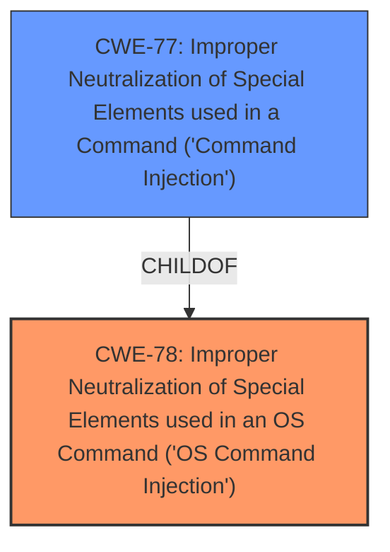

# Analysis Report for CVE-2021-38521

# Vulnerability Analysis Report: CVE-2021-38521

## Description


## Analysis (with Relationship Data)

# Summary
| CWE ID | CWE Name | Confidence | CWE Abstraction Level | CWE Vulnerability Mapping Label | CWE-Vulnerability Mapping Notes |
|---|---|---|---|---|---|
| CWE-78 | Improper Neutralization of Special Elements used in an OS Command ('OS Command Injection') | 1.0 | Base | Allowed | Primary CWE: **command injection** by an authenticated user |
| CWE-77 | Improper Neutralization of Special Elements used in a Command ('Command Injection') | 0.7 | Class | Allowed-with-Review | Secondary Candidate: Parent of CWE-78, but less specific. |

## Evidence and Confidence

*   **Confidence Score:** 1.0
*   **Evidence Strength:** HIGH

## Relationship Analysis
The primary relationship influencing the CWE selection is the ChildOf relationship between CWE-78 and CWE-77. CWE-78 is a Base level CWE that is a child of the Class level CWE-77. The vulnerability is specifically related to OS commands, therefore, the child CWE is a better fit.



## Vulnerability Chain
The chain of events is as follows:
1.  **Root Cause:** **Command Injection** (CWE-78) due to **improper neutralization of special elements**.
2.  **Attacker Action:** An authenticated user injects malicious commands.
3.  **Impact:** Arbitrary commands are executed on the router, compromising confidentiality, integrity, and potentially availability.

## Summary of Analysis
The initial assessment focused on the core vulnerability: **command injection**. The retriever results strongly suggested CWE-77 and CWE-78. The "Vulnerability Description Key Phrases" clearly indicated "**command injection**" as the **weakness**. The "CVE Reference Links Content Summary" confirmed this by stating the "**Root cause of vulnerability:** Post-authentication command injection" and "Weaknesses/vulnerabilities present: Command injection vulnerability that can be exploited after successful authentication."

CWE-78 (Improper Neutralization of Special Elements used in an OS Command ('OS Command Injection')) was selected as the primary CWE because the description explicitly mentions that the **command injection** vulnerability allows an attacker to execute arbitrary commands on the router's operating system. CWE-78 is more specific since it is related to OS commands.

CWE-77 (Improper Neutralization of Special Elements used in a Command ('Command Injection')) was considered but ultimately deemed less specific, as it is a parent CWE of CWE-78 and applies to command injection in general, not specifically OS commands. The MITRE mapping guidance for CWE-77 suggests considering CWE-78 when OS command injection is intended.

The selection of CWE-78 is at the optimal level of specificity (Base) as it directly reflects the **root cause** and the affected domain (OS commands).

Relevant CWE Information:
```
## CWE-78: Improper Neutralization of Special Elements used in an OS Command ('OS Command Injection')
**Abstraction:** Base
**Status:** Stable

### Description
The product constructs all or part of an OS command using externally-influenced input from an upstream component, but it does not neutralize or incorrectly neutralizes special elements that could modify the intended OS command when it is sent to a downstream component.
```


## CWE Relationship Analysis

Current CWEs represent these abstraction levels: .


### Vulnerability Chain Analysis

**Chain starting from CWE-78:**
- 78 (Improper Neutralization of Special Elements used in an OS Command ('OS Command Injection')) - ROOT


**Chain starting from CWE-77:**
- 77 (Improper Neutralization of Special Elements used in a Command ('Command Injection')) - ROOT


### CWE Relationship Diagram

```mermaid
graph TD
    classDef primary fill:#f96,stroke:#333,stroke-width:2px
    classDef secondary fill:#69f,stroke:#333
    classDef tertiary fill:#9e9,stroke:#333
```


*Report generated on 2025-04-02 16:01:24*
