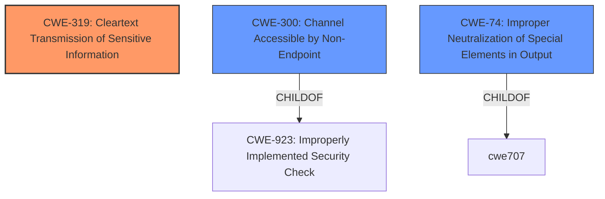

# Enhanced Analysis for CVE-2021-38542

# Summary
| CWE ID | CWE Name | Confidence | CWE Abstraction Level | CWE Vulnerability Mapping Label | CWE-Vulnerability Mapping Notes |
|---|---|---|---|---|---|
| CWE-319 | Cleartext Transmission of Sensitive Information | 0.9 | Base | Allowed | Primary CWE |
| CWE-300 | Channel Accessible by Non-Endpoint | 0.6 | Class | Discouraged | Secondary Candidate |
| CWE-74 | Improper Neutralization of Special Elements in Output Used by a Downstream Component ('Injection') | 0.5 | Class | Discouraged | Secondary Candidate |

## Evidence and Confidence

*   **Confidence Score:** 0.9
*   **Evidence Strength:** HIGH

## Relationship Analysis
The primary relationship influencing the CWE selection is the hierarchical relationship. CWE-319 is a base-level CWE that directly addresses the **cleartext transmission of sensitive information**, which is the core of the vulnerability. While other CWEs like CWE-300 and CWE-74 are related to the MITM attack vector and potential command injection, they are more abstract or focus on specific attack consequences rather than the root cause of sending sensitive data in cleartext.



## Vulnerability Chain
The vulnerability chain starts with the **lack of encryption** during the STARTTLS command usage, leading to **cleartext transmission**, which facilitates the **Man-in-the-middle command injection**, and finally results in **leakage of sensitive information**.

## Summary of Analysis
The analysis is primarily based on the provided vulnerability description and the CVE reference summary, which highlights that the **vulnerability** stems from the use of the STARTTLS command without proper encryption, leading to a Man-in-the-middle (MITM) attack and the potential **leakage of sensitive information**. The "CVE Reference Links Content Summary" states that "The core issue is a flaw in how Apache James handles the STARTTLS command, making it vulnerable to command injection. This is due to insufficient input validation and handling during the STARTTLS handshake." and "Successful exploitation allows for Man-in-the-middle (MITM) command injection attacks. This can lead to leakage of sensitive information."

Given this evidence, CWE-319 (Cleartext Transmission of Sensitive Information) is the most appropriate primary CWE. It directly addresses the root cause: transmitting sensitive information in cleartext, which enables the MITM attack.

CWE-300 (Channel Accessible by Non-Endpoint) was considered but deemed less specific. While the vulnerability enables a MITM attack, which fits CWE-300, the root cause is the cleartext transmission, not simply that the channel is accessible by a non-endpoint. The mapping guidance for CWE-300 discourages its use when root-cause weaknesses related to integrity protection are present.

CWE-74 (Improper Neutralization of Special Elements in Output Used by a Downstream Component ('Injection')) was also considered, given the "command injection" impact. However, this CWE is more focused on the injection itself, rather than the initial vulnerability that allowed the injection to occur. The retriever results also discourage using this CWE and recommends using lower level CWEs.

CWE-319 is at the optimal level of specificity because it precisely describes the **weakness** that makes the MITM attack possible.

Relevant CWE Information:

# Enhanced Context (25 CWEs)

## CWE-319: Cleartext Transmission of Sensitive Information
**Technical Explanation:**
The Apache James server transmits data without encryption during the STARTTLS handshake. An attacker can intercept this unencrypted traffic and potentially inject commands or steal sensitive information.
**Security Implications:**
Sensitive data can be easily intercepted and read by unauthorized parties.
**Relationship:**
ChildOf -> CWE-311 (Missing Encryption of Sensitive Data).
**Mapping Guidance Influence:**
The usage is "Allowed" and the rationale states that "This CWE entry is at the Base level of abstraction, which is a preferred level of abstraction for mapping to the root causes of vulnerabilities." This aligns perfectly with the identified root cause.
**Confidence:** 0.9

## CWE-300: Channel Accessible by Non-Endpoint
**Technical Explanation:**
The vulnerability allows an attacker to position themselves between the client and the server, intercepting and potentially modifying communication.
**Security Implications:**
An attacker can eavesdrop and potentially modify the communication between the original entities.
**Relationship:**
ChildOf -> CWE-923 (Improperly Implemented Security Check).
**Mapping Guidance Influence:**
The usage is "Discouraged" and the rationale states that "CWE-300 is commonly misused for vulnerabilities in which the prerequisites for exploitation require the adversary to be in a privileged "in-the-middle" position." While the MITM is present, it is a consequence of the cleartext transmission.
**Confidence:** 0.6

## CWE-74: Improper Neutralization of Special Elements in Output Used by a Downstream Component ('Injection')
**Technical Explanation:**
An attacker can inject commands due to the lack of proper handling of special elements when the server is using STARTTLS in cleartext.
**Security Implications:**
The attacker may alter the intended control flow.
**Relationship:**
ChildOf -> CWE-707 (Improper Neutralization).
**Mapping Guidance Influence:**
The usage is "Discouraged" and the rationale states that "CWE-74 is high-level and often misused when lower-level weaknesses are more appropriate."
**Confidence:** 0.5


## CWE Relationship Analysis

Current CWEs represent these abstraction levels: .


### Vulnerability Chain Analysis

**Chain starting from CWE-311:**
- 311 (Missing Encryption of Sensitive Data) - ROOT


**Chain starting from CWE-923:**
- 923 (Improper Restriction of Communication Channel to Intended Endpoints) - ROOT


### CWE Relationship Diagram

```mermaid
graph TD
    classDef primary fill:#f96,stroke:#333,stroke-width:2px
    classDef secondary fill:#69f,stroke:#333
    classDef tertiary fill:#9e9,stroke:#333
```