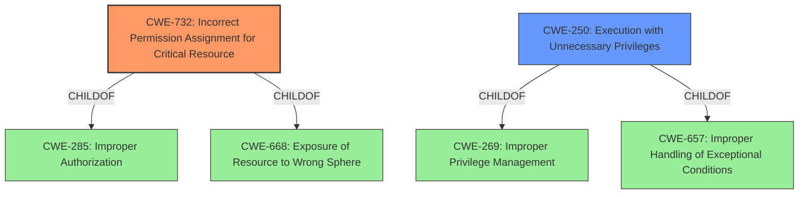

# Enhanced Analysis for CVE-2021-38557

# Summary
| CWE ID | CWE Name | Confidence | CWE Abstraction Level | CWE Vulnerability Mapping Label | CWE-Vulnerability Mapping Notes |
|---|---|---|---|---|---|
| CWE-732 | Incorrect Permission Assignment for Critical Resource | 0.9 | Class | Allowed-with-Review | Primary CWE |
| CWE-250 | Execution with Unnecessary Privileges | 0.7 | Base | Allowed | Secondary Candidate |

## Evidence and Confidence

*   **Confidence Score:** 0.8
*   **Evidence Strength:** MEDIUM

## Relationship Analysis
The primary relationship that influenced my decision was the ChildOf relationship between CWE-732 and CWE-285 (Improper Authorization). Although the description mentions "insecure sudoers permissions", which directly points to a permission issue, the potential for misuse of CWE-732 for authorization issues was considered. However, the root cause is directly related to the incorrect assignment of permissions in the sudoers file which is a critical resource.



## Vulnerability Chain
The vulnerability chain starts with the **insecure sudoers permissions** (CWE-732), which allows the www-data account to overwrite /etc/raspap/hostapd/enablelog.sh with arbitrary content. This then leads to the attacker being able to execute commands as root.

## Summary of Analysis
The analysis is primarily based on the provided vulnerability description. The key phrase "**insecure sudoers permissions**" directly suggests a misconfiguration related to resource permissions.

The description states: "raspap-webgui in RaspAP 2.6.6 allows attackers to execute commands as root because of the **insecure sudoers permissions**. The www-data account can execute /etc/raspap/hostapd/enablelog.sh as root with no password however, the www-data account can also overwrite /etc/raspap/hostapd/enablelog.sh with any executable content."

The retriever results also suggest CWE-732 as a potential match. The mapping guidance for CWE-732 advises caution due to potential misuse for authorization weaknesses, but in this case, the **root cause** is explicitly tied to the **incorrect permission assignment**, making it a suitable primary CWE.

CWE-250 (Execution with Unnecessary Privileges) is considered as a secondary CWE, as the www-data account having the ability to execute commands as root contributes to the vulnerability's impact. However, the **root cause** lies in the initial incorrect permission assignment (CWE-732).

The selected CWEs are at the appropriate level of specificity, with CWE-732 being a Class that accurately describes the general weakness, and CWE-250 being a Base that reflects the unnecessary privileges.

Relevant CWE Information:

# Enhanced Context (25 CWEs)
The following CWEs were identified as potentially relevant to this vulnerability:

## CWE-41: Improper Resolution of Path Equivalence
**Abstraction Level**: Base
**Similarity Score**: 0.77
**Source**: dense

**Description**:
The product is vulnerable to file system contents disclosure through path equivalence. Path equivalence involves the use of special characters in file and directory names. The associated manipulations are intended to generate multiple names for the same object.

**Why Not Used:** This vulnerability is not about file system content disclosure through path equivalence, so this CWE is not applicable.

## CWE-639: Authorization Bypass Through User-Controlled Key
**Abstraction Level**: Base
**Similarity Score**: 0.77
**Source**: dense

**Description**:
The system's authorization functionality does not prevent one user from gaining access to another user's data or record by modifying the key value identifying the data.

**Why Not Used:** The issue is not about bypassing authorization through user-controlled keys, but rather due to incorrect permission assignments, so this CWE is not applicable.

## CWE-668: Exposure of Resource to Wrong Sphere
**Abstraction Level**: Class
**Similarity Score**: 0.77
**Source**: dense

**Description**:
The product exposes a resource to the wrong control sphere, providing unintended actors with inappropriate access to the resource.

**Why Not Used:** While related, CWE-668 is too high-level. CWE-732 provides a more specific classification as the root cause lies in the incorrect permission assignment rather than simply the exposure of a resource.

## CWE-807: Reliance on Untrusted Inputs in a Security Decision
**Abstraction Level**: Base
**Similarity Score**: 0.76
**Source**: dense

**Description**:
The product uses a protection mechanism that relies on the existence or values of an input, but the input can be modified by an untrusted actor in a way that bypasses the protection mechanism.

**Why Not Used:** The vulnerability isn't about relying on untrusted inputs in a security decision, but rather about misconfigured permissions.

## CWE-74: Improper Neutralization of Special Elements in Output Used by a Downstream Component ('Injection')
**Abstraction Level**: Class
**Similarity Score**: 0.76
**Source**: dense

**Description**:
The product constructs all or part of a command, data structure, or record using externally-influenced input from an upstream component, but it does not neutralize or incorrectly neutralizes special elements that could modify how it is parsed or interpreted when it is sent to a downstream component.

**Why Not Used:** This is not an injection vulnerability. The issue is about incorrect permissions, not about failing to neutralize special elements.

## CWE-23: Relative Path Traversal
**Abstraction Level**: Base
**Similarity Score**: 0.76
**Source**: dense

**Description**:
The product uses external input to construct a pathname that should be within a restricted directory, but it does not properly neutralize sequences such as ".." that can resolve to a location that is outside of that directory.

**Why Not Used:** This is not a path traversal vulnerability.

## CWE-73: External Control of File Name or Path
**Abstraction Level**: Base
**Similarity Score**: 0.76
**Source**: dense

**Description**:
The product allows user input to control or influence paths or file names that are used in filesystem operations.

**Why Not Used:** While the attacker can overwrite a file, the root cause isn't the external control of a filename, but rather the insecure permissions that allow this overwrite to occur.

## CWE-472: External Control of Assumed-Immutable Web Parameter
**Abstraction Level**: Base
**Similarity Score**: 0.76
**Source**: dense

**Description**:
The web application does not sufficiently verify inputs that are assumed to be immutable but are actually externally controllable, such as hidden form fields.

**Why Not Used:** The vulnerability does not involve externally controllable immutable web parameters.

## CWE-1391: Use of Weak Credentials
**Abstraction Level**: Class
**Similarity Score**: 0.76
**Source**: dense

**Description**:
The product uses weak credentials (such as a default key or hard-coded password) that can be calculated, derived, reused, or guessed by an attacker.

**Why Not Used:** The vulnerability is not about weak credentials.

## CWE-798: Use of Hard-coded Credentials
**Abstraction Level**: Base
**Similarity Score**: 0.76
**Source**: dense

**Description**:
The product contains hard-coded credentials, such as a password or cryptographic key.

**Why Not Used:** The vulnerability is not about hard-coded credentials.

## CWE-427: Uncontrolled Search Path Element
**Abstraction Level**: Base
**Similarity Score**: 6778.92
**Source**: sparse

**Description**:
The product uses a fixed or controlled search path to find resources, but one or more locations in that path can be under the control of unintended actors.

**Why Not Used:** This is not an uncontrolled search path vulnerability.

## CWE-59: Improper Link Resolution Before File Access ('Link Following')
**Abstraction Level**: Base
**Similarity Score**: 6735.05
**Source**: sparse

**Description**:
The


## CWE Relationship Analysis

Current CWEs represent these abstraction levels: .


### Vulnerability Chain Analysis

**Chain starting from CWE-732:**
- 732 (Incorrect Permission Assignment for Critical Resource) - ROOT


**Chain starting from CWE-657:**
- 657 (Violation of Secure Design Principles) - ROOT


### CWE Relationship Diagram

```mermaid
graph TD
    classDef primary fill:#f96,stroke:#333,stroke-width:2px
    classDef secondary fill:#69f,stroke:#333
    classDef tertiary fill:#9e9,stroke:#333
```