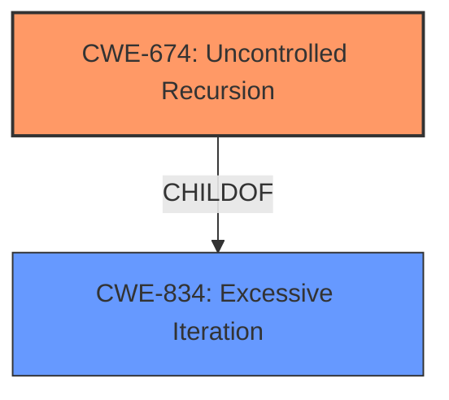

# Analysis for CVE-2021-38566

# Summary
| CWE ID | CWE Name | Confidence | CWE Abstraction Level | CWE Vulnerability Mapping Label | CWE-Vulnerability Mapping Notes |
|---|---|---|---|---|---|
| CWE-674 | Uncontrolled Recursion | 0.8 | Class | Primary | Allowed-with-Review |

## Evidence and Confidence

*   **Confidence Score:** 0.8
*   **Evidence Strength:** MEDIUM

## Relationship Analysis
The primary relationship considered was the ChildOf relationship, as CWE-674 is a Class-level CWE and may have more specific Base-level children. However, none of the children provided a better fit than CWE-674.

## Vulnerability Chain
The vulnerability chain involves the **uncontrolled recursion** during the processing of embedded XML nodes, which leads to stack consumption.

## Summary of Analysis
The initial analysis focused on identifying the **root cause** of the vulnerability, which is the **uncontrolled recursion** during the processing of embedded XML nodes. This leads to stack consumption. The "Retriever Results" listed CWE-674 (Uncontrolled Recursion) as the top candidate. While CWE-674 is a Class-level CWE, its description closely matches the vulnerability description.

The "CVE Reference Links Content Summary" section mentions "the application could be exposed to an Untrusted URL Invocation vulnerability when handling certain XFA documents" and other weaknesses, but these seem more related to other CVEs fixed in the same release, not the specific vulnerability described as **stack consumption** due to **recursive processing**.

Given the available information, CWE-674 is the most appropriate mapping. It is a Class-level CWE and might have more specific Base-level children, but none of the children presented in the "Complete CWE Specifications" section offer a better fit.

Relevant CWE Information:

# Enhanced Context (25 CWEs)
The following CWEs were identified as potentially relevant to this vulnerability:

## CWE-674: Uncontrolled Recursion
**Abstraction Level**: Class
**Similarity Score**: 0.78
**Source**: dense

**Description**:
The product does not properly control the amount of recursion that takes place,  consuming excessive resources, such as allocated memory or the program stack.

**Mapping Guidance**:
- Usage: Allowed-with-Review
- Rationale: This CWE entry is a Class and might have Base-level children that would be more appropriate

CWE-674 is the primary candidate because the vulnerability description explicitly mentions "recursive processing of embedded XML nodes" leading to **stack consumption**. The CWE description directly aligns with this: "The product does not properly control the amount of recursion that takes place, consuming excessive resources, such as allocated memory or the program stack."

## CWE-835: Loop with Unreachable Exit Condition ('Infinite Loop')
**Abstraction Level**: Base
**Similarity Score**: 9155.00
**Source**: sparse

**Description**:
The product contains an iteration or loop with an exit condition that cannot be reached, i.e., an infinite loop.

CWE-835 was considered, but recursion is not necessarily a loop. Also, the description mentions an "unreachable exit condition", which is not explicitly stated in the vulnerability description.

## CWE-776: Improper Restriction of Recursive Entity References in DTDs ('XML Entity Expansion')
**Abstraction Level**: Base
**Similarity Score**: 9115.42
**Source**: sparse

**Description**:
The product uses XML documents and allows their structure to be defined with a Document Type Definition (DTD), but it does not properly control the number of recursive definitions of entities.

CWE-776 was considered, but the vulnerability description doesn't explicitly mention DTDs or XML entity expansion.

## CWE-400: Uncontrolled Resource Consumption
**Abstraction Level**: Class
**Similarity Score**: 9082.53
**Source**: sparse

**Description**:
The product does not properly control the allocation and maintenance of a limited resource, thereby enabling an actor to influence the amount of resources consumed, eventually leading to the exhaustion of available resources.

CWE-400 is too general. The vulnerability description specifies that the resource consumption is due to uncontrolled recursion.

## CWE-121: Stack-based Buffer Overflow
**Abstraction Level**: Variant
**Similarity Score**: 9060.43
**Source**: sparse

**Description**:
A stack-based buffer overflow condition is a condition where the buffer being overwritten is allocated on the stack (i.e., is a local variable or, rarely, a parameter to a function).

CWE-121 is not directly supported by the vulnerability description. While stack consumption could potentially lead to a buffer overflow, the description does not explicitly state this.

## CWE-787: Out-of-bounds Write
**Abstraction Level**: Base
**Similarity Score**: 9052.88
**Source**: sparse

**Description**:
The product writes data past the end, or before the beginning, of the intended buffer.

CWE-787 is not directly supported by the vulnerability description. While stack consumption could potentially lead to an out-of-bounds write, the description does not explicitly state this.