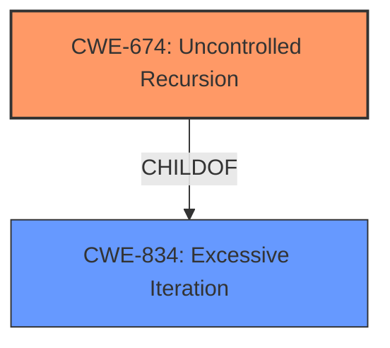

# Analysis for CVE-2021-38566

# Summary
| CWE ID | CWE Name | Confidence | CWE Abstraction Level | CWE Vulnerability Mapping Label | CWE-Vulnerability Mapping Notes |
|---|---|---|---|---|---|
| CWE-674 | Uncontrolled Recursion | 0.8 | Class | Primary | Allowed-with-Review |

## Evidence and Confidence

*   **Confidence Score:** 0.8
*   **Evidence Strength:** MEDIUM

## Relationship Analysis
The primary relationship considered was the ChildOf relationship, as CWE-674 is a Class-level CWE and may have more specific Base-level children. However, none of the children provided a better fit than CWE-674.



## Vulnerability Chain
The vulnerability chain involves the **uncontrolled recursion** during the processing of embedded XML nodes, which leads to stack consumption.

## Summary of Analysis
The initial analysis focused on identifying the **root cause** of the vulnerability, which is the **uncontrolled recursion** during the processing of embedded XML nodes. This leads to stack consumption. The "Retriever Results" listed CWE-674 (Uncontrolled Recursion) as the top candidate. While CWE-674 is a Class-level CWE, its description closely matches the vulnerability description.

The "CVE Reference Links Content Summary" section mentions "the application could be exposed to an Untrusted URL Invocation vulnerability when handling certain XFA documents" and other weaknesses, but these seem more related to other CVEs fixed in the same release, not the specific vulnerability described as **stack consumption** due to **recursive processing**.

Given the available information, CWE-674 is the most appropriate mapping. It is a Class-level CWE and might have more specific Base-level children, but none of the children presented in the "Complete CWE Specifications" section offer a better fit.

Relevant CWE Information:

# Enhanced Context (25 CWEs)
The following CWEs were identified as potentially relevant to this vulnerability:

## CWE-674: Uncontrolled Recursion
**Abstraction Level**: Class
**Similarity Score**: 0.78
**Source**: dense

**Description**:
The product does not properly control the amount of recursion that takes place,  consuming excessive resources, such as allocated memory or the program stack.

**Mapping Guidance**:
- Usage: Allowed-with-Review
- Rationale: This CWE entry is a Class and might have Base-level children that would be more appropriate

CWE-674 is the primary candidate because the vulnerability description explicitly mentions "recursive processing of embedded XML nodes" leading to **stack consumption**. The CWE description directly aligns with this: "The product does not properly control the amount of recursion that takes place, consuming excessive resources, such as allocated memory or the program stack."

## CWE-835: Loop with Unreachable Exit Condition ('Infinite Loop')
**Abstraction Level**: Base
**Similarity Score**: 9155.00
**Source**: sparse

**Description**:
The product contains an iteration or loop with an exit condition that cannot be reached, i.e., an infinite loop.

CWE-835 was considered, but recursion is not necessarily a loop. Also, the description mentions an "unreachable exit condition", which is not explicitly stated in the vulnerability description.

## CWE-776: Improper Restriction of Recursive Entity References in DTDs ('XML Entity Expansion')
**Abstraction Level**: Base
**Similarity Score**: 9115.42
**Source**: sparse

**Description**:
The product uses XML documents and allows their structure to be defined with a Document Type Definition (DTD), but it does not properly control the number of recursive definitions of entities.

CWE-776 was considered, but the vulnerability description doesn't explicitly mention DTDs or XML entity expansion.

## CWE-400: Uncontrolled Resource Consumption
**Abstraction Level**: Class
**Similarity Score**: 9082.53
**Source**: sparse

**Description**:
The product does not properly control the allocation and maintenance of a limited resource, thereby enabling an actor to influence the amount of resources consumed, eventually leading to the exhaustion of available resources.

CWE-400 is too general. The vulnerability description specifies that the resource consumption is due to uncontrolled recursion.

## CWE-121: Stack-based Buffer Overflow
**Abstraction Level**: Variant
**Similarity Score**: 9060.43
**Source**: sparse

**Description**:
A stack-based buffer overflow condition is a condition where the buffer being overwritten is allocated on the stack (i.e., is a local variable or, rarely, a parameter to a function).

CWE-121 is not directly supported by the vulnerability description. While stack consumption could potentially lead to a buffer overflow, the description does not explicitly state this.

## CWE-787: Out-of-bounds Write
**Abstraction Level**: Base
**Similarity Score**: 9052.88
**Source**: sparse

**Description**:
The product writes data past the end, or before the beginning, of the intended buffer.

CWE-787 is not directly supported by the vulnerability description. While stack consumption could potentially lead to an out-of-bounds write, the description does not explicitly state this.

# Enhanced Query for CVE-2021-38566

## Vulnerability Description
An issue was discovered in Foxit PDF Reader before 11.0.1 and PDF Editor before 11.0.1. It allows stack consumption during recursive processing of embedded XML nodes.

### Vulnerability Description Key Phrases
- **impact:** stack consumption
- **product:** Foxit PDF Reader and Editor
- **version:** before 11.0.1

## CVE Reference Links Content Summary
```
{
  "related_cves": [
    "CVE-2024-12751",
    "CVE-2024-12752",
    "CVE-2024-49576",
    "CVE-2024-47810",
    "CVE-2024-12753",
    "CVE-2024-28888",
    "CVE-2024-7725",
    "CVE-2024-9254",
    "CVE-2024-7722",
    "CVE-2024-7723",
    "CVE-2024-7724",
    "CVE-2024-9243",
    "CVE-2024-9246",
    "CVE-2024-9250",
    "CVE-2024-9252",
    "CVE-2024-9253",
    "CVE-2024-9251",
    "CVE-2024-9255",
    "CVE-2024-9256",
    "CVE-2024-9245",
    "CVE-2024-9244",
    "CVE-2024-38393",
    "CVE-2024-48618",
    "CVE-2024-9247",
    "CVE-2024-9249",
    "CVE-2024-9248",
    "CVE-2024-41605",
    "CVE-2024-25938",
    "CVE-2024-25648",
    "CVE-2024-25575",
    "CVE-2024-25858",
    "CVE-2024-30324",
    "CVE-2024-30327",
    "CVE-2024-30328",
    "CVE-2024-30331",
    "CVE-2024-30336",
    "CVE-2024-30342",
    "CVE-2024-30343",
    "CVE-2024-30344",
    "CVE-2024-30345",
    "CVE-2024-30346",
    "CVE-2024-30351",
    "CVE-2024-30357",
    "CVE-2024-30348",
    "CVE-2024-30363",
     "CVE-2024-30361",
    "CVE-2024-30362",
    "CVE-2024-30354",
    "CVE-2024-30365",
    "CVE-2024-30366",
    "CVE-2024-32488",
    "CVE-2024-30356",
    "CVE-2024-29072",
        "CVE-2023-51549",
    "CVE-2023-51550",
    "CVE-2023-51552",
    "CVE-2023-51554",
    "CVE-2023-51553",
    "CVE-2023-32616",
    "CVE-2023-41257",
    "CVE-2023-38573",
      "CVE-2023-51555",
    "CVE-2023-51556",
    "CVE-2023-51557",
    "CVE-2023-51558",
     "CVE-2023-51559",
    "CVE-2023-51551",
    "CVE-2023-51562",
      "CVE-2023-40194",
    "CVE-2023-35985",
        "CVE-2023-51560",
    "CVE-2023-51561",
        "CVE-2023-42089",
    "CVE-2023-42090",
    "CVE-2023-42091",
    "CVE-2023-42092",
    "CVE-2023-42093",
     "CVE-2023-42094",
    "CVE-2023-42095",
    "CVE-2023-42096",
    "CVE-2023-42097",
    "CVE-2023-42098",
    "CVE-2023-39542",
    "CVE-2023-28744",
    "CVE-2023-38111",
    "CVE-2023-38107",
    "CVE-2023-38109",
    "CVE-2023-38113",
    "CVE-2023-38114",
    "CVE-2023-38112",
    "CVE-2023-38110",
     "CVE-2023-38115",
    "CVE-2023-38117",
    "CVE-2023-27379",
    "CVE-2023-33866",
    "CVE-2023-32664",
    "CVE-2023-33876",
        "CVE-2023-38105",
    "CVE-2023-38106",
    "CVE-2023-38108",
    "CVE-2023-38116",
     "CVE-2023-38119",
    "CVE-2023-38118",
        "CVE-2023-27363",
    "CVE-2023-27364",
    "CVE-2023-27365",
    "CVE-2023-27366",
     "CVE-2023-51560",
        "CVE-2023-25938",
    "CVE-2024-30322",
        "CVE-2023-28744",
     "CVE-2023-51549",
    "CVE-2023-51550",
    "CVE-2023-51552",
    "CVE-2023-51554",
    "CVE-2023-51553",
    "CVE-2023-32616",
    "CVE-2023-41257",
    "CVE-2023-38573",
      "CVE-2023-51555",
    "CVE-2023-51556",
    "CVE-2023-51557",
    "CVE-2023-51558",
    "CVE-2023-51559",
      "CVE-2023-51551",
     "CVE-2023-51562",
    "CVE-2023-30322",
    "CVE-2023-27331",
    "CVE-2023-27330",
    "CVE-2023-27329",
    "CVE-2022-43637",
    "CVE-2022-43638",
    "CVE-2022-43639",
    "CVE-2022-43640",
    "CVE-2022-43641",
    "CVE-2022-32774",
    "CVE-2022-38097",
    "CVE-2022-37332",
    "CVE-2022-40129",
    "CVE-2022-29072",
    "CVE-2022-43649",
    "CVE-2022-25641",
    "CVE-2022-30557",
     "CVE-2022-30323",
    "CVE-2022-30360",
     "CVE-2022-30324",
      "CVE-2022-30327",
    "CVE-2022-30328",
    "CVE-2022-30331",
        "CVE-2022-30336",
    "CVE-2022-30342",
      "CVE-2022-30343",
    "CVE-2022-30344",
    "CVE-2022-30345",
    "CVE-2022-30346",
    "CVE-2022-30351",
    "CVE-2022-30357",
        "CVE-2022-30348",
     "CVE-2022-30363",
        "CVE-2022-30358",
      "CVE-2022-30349",
        "CVE-2022-25938",
        "CVE-2022-25858",
        "CVE-2022-32488",
        "CVE-2022-30356",
    "CVE-2022-25575",
         "CVE-2023-30322",
          "CVE-2024-30324",
        "CVE-2024-30325",
    "CVE-2024-30326",
     "CVE-2024-30327",
      "CVE-2024-30328",
    "CVE-2024-30329",
       "CVE-2024-30330",
          "CVE-2024-30331",
    "CVE-2024-30332",
      "CVE-2024-30333",
    "CVE-2024-30334",
    "CVE-2024-30335",
     "CVE-2024-30336",
        "CVE-2024-30337",
     "CVE-2024-30338",
    "CVE-2024-30339",
     "CVE-2024-30340",
       "CVE-2024-30342",
     "CVE-2024-30343",
    "CVE-2024-30344",
    "CVE-2024-30345",
    "CVE-2024-30346",
    "CVE-2024-30347",
        "CVE-2024-30350",
     "CVE-2024-30351",
       "CVE-2024-30352",
      "CVE-2024-30353",
      "CVE-2024-30355",
    "CVE-2024-30357",
       "CVE-2024-30348",
     "CVE-2024-30358",
        "CVE-2024-30349",
     "CVE-2024-30363",
       "CVE-2024-30364",
         "CVE-2024-30367",
    "CVE-2024-30371",
          "CVE-2024-30323",
        "CVE-2024-30360",
    "CVE-2024-30361",
    "CVE-2024-30362",
    "CVE-2024-30341",
    "CVE-2024-30354",
      "CVE-2024-30359",
     "CVE-2024-30365",
    "CVE-2024-30366",
    "CVE-2024-38119",
    "CVE-2024-38118",
        "CVE-2023-51549",
    "CVE-2023-51550",
    "CVE-2023-51552",
        "CVE-2023-51554",
     "CVE-2023-51553",
          "CVE-2023-51555",
    "CVE-2023-51556",
    "CVE-2023-51557",
    "CVE-2023-51558",
     "CVE-2023-51559",
    "CVE-2023-51551",
    "CVE-2023-51562",
    "CVE-2023-40194",
    "CVE-2023-35985",
     "CVE-2023-51560",
      "CVE-2023-51561",
      "CVE-2024-28888",
    "CVE-2024-7722",
     "CVE-2024-7723",
        "CVE-2024-7724",
    "CVE-2024-7725",
          "CVE-2024-25938",
            "CVE-2024-25648",
                "CVE-2024-25575",
       "CVE-2024-25648",
        "CVE-2024-25575"

  ],
  "description": "PLACEHOLDER - Implement CVE description retrieval",
  "fixes": [
    "Addressed potential issues where the application could be exposed to an Untrusted URL Invocation vulnerability when handling certain XFA documents, which attackers could exploit to access the resources or execute malicious actions under users’ systems by embedding malicious images or codes in PDF documents. This occurs as the application loads images from all resources (including those untrusted) when parsing the image resources or fails to properly request user confirmation before getting or posting content from external HTTP servers.",
    "Addressed potential issues where the application could deliver incorrect signature verification information when handling certain signed XFA documents, which attackers could exploit to manipulate document content and deceive users into trusting and signing the manipulated documents. This occurs as the application improperly ignores the changes to the “/NeedsRendering” key or “TextField” field when verifying the XFA documents.",
    "Addressed potential issues where the application could be exposed to an Information Disclosure vulnerability when handling certain XFA documents with the “app.openDoc” function, certain PDF files with the ‘’LaunchAction” function, or submitting form data in certain XFA documents with encryption elements. Attackers could exploit this vulnerability to exfiltrate XFA data from other documents on the file system or from SMB servers, retrieve NTLM information, or access form data. This occurs as the application fails to provide a reasonable prompt for user confirmation when executing the “app.openDoc”/“LaunchAction” functions, or ignores the encryption elements and transmits form content in clear text without a proper prompt for users.",
    "Addressed potential issues where the application could be exposed to a Use-After-Free vulnerability and crash when handling certain AcroForms, checkbox objects, or 3D page objects, which attackers could exploit to execute remote code. This occurs due to the use of a wild pointer or null pointer without proper validation. (CVE-2024-12751, CVE-2024-12752, CVE-2024-49576, CVE-2024-47810)",
    "Addressed a potential issue where the application could be exposed to a DLL Hijacking vulnerability, which attackers could exploit to execute malicious actions. This occurs as the application fails to specify the secure search path when loading edputil.dll.",
    "Addressed potential issues where the application could be exposed to Privilege Escalation vulnerability due to the lack of proper validation when performing an update or installing a plugin. Attackers could exploit this vulnerability to execute arbitrary code in the context of SYSTEM by loading malicious DLLs, calling an outdated version of the updater, or creating a junction to write an arbitrary file with full privileges. (CVE-2024-12753)",
      "Addressed potential issues where the application could be exposed to a Use-After-Free vulnerability and crash when handling certain checkbox field objects or AcroForms, which attackers could exploit to execute remote code. This occurs as the application uses a wild pointer or an object that has been freed without proper validation, or fails to properly synchronize the annotation items when handling the Reply Note of an annotation using JavaScript. (CVE-2024-28888, CVE-2024-7725, CVE-2024-9254)",
      "Addressed potential issues where the application could be exposed to a Use-After-Free vulnerability and crash when handling certain Doc objects or AcroForms, which attackers could exploit to execute remote code or disclose information. This occurs due to the use of a wild pointer or an object that has been freed without proper validation. (CVE-2024-7722, CVE-2024-7723, CVE-2024-7724, CVE-2024-7725)",
      "Addressed potential issues where the application could be exposed to a Use-After-Free vulnerability and crash when handling certain checkbox field objects, Doc objects, Annotation objects, or AcroForms, which attackers could exploit to execute remote code or disclose information. This occurs as the application uses a wild pointer or an object that has been freed without proper validation, fails to properly synchronize the annotation items when handling the Reply Note of an annotation using JavaScript, or fails to correctly update the font cache after deleting a page. (CVE-2024-28888, CVE-2024-7722, CVE-2024-7723, CVE-2024-7724, CVE-2024-7725, CVE-2024-9243, CVE-2024-9246, CVE-2024-9250, CVE-2024-9252, CVE-2024-9253, CVE-2024-9251, CVE-2024-9254, CVE-2024-9255, CVE-2024-9256)",
     "Addressed potential issues where the application could be exposed to a Privilege Escalation vulnerability when performing an update or installing a plugin, which attackers could exploit to delete arbitrary files or execute arbitrary code so as to carry out privilege escalation attacks. This occurs due to the incorrect permission assignment on the resources used by the update service, improper signature validation and incomplete certificate check for the updater, weak randomness setting for the name of the temporary folder during a plugin installation, or improper DLL loading without using the built-in manifest file. (CVE-2024-9245, CVE-2024-9244, CVE-2024-38393, CVE-2024-48618)",
      "Addressed potential issues where the application could be exposed to an Out-of-Bounds Read/Write vulnerability and crash when parsing certain PDF files or handling certain Annotation objects, which attackers could exploit to execute remote code. This occurs as the application reads or writes data beyond the boundaries of an allocated object or buffer. (CVE-2024-9247, CVE-2024-9249, CVE-2024-9248)",
     "Addressed a potential issue where the application could be exposed to a Side-Loading vulnerability when performing an update, which attackers could exploit to run malicious payloads by replacing the update file with a malicious one. This occurs as the application fails to validate the integrity of the updater when running the update service. (CVE-2024-41605)",
   "Addressed a potential issue where the application could be exposed to a Null Pointer Dereference vulnerability and crash when scrolling certain PDF files with an abnormal *StructTreeRoot* dictionary entry, which attackers could exploit to launch a Denial of Service attack. This occurs due to the use of a null pointer without proper validation.",
     "Addressed potential issues where the application could be exposed to User-After-Free or Type Confusion vulnerability and crash when opening certain PDF files that contain JavaScripts, which attackers could exploit to execute arbitrary code. This occurs due to the use of object that has been deleted or freed without proper validation. (CVE-2024-25938, CVE-2024-25648, CVE-2024-25575)",
     "Addressed a potential issue where the application could be exposed to Arbitrary Code Execution vulnerability when executing certain JavaScripts, which attackers could exploit to induce users to execute commands with malicious parameters. The application has optimized the prompt message to enable users to view the complete parameters before executing commands. (CVE-2024-25858)",
      "Addressed potential issues where the application could be exposed to Use-After-Free or Out-of-Bounds Read vulnerability and crash when parsing certain PDF files or handling certain Doc, Annotation, Signature, or AcroForm objects, which attackers could exploit to execute remote code or disclose information. This occurs due to the use of the wild pointer, memory, or object that has been deleted or freed without proper validation. (CVE-2024-30322, CVE-2024-30324, CVE-2024-30325, CVE-2024-30326, CVE-2024-30327, CVE-2024-30328, CVE-2024-30329, CVE-2024-30330, CVE-2024-30331, CVE-2024-30332, CVE-2024-30333, CVE-2024-30334, CVE-2024-30335, CVE-2024-30336, CVE-2024-30337, CVE-2024-30338, CVE-2024-30339, CVE-2024-30340, CVE-2024-30342, CVE-2024-30343, CVE-2024-30344, CVE-2024-30345, CVE-2024-30346, CVE-2024-30347, CVE-2024-30350, CVE-2024-30351, CVE-2024-30352, CVE-2024-30353, CVE-2024-30355, CVE-2024-30357, CVE-2024-30348, CVE-2024-30358, CVE-2024-30349, CVE-2024-30363, CVE-2024-30364, CVE-2024-30367, CVE-2024-30371)",
      "Addressed potential issues where the application could be exposed to Out-of-Bounds Read/Write vulnerability and crash when handing certain U3D files, Doc objects, or 3D objects in AcroForms, which attackers could exploit to execute remote code or disclose information. This occurs as the application encounters an infinite loop when traversing objects in a circular reference, reads or writes data beyond the boundaries of an allocated object/buffer, or converts and uses the pointer that is discrepant with the object type. (CVE-2024-30323, CVE-2024-30360, CVE-2024-30361, CVE-2024-30362, CVE-2024-30341, CVE-2024-30354, CVE-2024-30359, CVE-2024-30365, CVE-2024-30366)",
  "Addressed a potential issue where the application could be exposed to Local Privilege Escalation vulnerability when checking for updates, which attackers could exploit to execute malicious DLL files. This occurs due to the weak permissions on the folder in which the update service is executed. (CVE-2024-32488)",
  "Addressed potential issues where the application could be exposed to Null Pointer Dereference vulnerability and crash when playing multimedia in certain PDF files, which attackers could exploit to launch a denial of service. This occurs due to the use of null pointer without proper validation as the application fails to properly handle the situation where the canvas is set as zero in width and length or the “/S” dictionary entry for the rendition object has been modified.",
    "Addressed a potential issue where the application could be exposed to Type Confusion vulnerability when handling certain Annotation objects, which attackers could exploit to execute remote code. This occurs as the application improperly handles the annotation object that contains a non-standard “DS” field in the annotation dictionary entry using a type that is incompatible with the intended type. (CVE-2024-30356)",
    "Addressed a potential issue where the application could be exposed to hidden dangers lurking in common tools when opening certain PDFs that include the Launch File action, which attackers could exploit to deceive users into executing harmful commands. This appears in the security warning dialog box as it shows “OK” as the default selected option, which may cause users to habitually click “OK” without understanding the potential risks involved.",
   "Addressed potential issues where the application could be exposed to Time-of-Check Time-of-Use (TOCTOU) Race Condition or Privilege Escalation vulnerability when performing an update, which attackers could exploit to carry out privilege escalation attacks by replacing the update file with a malicious one. This occurs as the application fails to properly validate the certificate of the updater executable or fails to lock the permissions of the update file after certificate validation. (CVE-2024-29072)",
    "Addressed an issue that causes partial redaction of information.  Please note the issue occurs under the following conditions:  1. When you are using the following affected versions:  1. Windows editor versions: PDF Editor v13.0 – v13.1.2 and PDF Editor v2023.2 - v2024.2.2; and 2. Mac editor versions: PDF Editor v2024.1, v2024.2, v2024.2.1, v2024.2.2;  3. When you are using the **“Search and Redact”** or “Smart Redact” feature (the issue does not impact the manual marking of text and images prior to redacting); 4. When your search text includes multiple words with a space; and 5. When your search text within the same text object includes a character that is larger than your search text within the same text object. The issue does not happen if the character is part of the search term.  **All 4 conditions must be met simultaneously** to replicate this issue.",
   "Addressed potential issues where the application could be exposed to a Cross-Site Scripting vulnerability when working with certain PDF files embedded with JavaScript. This occurs due to the incomplete isolation of the JavaScript execution environment in PDFs, which allows the JavaScript embedded in PDFs to be executed within the browser environment.",
   "Addressed a potential issue where the application could be exposed to a Privilege Escalation vulnerability during the deactivation or uninstallation if the application is reinstalled without prior uninstallation, which attackers could exploit to execute malicious actions. This occurs due to the inadequate permission setting for the “/usr/local/share/foxit” folder used during the installation so that low-privilege attackers can easily tamper with the script files in the directory."
  ],
  "vulnerability_details": {
    "root_cause": "Multiple vulnerabilities exist across various components and functionalities of the Foxit PDF Reader and Editor applications.",
    "weaknesses": [
      "Untrusted URL Invocation",
      "Incorrect signature verification",
      "Information Disclosure",
      "Use-After-Free",
       "DLL Hijacking",
      "Privilege Escalation",
       "Cross-Site Scripting",
      "Type Confusion",
      "Out-of-Bounds Read/Write",
      "Side-Loading",
       "Null Pointer Dereference",
        "Time-of-Check Time-of-Use (TOCTOU) Race Condition",
        "Partial Redaction"
      ],
    "impact": "Exploitation of these vulnerabilities can lead to a variety of impacts, including remote code execution, privilege escalation, denial of service, information disclosure, and the execution of malicious actions.",
    "attack_vectors": [
        "Handling of XFA documents",
        "Handling of signed XFA documents",
        "Handling of XFA documents with the “app.openDoc” function",
        "Handling of PDF files with the ‘’LaunchAction” function",
          "Submitting form data in certain XFA documents with encryption elements",
          "Handling of AcroForms, checkbox objects, or 3D page objects",
          "Loading of DLLs",
          "Performing an update or installing a plugin",
        "JavaScript execution",
           "Parsing of PDF files or handling of Annotation objects",
             "Opening of certain PDF files",
        "Scrolling certain PDF files",
       "Working with certain PDF files embedded with JavaScript",
          "During the deactivation or uninstallation if the application is reinstalled without prior uninstallation"
    ],
    "attacker_capabilities": "Attacker needs to craft a malicious PDF file or utilize specific features within the application to trigger the vulnerabilities. In some cases, they need to replace update files with malicious ones or exploit file permission issues. Some vulnerabilities can be exploited remotely through manipulated PDF documents while others require local access to execute."
  }
}
```

## Retriever Results

### Top Combined Results

| Rank | CWE ID | Name | Abstraction | Usage  | Retrievers | Individual Scores |
|------|--------|------|-------------|-------|------------|-------------------|
| 1 | 674 | Uncontrolled Recursion | Class | Allowed-with-Review | sparse | 0.073 |
| 2 | 835 | Loop with Unreachable Exit Condition ('Infinite Loop') | Base | Allowed | sparse | 0.056 |
| 3 | 776 | Improper Restriction of Recursive Entity References in DTDs ('XML Entity Expansion') | Base | Allowed | sparse | 0.056 |
| 4 | 400 | Uncontrolled Resource Consumption | Class | Discouraged | sparse | 0.048 |
| 5 | 121 | Stack-based Buffer Overflow | Variant | Allowed | sparse | 0.046 |
| 6 | 611 | Improper Restriction of XML External Entity Reference | Base | Allowed | dense | 0.491 |
| 7 | 1322 | Use of Blocking Code in Single-threaded, Non-blocking Context | Base | Allowed | graph | 0.002 |
| 8 | 460 | Improper Cleanup on Thrown Exception | Base | Allowed | sparse | 0.044 |
| 9 | 787 | Out-of-bounds Write | Base | Allowed | sparse | 0.044 |
| 10 | 1333 | Inefficient Regular Expression Complexity | Base | Allowed | sparse | 0.043 |


# Complete CWE Specifications


## CWE-674: Uncontrolled Recursion
**Abstraction:** Class
**Status:** Draft

### Description
The product does not properly control the amount of recursion that takes place,  consuming excessive resources, such as allocated memory or the program stack.

### Extended Description
Not provided

### Alternative Terms
Stack Exhaustion

### Relationships
ChildOf -> CWE-834

### Mapping Guidance
**Usage:** Allowed-with-Review
**Rationale:** This CWE entry is a Class and might have Base-level children that would be more appropriate
**Comments:** Examine children of this entry to see if there is a better fit
**Reasons:**
- Abstraction


### Observed Examples
- **CVE-2007-1285:** Deeply nested arrays trigger stack exhaustion.
- **CVE-2007-3409:** Self-referencing pointers create infinite loop and resultant stack exhaustion.
- **CVE-2016-10707:** Javascript application accidentally changes input in a way that prevents a recursive call from detecting an exit condition.


## CWE-835: Loop with Unreachable Exit Condition ('Infinite Loop')
**Abstraction:** Base
**Status:** Incomplete

### Description
The product contains an iteration or loop with an exit condition that cannot be reached, i.e., an infinite loop.

### Extended Description
Not provided

### Alternative Terms
None

### Relationships
ChildOf -> CWE-834
ChildOf -> CWE-834

### Mapping Guidance
**Usage:** Allowed
**Rationale:** This CWE entry is at the Base level of abstraction, which is a preferred level of abstraction for mapping to the root causes of vulnerabilities.
**Comments:** Carefully read both the name and description to ensure that this mapping is an appropriate fit. Do not try to 'force' a mapping to a lower-level Base/Variant simply to comply with this preferred level of abstraction.
**Reasons:**
- Acceptable-Use


### Observed Examples
- **CVE-2022-22224:** Chain: an operating system does not properly process malformed Open Shortest Path First (OSPF) Type/Length/Value Identifiers (TLV) (CWE-703), which can cause the process to enter an infinite loop (CWE-835)
- **CVE-2022-25304:** A Python machine communication platform did not account for receiving a malformed packet with a null size, causing the receiving function to never update the message buffer and be caught in an infinite loop.
- **CVE-2011-1027:** Chain: off-by-one error (CWE-193) leads to infinite loop (CWE-835) using invalid hex-encoded characters.


## CWE-776: Improper Restriction of Recursive Entity References in DTDs ('XML Entity Expansion')
**Abstraction:** Base
**Status:** Draft

### Description
The product uses XML documents and allows their structure to be defined with a Document Type Definition (DTD), but it does not properly control the number of recursive definitions of entities.

### Extended Description
If the DTD contains a large number of nested or recursive entities, this can lead to explosive growth of data when parsed, causing a denial of service.

### Alternative Terms
XEE: XEE is the acronym commonly used for XML Entity Expansion.
Billion Laughs Attack
XML Bomb: While the "XML Bomb" term was used in the early years of knowledge of this issue, the XEE term seems to be more commonly used.

### Relationships
ChildOf -> CWE-674
ChildOf -> CWE-674
ChildOf -> CWE-405

### Mapping Guidance
**Usage:** Allowed
**Rationale:** This CWE entry is at the Base level of abstraction, which is a preferred level of abstraction for mapping to the root causes of vulnerabilities.
**Comments:** Carefully read both the name and description to ensure that this mapping is an appropriate fit. Do not try to 'force' a mapping to a lower-level Base/Variant simply to comply with this preferred level of abstraction.
**Reasons:**
- Acceptable-Use


### Observed Examples
- **CVE-2008-3281:** XEE in XML-parsing library.
- **CVE-2011-3288:** XML bomb / XEE in enterprise communication product.
- **CVE-2011-1755:** "Billion laughs" attack in XMPP server daemon.


## CWE-400: Uncontrolled Resource Consumption
**Abstraction:** Class
**Status:** Draft

### Description
The product does not properly control the allocation and maintenance of a limited resource, thereby enabling an actor to influence the amount of resources consumed, eventually leading to the exhaustion of available resources.

### Extended Description


Limited resources include memory, file system storage, database connection pool entries, and CPU. If an attacker can trigger the allocation of these limited resources, but the number or size of the resources is not controlled, then the attacker could cause a denial of service that consumes all available resources. This would prevent valid users from accessing the product, and it could potentially have an impact on the surrounding environment. For example, a memory exhaustion attack against an application could slow down the application as well as its host operating system.


There are at least three distinct scenarios which can commonly lead to resource exhaustion:


  - Lack of throttling for the number of allocated resources

  - Losing all references to a resource before reaching the shutdown stage

  - Not closing/returning a resource after processing

Resource exhaustion problems are often result due to an incorrect implementation of the following situations:

  - Error conditions and other exceptional circumstances.

  - Confusion over which part of the program is responsible for releasing the resource.


### Alternative Terms
Resource Exhaustion

### Relationships
ChildOf -> CWE-664

### Mapping Guidance
**Usage:** Discouraged
**Rationale:** CWE-400 is intended for incorrect behaviors in which the product is expected to track and restrict how many resources it consumes, but CWE-400 is often misused because it is conflated with the "technical impact" of vulnerabilities in which resource consumption occurs. It is sometimes used for low-information vulnerability reports. It is a level-1 Class (i.e., a child of a Pillar).
**Comments:** Closely analyze the specific mistake that is causing resource consumption, and perform a CWE mapping for that mistake. Consider children/descendants such as CWE-770: Allocation of Resources Without Limits or Throttling, CWE-771: Missing Reference to Active Allocated Resource, CWE-410: Insufficient Resource Pool, CWE-772: Missing Release of Resource after Effective Lifetime, CWE-834: Excessive Iteration, CWE-405: Asymmetric Resource Consumption (Amplification), and others.
**Reasons:**
- Frequent Misuse


### Additional Notes
**[Maintenance]** "Resource consumption" could be interpreted as a consequence instead of an insecure behavior, so this entry is being considered for modification. It appears to be referenced too frequently when more precise mappings are available. Some of its children, such as CWE-771, might be better considered as a chain.

**[Theoretical]** Vulnerability theory is largely about how behaviors and resources interact. "Resource exhaustion" can be regarded as either a consequence or an attack, depending on the perspective. This entry is an attempt to reflect the underlying weaknesses that enable these attacks (or consequences) to take place.

**[Other]** 

Database queries that take a long time to process are good DoS targets. An attacker would have to write a few lines of Perl code to generate enough traffic to exceed the site's ability to keep up. This would effectively prevent authorized users from using the site at all. Resources can be exploited simply by ensuring that the target machine must do much more work and consume more resources in order to service a request than the attacker must do to initiate a request.


A prime example of this can be found in old switches that were vulnerable to "macof" attacks (so named for a tool developed by Dugsong). These attacks flooded a switch with random IP and MAC address combinations, therefore exhausting the switch's cache, which held the information of which port corresponded to which MAC addresses. Once this cache was exhausted, the switch would fail in an insecure way and would begin to act simply as a hub, broadcasting all traffic on all ports and allowing for basic sniffing attacks.


**[Maintenance]** The Taxonomy_Mappings to ISA/IEC 62443 were added in CWE 4.10, but they are still under review and might change in future CWE versions. These draft mappings were performed by members of the "Mapping CWE to 62443" subgroup of the CWE-CAPEC ICS/OT Special Interest Group (SIG), and their work is incomplete as of CWE 4.10. The mappings are included to facilitate discussion and review by the broader ICS/OT community, and they are likely to change in future CWE versions.


### Observed Examples
- **CVE-2022-21668:** Chain: Python library does not limit the resources used to process images that specify a very large number of bands (CWE-1284), leading to excessive memory consumption (CWE-789) or an integer overflow (CWE-190).
- **CVE-2020-7218:** Go-based workload orchestrator does not limit resource usage with unauthenticated connections, allowing a DoS by flooding the service
- **CVE-2020-3566:** Resource exhaustion in distributed OS because of "insufficient" IGMP queue management, as exploited in the wild per CISA KEV.


## CWE-121: Stack-based Buffer Overflow
**Abstraction:** Variant
**Status:** Draft

### Description
A stack-based buffer overflow condition is a condition where the buffer being overwritten is allocated on the stack (i.e., is a local variable or, rarely, a parameter to a function).

### Extended Description
Not provided

### Alternative Terms
Stack Overflow: "Stack Overflow" is often used to mean the same thing as stack-based buffer overflow, however it is also used on occasion to mean stack exhaustion, usually a result from an excessively recursive function call. Due to the ambiguity of the term, use of stack overflow to describe either circumstance is discouraged.

### Relationships
ChildOf -> CWE-788
ChildOf -> CWE-787

### Mapping Guidance
**Usage:** Allowed
**Rationale:** This CWE entry is at the Variant level of abstraction, which is a preferred level of abstraction for mapping to the root causes of vulnerabilities.
**Comments:** Carefully read both the name and description to ensure that this mapping is an appropriate fit. Do not try to 'force' a mapping to a lower-level Base/Variant simply to comply with this preferred level of abstraction.
**Reasons:**
- Acceptable-Use


### Additional Notes
**[Other]** Stack-based buffer overflows can instantiate in return address overwrites, stack pointer overwrites or frame pointer overwrites. They can also be considered function pointer overwrites, array indexer overwrites or write-what-where condition, etc.


### Observed Examples
- **CVE-2021-35395:** Stack-based buffer overflows in SFK for wifi chipset used for IoT/embedded devices, as exploited in the wild per CISA KEV.


## CWE-611: Improper Restriction of XML External Entity Reference
**Abstraction:** Base
**Status:** Draft

### Description
The product processes an XML document that can contain XML entities with URIs that resolve to documents outside of the intended sphere of control, causing the product to embed incorrect documents into its output.

### Extended Description


XML documents optionally contain a Document Type Definition (DTD), which, among other features, enables the definition of XML entities. It is possible to define an entity by providing a substitution string in the form of a URI. The XML parser can access the contents of this URI and embed these contents back into the XML document for further processing.


By submitting an XML file that defines an external entity with a file:// URI, an attacker can cause the processing application to read the contents of a local file. For example, a URI such as "file:///c:/winnt/win.ini" designates (in Windows) the file C:\Winnt\win.ini, or file:///etc/passwd designates the password file in Unix-based systems. Using URIs with other schemes such as http://, the attacker can force the application to make outgoing requests to servers that the attacker cannot reach directly, which can be used to bypass firewall restrictions or hide the source of attacks such as port scanning.


Once the content of the URI is read, it is fed back into the application that is processing the XML. This application may echo back the data (e.g. in an error message), thereby exposing the file contents.


### Alternative Terms
XXE: An acronym used for the term "XML eXternal Entities"

### Relationships
ChildOf -> CWE-610
ChildOf -> CWE-610
PeerOf -> CWE-441

### Mapping Guidance
**Usage:** Allowed
**Rationale:** This CWE entry is at the Base level of abstraction, which is a preferred level of abstraction for mapping to the root causes of vulnerabilities.
**Comments:** Carefully read both the name and description to ensure that this mapping is an appropriate fit. Do not try to 'force' a mapping to a lower-level Base/Variant simply to comply with this preferred level of abstraction.
**Reasons:**
- Acceptable-Use


### Additional Notes
**[Relationship]** CWE-918 (SSRF) and CWE-611 (XXE) are closely related, because they both involve web-related technologies and can launch outbound requests to unexpected destinations. However, XXE can be performed client-side, or in other contexts in which the software is not acting directly as a server, so the "Server" portion of the SSRF acronym does not necessarily apply.


### Observed Examples
- **CVE-2022-42745:** Recruiter software allows reading arbitrary files using XXE
- **CVE-2005-1306:** A browser control can allow remote attackers to determine the existence of files via Javascript containing XML script.
- **CVE-2012-5656:** XXE during SVG image conversion


## CWE-1322: Use of Blocking Code in Single-threaded, Non-blocking Context
**Abstraction:** Base
**Status:** Incomplete

### Description
The product uses a non-blocking model that relies on a single threaded process
			for features such as scalability, but it contains code that can block when it is invoked.

### Extended Description


When an attacker can directly invoke the blocking code, or the blocking code can be affected by environmental conditions that can be influenced by an attacker, then this can lead to a denial of service by causing unexpected hang or freeze of the code. Examples of blocking code might be an expensive computation or calling blocking library calls, such as those that perform exclusive file operations or require a successful network operation.


Due to limitations in multi-thread models, single-threaded models are used to overcome the resource constraints that are caused by using many threads. In such a model, all code should generally be non-blocking. If blocking code is called, then the event loop will effectively be stopped, which can be undesirable or dangerous. Such models are used in Python asyncio, Vert.x, and Node.js, or other custom event loop code.


### Alternative Terms
None

### Relationships
ChildOf -> CWE-834
CanPrecede -> CWE-835

### Mapping Guidance
**Usage:** Allowed
**Rationale:** This CWE entry is at the Base level of abstraction, which is a preferred level of abstraction for mapping to the root causes of vulnerabilities.
**Comments:** Carefully read both the name and description to ensure that this mapping is an appropriate fit. Do not try to 'force' a mapping to a lower-level Base/Variant simply to comply with this preferred level of abstraction.
**Reasons:**
- Acceptable-Use


## CWE-460: Improper Cleanup on Thrown Exception
**Abstraction:** Base
**Status:** Draft

### Description
The product does not clean up its state or incorrectly cleans up its state when an exception is thrown, leading to unexpected state or control flow.

### Extended Description
Often, when functions or loops become complicated, some level of resource cleanup is needed throughout execution. Exceptions can disturb the flow of the code and prevent the necessary cleanup from happening.

### Alternative Terms
None

### Relationships
ChildOf -> CWE-459
ChildOf -> CWE-755

### Mapping Guidance
**Usage:** Allowed
**Rationale:** This CWE entry is at the Base level of abstraction, which is a preferred level of abstraction for mapping to the root causes of vulnerabilities.
**Comments:** Carefully read both the name and description to ensure that this mapping is an appropriate fit. Do not try to 'force' a mapping to a lower-level Base/Variant simply to comply with this preferred level of abstraction.
**Reasons:**
- Acceptable-Use


## CWE-787: Out-of-bounds Write
**Abstraction:** Base
**Status:** Draft

### Description
The product writes data past the end, or before the beginning, of the intended buffer.

### Extended Description
Not provided

### Alternative Terms
Memory Corruption: Often used to describe the consequences of writing to memory outside the bounds of a buffer, or to memory that is otherwise invalid.

### Relationships
ChildOf -> CWE-119
ChildOf -> CWE-119
ChildOf -> CWE-119
ChildOf -> CWE-119

### Mapping Guidance
**Usage:** Allowed
**Rationale:** This CWE entry is at the Base level of abstraction, which is a preferred level of abstraction for mapping to the root causes of vulnerabilities.
**Comments:** Carefully read both the name and description to ensure that this mapping is an appropriate fit. Do not try to 'force' a mapping to a lower-level Base/Variant simply to comply with this preferred level of abstraction.
**Reasons:**
- Acceptable-Use


### Observed Examples
- **CVE-2023-1017:** The reference implementation code for a Trusted Platform Module does not implement length checks on data, allowing for an attacker to write 2 bytes past the end of a buffer.
- **CVE-2021-21220:** Chain: insufficient input validation (CWE-20) in browser allows heap corruption (CWE-787), as exploited in the wild per CISA KEV.
- **CVE-2021-28664:** GPU kernel driver allows memory corruption because a user can obtain read/write access to read-only pages, as exploited in the wild per CISA KEV.


## CWE-1333: Inefficient Regular Expression Complexity
**Abstraction:** Base
**Status:** Draft

### Description
The product uses a regular expression with an inefficient, possibly exponential worst-case computational complexity that consumes excessive CPU cycles.

### Extended Description
Some regular expression engines have a feature called "backtracking". If the token cannot match, the engine "backtracks" to a position that may result in a different token that can match.
 Backtracking becomes a weakness if all of these conditions are met:


  - The number of possible backtracking attempts are exponential relative to the length of the input.

  - The input can fail to match the regular expression.

  - The input can be long enough.

 Attackers can create crafted inputs that intentionally cause the regular expression to use excessive backtracking in a way that causes the CPU consumption to spike. 

### Alternative Terms
ReDoS: ReDoS is an abbreviation of "Regular expression Denial of Service".
Regular Expression Denial of Service: While this term is attack-focused, this is commonly used to describe the weakness.
Catastrophic backtracking: This term is used to describe the behavior of the regular expression as a negative technical impact.

### Relationships
ChildOf -> CWE-407
ChildOf -> CWE-407

### Mapping Guidance
**Usage:** Allowed
**Rationale:** This CWE entry is at the Base level of abstraction, which is a preferred level of abstraction for mapping to the root causes of vulnerabilities.
**Comments:** Carefully read both the name and description to ensure that this mapping is an appropriate fit. Do not try to 'force' a mapping to a lower-level Base/Variant simply to comply with this preferred level of abstraction.
**Reasons:**
- Acceptable-Use


### Observed Examples
- **CVE-2020-5243:** server allows ReDOS with crafted User-Agent strings, due to overlapping capture groups that cause excessive backtracking.
- **CVE-2021-21317:** npm package for user-agent parser prone to ReDoS due to overlapping capture groups
- **CVE-2019-16215:** Markdown parser uses inefficient regex when processing a message, allowing users to cause CPU consumption and delay preventing processing of other messages.

