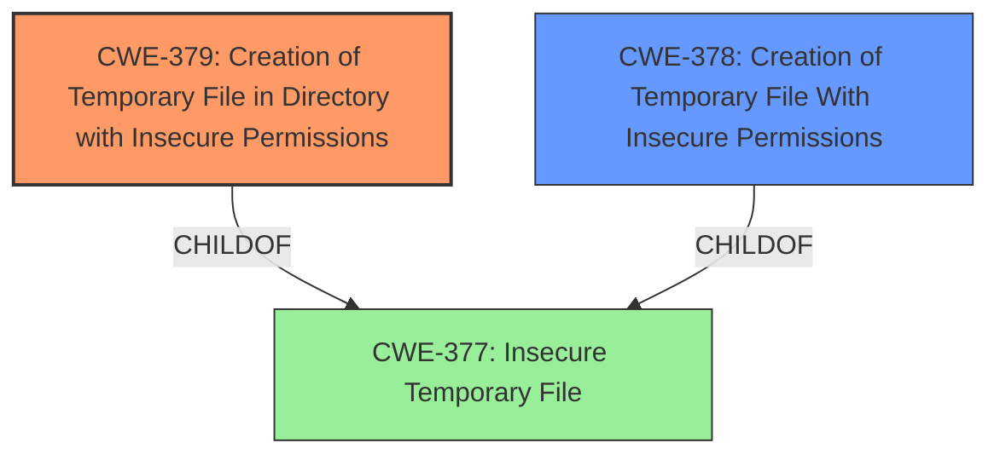

# Enhanced Analysis for CVE-2021-38587

# Summary
| CWE ID  | CWE Name                                                                 | Confidence | CWE Abstraction Level | CWE Vulnerability Mapping Label | CWE-Vulnerability Mapping Notes |
| :-------- | :----------------------------------------------------------------------- | :--------- | :---------------------- | :------------------------------ | :------------------------------ |
| CWE-379   | Creation of Temporary File in Directory with Insecure Permissions        | 0.85       | Base                    | Primary                         | Allowed                       |
| CWE-378   | Creation of Temporary File With Insecure Permissions                   | 0.70       | Base                    | Secondary                       | Allowed                       |
| CWE-377   | Insecure Temporary File                                                  | 0.50       | Class                   | Secondary                       | Allowed-with-Review           |

## Evidence and Confidence

*   **Confidence Score:** 0.80
*   **Evidence Strength:** MEDIUM

## Relationship Analysis
The primary relationship influencing the CWE selection is the ChildOf relationship. CWE-379 and CWE-378 are children of CWE-377, indicating a hierarchy from general to specific. The analysis favors the base-level CWEs (CWE-379, CWE-378) as they provide more detailed descriptions of the vulnerability than the class-level CWE-377.



## Vulnerability Chain
The vulnerability chain starts with the **mishandling of temporary files**, leading to potential insecure permissions or access control issues.
  - **Root Cause:** Mishandling of temporary files
  - **Weakness:** Insecure permissions on the temporary file's directory.
  - **Impact:** Potential for unauthorized access or modification of the temporary file.

## Summary of Analysis
The initial assessment strongly points towards CWE-379 (Creation of Temporary File in Directory with Insecure Permissions) due to the vulnerability description mentioning a **mishandling of temporary files**. The retriever results also prioritize CWE-379 and CWE-378 as top candidates.

The evidence directly supporting the selection of CWE-379 is the "**rootcause:** **mishandling of temporary files**" from the "Vulnerability Description Key Phrases".

The graph relationships indicate that CWE-379 and CWE-378 are more specific instances of the more general CWE-377, which is "Insecure Temporary File". This hierarchical structure supports choosing the more specific Base CWEs when the evidence supports it.

The selection is based on the evidence from the vulnerability description and the retriever results. CWE-379 is at the optimal level of specificity because it accurately reflects the weakness.

Relevant CWE Information:

# Enhanced Context (25 CWEs)
The following CWEs were identified as potentially relevant to this vulnerability:

## CWE-59: Improper Link Resolution Before File Access ('Link Following')
**Abstraction Level**: Base
**Similarity Score**: 0.77
**Source**: dense

**Description**:
The product attempts to access a file based on the filename, but it does not properly prevent that filename from identifying a link or shortcut that resolves to an unintended resource.

**Mapping Guidance**:
- Usage: Allowed
- Rationale: This CWE entry is at the Base level of abstraction, which is a preferred level of abstraction for mapping to the root causes of vulnerabilities.

## CWE-379: Creation of Temporary File in Directory with Insecure Permissions
**Abstraction:** Base
**Similarity Score**: 0.121
**Source**: sparse

### Description
The product creates a temporary file in a directory whose permissions allow unintended actors to determine the file's existence or otherwise access that file.

### Observed Examples
- **CVE-2022-27818:** A hotkey daemon written in Rust creates a domain socket file underneath /tmp, which is accessible by any user.
- **CVE-2021-21290:** A Java-based application for a rapid-development framework uses File.createTempFile() to create a random temporary file with insecure default permissions.

## CWE-378: Creation of Temporary File With Insecure Permissions
**Abstraction:** Base
**Similarity Score**: 0.118
**Source**: sparse

### Description
Opening temporary files without appropriate measures or controls can leave the file, its contents and any function that it impacts vulnerable to attack.

### Observed Examples
- **CVE-2022-24823:** A network application framework uses the Java function createTempFile(), which will create a file that is readable by other local users of the system

## CWE-377: Insecure Temporary File
**Abstraction:** Class
**Similarity Score**: 0.110
**Source**: sparse

### Description
Creating and using insecure temporary files can leave application and system data vulnerable to attack.

### Observed Examples
- **CVE-2022-41954:** A library uses the Java File.createTempFile() method which creates a file with "-rw-r--r--" default permissions on Unix-like operating systems

### Detailed Analysis of Selected CWEs:

1.  **CWE-379: Creation of Temporary File in Directory with Insecure Permissions**
    *   **Match:** The vulnerability involves the **mishandling of temporary files**, which could lead to the creation of temporary files in directories with insecure permissions.
    *   **Implication:** This allows unintended actors to potentially access or determine the existence of the temporary files, leading to information disclosure or unauthorized modification.
    *   **Relationship:** ChildOf -> CWE-377 (Insecure Temporary File). This indicates that CWE-379 is a more specific type of insecure temporary file issue.
    *   **Mapping Guidance:** The Usage is Allowed, and the rationale states that it is at the Base level of abstraction, making it suitable for mapping root causes.
    *   **Confidence:** 0.85
2.  **CWE-378: Creation of Temporary File With Insecure Permissions**
    *   **Match:** The vulnerability could also be related to the creation of temporary files with insecure permissions directly.
    *   **Implication:** This could allow unintended actors to read the file, its contents, and any function that it impacts vulnerable to attack.
    *   **Relationship:** ChildOf -> CWE-377 (Insecure Temporary File). This indicates that CWE-378 is a more specific type of insecure temporary file issue.
    *   **Mapping Guidance:** The Usage is Allowed, and the rationale states that it is at the Base level of abstraction, making it suitable for mapping root causes.
    *   **Confidence:** 0.70
3.  **CWE-377: Insecure Temporary File**
    *   **Match:** This is a general class of weakness related to insecure temporary files. While the description is not as specific as CWE-379 or CWE-378, it broadly covers the vulnerability.
    *   **Implication:** Creating and using insecure temporary files can leave application and system data vulnerable to attack.
    *   **Relationship:** ChildOf -> CWE-668 (Exposure of Resource to Wrong Sphere).
    *   **Mapping Guidance:** The Usage is Allowed-with-Review, suggesting that more specific child CWEs should be considered if they fit the vulnerability better.
    *   **Confidence:** 0.50

### CWEs Considered But Not Used:

*   **CWE-59: Improper Link Resolution Before File Access ('Link Following'):** While temporary file handling can sometimes involve symlinks, there's no direct indication of symlink usage in the provided description. Therefore, this CWE is not selected.
*   **CWE-362: Concurrent Execution using Shared Resource with Improper Synchronization ('Race Condition'):** The description does not explicitly mention concurrent execution or race conditions. While race conditions can occur during temporary file creation, there isn't enough evidence to support this CWE.
*   **CWE-732: Incorrect Permission Assignment for Critical Resource:** This CWE is related to permission assignment, but the vulnerability description focuses more on the **mishandling of temporary files** rather than a specific permission assignment issue for critical resources.


## CWE Relationship Analysis

Current CWEs represent these abstraction levels: .


### Vulnerability Chain Analysis

**Chain starting from CWE-732:**
- 732 (Incorrect Permission Assignment for Critical Resource) - ROOT


**Chain starting from CWE-377:**
- 377 (Insecure Temporary File) - ROOT


### CWE Relationship Diagram

```mermaid
graph TD
    classDef primary fill:#f96,stroke:#333,stroke-width:2px
    classDef secondary fill:#69f,stroke:#333
    classDef tertiary fill:#9e9,stroke:#333
```