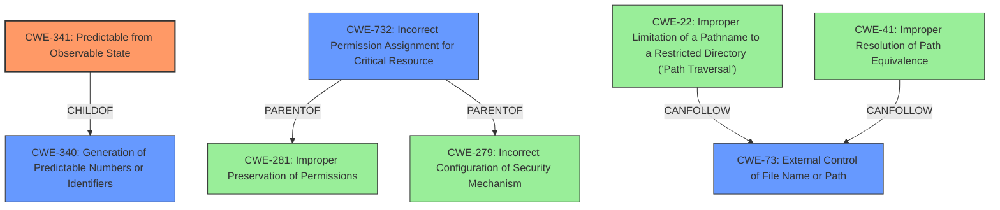

# Analysis for CVE-2021-38606

# Summary
| CWE ID | CWE Name | Confidence | CWE Abstraction Level | CWE Vulnerability Mapping Label | CWE-Vulnerability Mapping Notes |
|---|---|---|---|---|---|
| CWE-341 | Predictable from Observable State | 0.9 | Base | Allowed | Primary CWE |
| CWE-73 | External Control of File Name or Path | 0.6 | Base | Allowed | Secondary CWE |
| CWE-732 | Incorrect Permission Assignment for Critical Resource | 0.4 | Class | Allowed-with-Review | Secondary CWE |

## Evidence and Confidence

*   **Confidence Score:** 0.8
*   **Evidence Strength:** HIGH

## Relationship Analysis
The primary CWE, CWE-341, is a Base level weakness that describes a situation where a number or object is predictable based on observations. It is a child of CWE-340, Use of Insufficiently Random Values, which is a broader Class level weakness. CWE-73, External Control of File Name or Path, is a Base level weakness that can follow CWE-22 and CWE-41, showing how path-related vulnerabilities can chain together. CWE-732, Incorrect Permission Assignment for Critical Resource is a Class level weakness that is parent to CWE-281, Improper Preservation of Permissions, and CWE-279, Incorrect Configuration of Security Mechanism.

## Vulnerability Chain
The vulnerability chain starts with the **predictable directory name** (CWE-341). This leads to potential issues with file deletion and, more critically, to OS command injection. If the directory names were not predictable, the command injection would be less severe.

## Summary of Analysis
The initial assessment identifies CWE-341 as the primary weakness due to the **predictable directory name**. The evidence from the "Vulnerability Description Key Phrases" and "CVE Reference Links Content Summary" sections supports this. The code uses two different ways to determine the directory name for deletion, one of which relies on predictable information. This inconsistency, combined with the `os.system` calls, leads to potential OS command injection.

The Retriever Results also support this assessment, with CWE-341 being the top-ranked CWE. Other considered CWEs include those related to temporary files and symlink issues, but these are not as directly relevant as CWE-341.

CWE-73 (External Control of File Name or Path) is also considered as a secondary weakness because the `delete_dir` variable is read directly from the database and used in the `os.system` call. If an attacker can control this variable, they can inject arbitrary commands.

CWE-732 (Incorrect Permission Assignment for Critical Resource) is included as a potential contributing factor, particularly if the database permissions are not correctly configured, allowing an attacker to modify the `results_dir` value. However, this is less direct than the other two CWEs.

The selected CWEs are at the appropriate level of specificity. CWE-341 directly addresses the root cause of the predictability issue. CWE-73 accounts for the external control of the file path that enables the command injection.

Relevant CWE Information:

# Enhanced Context (25 CWEs)

## CWE-59: Improper Link Resolution Before File Access ('Link Following')
**Abstraction Level**: Base
**Similarity Score**: 0.79
**Source**: dense

**Description**:
The product attempts to access a file based on the filename, but it does not properly prevent that filename from identifying a link or shortcut that resolves to an unintended resource.

**Mapping Guidance**:
- Usage: Allowed
- Rationale: This CWE entry is at the Base level of abstraction, which is a preferred level of abstraction for mapping to the root causes of vulnerabilities.

## CWE-61: UNIX Symbolic Link (Symlink) Following
**Abstraction Level**: Compound
**Similarity Score**: 0.76
**Source**: dense

**Description**:
The product, when opening a file or directory, does not sufficiently account for when the file is a symbolic link that resolves to a target outside of the intended control sphere. This could allow an attacker to cause the product to operate on unauthorized files.

**Mapping Guidance**:
- Usage: Allowed
- Rationale: This is a well-known Composite of multiple weaknesses that must all occur simultaneously, although it is attack-oriented in nature.

## CWE-330: Use of Insufficiently Random Values
**Abstraction Level**: Class
**Similarity Score**: 0.76
**Source**: dense

**Description**:
The product uses insufficiently random numbers or values in a security context that depends on unpredictable numbers.

**Mapping Guidance**:
- Usage: Discouraged
- Rationale: This CWE entry is a level-1 Class (i.e., a child of a Pillar). It might have lower-level children that would be more appropriate

## CWE-379: Creation of Temporary File in Directory with Insecure Permissions
**Abstraction Level**: Base
**Similarity Score**: 0.76
**Source**: dense

**Description**:
The product creates a temporary file in a directory whose permissions allow unintended actors to determine the file's existence or otherwise access that file.

**Mapping Guidance**:
- Usage: Allowed
- Rationale: This CWE entry is at the Base level of abstraction, which is a preferred level of abstraction for mapping to the root causes of vulnerabilities.

## CWE-378: Creation of Temporary File With Insecure Permissions
**Abstraction Level**: Base
**Similarity Score**: 0.76
**Source**: dense

**Description**:
Opening temporary files without appropriate measures or controls can leave the file, its contents and any function that it impacts vulnerable to attack.

**Mapping Guidance**:
- Usage: Allowed
- Rationale: This CWE entry is at the Base level of abstraction, which is a preferred level of abstraction for mapping to the root causes of vulnerabilities.

## CWE-41: Improper Resolution of Path Equivalence
**Abstraction Level**: Base
**Similarity Score**: 0.76
**Source**: dense

**Description**:
The product is vulnerable to file system contents disclosure through path equivalence. Path equivalence involves the use of special characters in file and directory names. The associated manipulations are intended to generate multiple names for the same object.

**Mapping Guidance**:
- Usage: Allowed
- Rationale: This CWE entry is at the Base level of abstraction, which is a preferred level of abstraction for mapping to the root causes of vulnerabilities.

## CWE-73: External Control of File Name or Path
**Abstraction Level**: Base
**Similarity Score**: 0.75
**Source**: dense

**Description**:
The product allows user input to control or influence paths or file names that are used in filesystem operations.

**Mapping Guidance**:
- Usage: Allowed
- Rationale: This CWE entry is at the Base level of abstraction, which is a preferred level of abstraction for mapping to the root causes of vulnerabilities.

## CWE-23: Relative Path Traversal
**Abstraction Level**: Base
**Similarity Score**: 0.74
**Source**: dense

**Description**:
The product uses external input to construct a pathname that should be within a restricted directory, but it does not properly neutralize sequences such as ".." that can resolve to a location that is outside of that directory.

**Mapping Guidance**:
- Usage: Allowed
- Rationale: This CWE entry is at the Base level of abstraction, which is a preferred level of abstraction for mapping to the root causes of vulnerabilities.

## CWE-427: Uncontrolled Search Path Element
**Abstraction Level**: Base
**Similarity Score**: 0.74
**Source**: dense

**Description**:
The product uses a fixed or controlled search path to find resources, but one or more locations in that path can be under the control of unintended