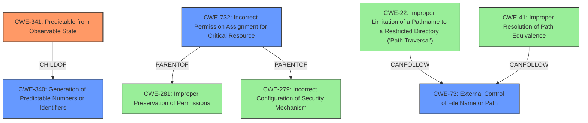

# Analysis for CVE-2021-38606

# Summary
| CWE ID | CWE Name | Confidence | CWE Abstraction Level | CWE Vulnerability Mapping Label | CWE-Vulnerability Mapping Notes |
|---|---|---|---|---|---|
| CWE-341 | Predictable from Observable State | 0.9 | Base | Allowed | Primary CWE |
| CWE-73 | External Control of File Name or Path | 0.6 | Base | Allowed | Secondary CWE |
| CWE-732 | Incorrect Permission Assignment for Critical Resource | 0.4 | Class | Allowed-with-Review | Secondary CWE |

## Evidence and Confidence

*   **Confidence Score:** 0.8
*   **Evidence Strength:** HIGH

## Relationship Analysis
The primary CWE, CWE-341, is a Base level weakness that describes a situation where a number or object is predictable based on observations. It is a child of CWE-340, Use of Insufficiently Random Values, which is a broader Class level weakness. CWE-73, External Control of File Name or Path, is a Base level weakness that can follow CWE-22 and CWE-41, showing how path-related vulnerabilities can chain together. CWE-732, Incorrect Permission Assignment for Critical Resource is a Class level weakness that is parent to CWE-281, Improper Preservation of Permissions, and CWE-279, Incorrect Configuration of Security Mechanism.

## Vulnerability Chain
The vulnerability chain starts with the **predictable directory name** (CWE-341). This leads to potential issues with file deletion and, more critically, to OS command injection. If the directory names were not predictable, the command injection would be less severe.

## Summary of Analysis
The initial assessment identifies CWE-341 as the primary weakness due to the **predictable directory name**. The evidence from the "Vulnerability Description Key Phrases" and "CVE Reference Links Content Summary" sections supports this. The code uses two different ways to determine the directory name for deletion, one of which relies on predictable information. This inconsistency, combined with the `os.system` calls, leads to potential OS command injection.

The Retriever Results also support this assessment, with CWE-341 being the top-ranked CWE. Other considered CWEs include those related to temporary files and symlink issues, but these are not as directly relevant as CWE-341.

CWE-73 (External Control of File Name or Path) is also considered as a secondary weakness because the `delete_dir` variable is read directly from the database and used in the `os.system` call. If an attacker can control this variable, they can inject arbitrary commands.

CWE-732 (Incorrect Permission Assignment for Critical Resource) is included as a potential contributing factor, particularly if the database permissions are not correctly configured, allowing an attacker to modify the `results_dir` value. However, this is less direct than the other two CWEs.

The selected CWEs are at the appropriate level of specificity. CWE-341 directly addresses the root cause of the predictability issue. CWE-73 accounts for the external control of the file path that enables the command injection.

Relevant CWE Information:

# Enhanced Context (25 CWEs)

## CWE-59: Improper Link Resolution Before File Access ('Link Following')
**Abstraction Level**: Base
**Similarity Score**: 0.79
**Source**: dense

**Description**:
The product attempts to access a file based on the filename, but it does not properly prevent that filename from identifying a link or shortcut that resolves to an unintended resource.

**Mapping Guidance**:
- Usage: Allowed
- Rationale: This CWE entry is at the Base level of abstraction, which is a preferred level of abstraction for mapping to the root causes of vulnerabilities.

## CWE-61: UNIX Symbolic Link (Symlink) Following
**Abstraction Level**: Compound
**Similarity Score**: 0.76
**Source**: dense

**Description**:
The product, when opening a file or directory, does not sufficiently account for when the file is a symbolic link that resolves to a target outside of the intended control sphere. This could allow an attacker to cause the product to operate on unauthorized files.

**Mapping Guidance**:
- Usage: Allowed
- Rationale: This is a well-known Composite of multiple weaknesses that must all occur simultaneously, although it is attack-oriented in nature.

## CWE-330: Use of Insufficiently Random Values
**Abstraction Level**: Class
**Similarity Score**: 0.76
**Source**: dense

**Description**:
The product uses insufficiently random numbers or values in a security context that depends on unpredictable numbers.

**Mapping Guidance**:
- Usage: Discouraged
- Rationale: This CWE entry is a level-1 Class (i.e., a child of a Pillar). It might have lower-level children that would be more appropriate

## CWE-379: Creation of Temporary File in Directory with Insecure Permissions
**Abstraction Level**: Base
**Similarity Score**: 0.76
**Source**: dense

**Description**:
The product creates a temporary file in a directory whose permissions allow unintended actors to determine the file's existence or otherwise access that file.

**Mapping Guidance**:
- Usage: Allowed
- Rationale: This CWE entry is at the Base level of abstraction, which is a preferred level of abstraction for mapping to the root causes of vulnerabilities.

## CWE-378: Creation of Temporary File With Insecure Permissions
**Abstraction Level**: Base
**Similarity Score**: 0.76
**Source**: dense

**Description**:
Opening temporary files without appropriate measures or controls can leave the file, its contents and any function that it impacts vulnerable to attack.

**Mapping Guidance**:
- Usage: Allowed
- Rationale: This CWE entry is at the Base level of abstraction, which is a preferred level of abstraction for mapping to the root causes of vulnerabilities.

## CWE-41: Improper Resolution of Path Equivalence
**Abstraction Level**: Base
**Similarity Score**: 0.76
**Source**: dense

**Description**:
The product is vulnerable to file system contents disclosure through path equivalence. Path equivalence involves the use of special characters in file and directory names. The associated manipulations are intended to generate multiple names for the same object.

**Mapping Guidance**:
- Usage: Allowed
- Rationale: This CWE entry is at the Base level of abstraction, which is a preferred level of abstraction for mapping to the root causes of vulnerabilities.

## CWE-73: External Control of File Name or Path
**Abstraction Level**: Base
**Similarity Score**: 0.75
**Source**: dense

**Description**:
The product allows user input to control or influence paths or file names that are used in filesystem operations.

**Mapping Guidance**:
- Usage: Allowed
- Rationale: This CWE entry is at the Base level of abstraction, which is a preferred level of abstraction for mapping to the root causes of vulnerabilities.

## CWE-23: Relative Path Traversal
**Abstraction Level**: Base
**Similarity Score**: 0.74
**Source**: dense

**Description**:
The product uses external input to construct a pathname that should be within a restricted directory, but it does not properly neutralize sequences such as ".." that can resolve to a location that is outside of that directory.

**Mapping Guidance**:
- Usage: Allowed
- Rationale: This CWE entry is at the Base level of abstraction, which is a preferred level of abstraction for mapping to the root causes of vulnerabilities.

## CWE-427: Uncontrolled Search Path Element
**Abstraction Level**: Base
**Similarity Score**: 0.74
**Source**: dense

**Description**:
The product uses a fixed or controlled search path to find resources, but one or more locations in that path can be under the control of unintended

# Enhanced Query for CVE-2021-38606

## Vulnerability Description
reNgine through 0.5 relies on a **predictable directory name**.

### Vulnerability Description Key Phrases
- **rootcause:** **predictable directory name**
- **product:** reNgine
- **version:** through 0.5

## CVE Reference Links Content Summary
Based on the provided diff, here's a breakdown of the vulnerability:

**Root Cause:**
The vulnerability stems from the way the application generates and stores scan results directories. Originally, the directory names were predictable, based on the domain name and timestamp. This was changed to use random integers, which is intended to make directory names unpredictable. However, in the code that deletes scan results, the application uses two different ways to determine the directory name.

**Weaknesses/Vulnerabilities:**

*   **Inconsistent Directory Deletion:** The application uses two different methods to construct the path to the scan results directory when deleting scan data:
    *   One method constructs the directory name based on `domain.name` and a formatted `start_scan_date`.
    *   The other method uses the `results_dir` which, after the fix in the commit, is based on a random integer.
    *   This inconsistency causes the application to fail to delete the correct directory when the older method is used.
*   **OS Command Injection:** The code uses `os.system('rm -rf ' + delete_path)` and `os.system('rm -rf /usr/src/scan_results/' + delete_dir)` which is vulnerable to OS command injection if the `delete_path` or `delete_dir` variables are not properly sanitized or validated. This is particularly problematic because `delete_dir` is a string read directly from the database, and could be modified maliciously.

**Impact of Exploitation:**
*   **File Deletion Issues:** Legitimate scan data may not be deleted as expected.
*   **Potential Arbitrary File Deletion:** Due to the OS command injection vulnerability, a malicious attacker could potentially inject arbitrary shell commands and delete other files/directories outside of the expected scan results directory if the `delete_path` or `delete_dir` variables are not sanitized. This could lead to data loss or compromise system integrity.
*   **Denial of Service:** A malicious attacker could use this to cause a denial of service by deleting essential system files.

**Attack Vectors:**
*   **Direct Request Modification:** An attacker could potentially try to modify the scan data, especially `obj.results_dir` or related values in database, to control the directory deletion process.
*   **Database Manipulation:** An attacker with access to the database could modify the `results_dir` value associated with a scan, which would then be used in the `os.system` call when deleting a scan, enabling arbitrary file deletion.

**Required Attacker Capabilities/Position:**
*   **Authenticated Access:** The attacker needs to have some form of authenticated access to the web application or underlying database to manipulate the data used in the vulnerable functionality.
*   **Understanding the Code:** The attacker needs to understand how the application constructs and uses directory paths to exploit the command injection and inconsistent path handling.

## Retriever Results

### Top Combined Results

| Rank | CWE ID | Name | Abstraction | Usage  | Retrievers | Individual Scores |
|------|--------|------|-------------|-------|------------|-------------------|
| 1 | 341 | Predictable from Observable State | Base | Allowed | sparse | 0.135 |
| 2 | 65 | Windows Hard Link | Variant | Allowed | sparse | 0.084 |
| 3 | 330 | Use of Insufficiently Random Values | Class | Discouraged | sparse | 0.077 |
| 4 | 41 | Improper Resolution of Path Equivalence | Base | Allowed | sparse | 0.076 |
| 5 | 379 | Creation of Temporary File in Directory with Insecure Permissions | Base | Allowed | sparse | 0.072 |
| 6 | 337 | Predictable Seed in Pseudo-Random Number Generator (PRNG) | Variant | Allowed | dense | 0.384 |
| 7 | 59 | Improper Link Resolution Before File Access ('Link Following') | Base | Allowed | graph | 0.002 |
| 8 | 61 | UNIX Symbolic Link (Symlink) Following | Compound | Allowed | sparse | 0.071 |
| 9 | 646 | Reliance on File Name or Extension of Externally-Supplied File | Variant | Allowed | sparse | 0.069 |
| 10 | 377 | Insecure Temporary File | Class | Allowed-with-Review | sparse | 0.067 |

# Complete CWE Specifications

## CWE-341: Predictable from Observable State
**Abstraction:** Base
**Status:** Draft

### Description
A number or object is predictable based on observations that the attacker can make about the state of the system or network, such as time, process ID, etc.

### Extended Description
Not provided

### Alternative Terms
None

### Relationships
ChildOf -> CWE-340

### Mapping Guidance
**Usage:** Allowed
**Rationale:** This CWE entry is at the Base level of abstraction, which is a preferred level of abstraction for mapping to the root causes of vulnerabilities.
**Comments:** Carefully read both the name and description to ensure that this mapping is an appropriate fit. Do not try to 'force' a mapping to a lower-level Base/Variant simply to comply with this preferred level of abstraction.
**Reasons:**
- Acceptable-Use

### Additional Notes
**[Maintenance]** As of CWE 4.5, terminology related to randomness, entropy, and predictability can vary widely. Within the developer and other communities, "randomness" is used heavily. However, within cryptography, "entropy" is distinct, typically implied as a measurement. There are no commonly-used definitions, even within standards documents and cryptography papers. Future versions of CWE will attempt to define these terms and, if necessary, distinguish between them in ways that are appropriate for different communities but do not reduce the usability of CWE for mapping, understanding, or other scenarios.

### Observed Examples
- **CVE-2002-0389:** Mail server stores private mail messages with predictable filenames in a world-executable directory, which allows local users to read private mailing list archives.
- **CVE-2001-1141:** PRNG allows attackers to use the output of small PRNG requests to determine the internal state information, which could be used by attackers to predict future pseudo-random numbers.
- **CVE-2000-0335:** DNS resolver library uses predictable IDs, which allows a local attacker to spoof DNS query results.

## CWE-65: Windows Hard Link
**Abstraction:** Variant
**Status:** Incomplete

### Description
The product, when opening a file or directory, does not sufficiently handle when the name is associated with a hard link to a target that is outside of the intended control sphere. This could allow an attacker to cause the product to operate on unauthorized files.

### Extended Description
Failure for a system to check for hard links can result in vulnerability to different types of attacks. For example, an attacker can escalate their privileges if a file used by a privileged program is replaced with a hard link to a sensitive file (e.g. AUTOEXEC.BAT). When the process opens the file, the attacker can assume the privileges of that process, or prevent the program from accurately processing data.

### Alternative Terms
None

### Relationships
ChildOf -> CWE-59

### Mapping Guidance
**Usage:** Allowed
**Rationale:** This CWE entry is at the Variant level of abstraction, which is a preferred level of abstraction for mapping to the root causes of vulnerabilities.
**Comments:** Carefully read both the name and description to ensure that this mapping is an appropriate fit. Do not try to 'force' a mapping to a lower-level Base/Variant simply to comply with this preferred level of abstraction.
**Reasons:**
- Acceptable-Use

### Observed Examples
- **CVE-2002-0725:** File system allows local attackers to hide file usage activities via a hard link to the target file, which causes the link to be recorded in the audit trail instead of the target file.
- **CVE-2003-0844:** Web server plugin allows local users to overwrite arbitrary files via a symlink attack on predictable temporary filenames.

## CWE-330: Use of Insufficiently Random Values
**Abstraction:** Class
**Status:** Stable

### Description
The product uses insufficiently random numbers or values in a security context that depends on unpredictable numbers.

### Extended Description
When product generates predictable values in a context requiring unpredictability, it may be possible for an attacker to guess the next value that will be generated, and use this guess to impersonate another user or access sensitive information.

### Alternative Terms
None

### Relationships
ChildOf -> CWE-693
CanPrecede -> CWE-804

### Mapping Guidance
**Usage:** Discouraged
**Rationale:** This CWE entry is a level-1 Class (i.e., a child of a Pillar). It might have lower-level children that would be more appropriate
**Comments:** Examine children of this entry to see if there is a better fit
**Reasons:**
- Abstraction

### Additional Notes
**[Relationship]** This can be primary to many other weaknesses such as cryptographic errors, authentication errors, symlink following, information leaks, and others.

**[Maintenance]** As of CWE 4.3, CWE-330 and its descendants are being investigated by the CWE crypto team to identify gaps related to randomness and unpredictability, as well as the relationships between randomness and cryptographic primitives. This "subtree analysis" might result in the addition or deprecation of existing entries; the reorganization of relationships in some views, e.g. the research view (CWE-1000); more consistent use of terminology; and/or significant modifications to related entries.

**[Maintenance]** As of CWE 4.5, terminology related to randomness, entropy, and predictability can vary widely. Within the developer and other communities, "randomness" is used heavily. However, within cryptography, "entropy" is distinct, typically implied as a measurement. There are no commonly-used definitions, even within standards documents and cryptography papers. Future versions of CWE will attempt to define these terms and, if necessary, distinguish between them in ways that are appropriate for different communities but do not reduce the usability of CWE for mapping, understanding, or other scenarios.

### Observed Examples
- **CVE-2021-3692:** PHP framework uses mt_rand() function (Marsenne Twister) when generating tokens
- **CVE-2020-7010:** Cloud application on Kubernetes generates passwords using a weak random number generator based on deployment time.
- **CVE-2009-3278:** Crypto product uses rand() library function to generate a recovery key, making it easier to conduct brute force attacks.

## CWE-41: Improper Resolution of Path Equivalence
**Abstraction:** Base
**Status:** Incomplete

### Description
The product is vulnerable to file system contents disclosure through path equivalence. Path equivalence involves the use of special characters in file and directory names. The associated manipulations are intended to generate multiple names for the same object.

### Extended Description
Path equivalence is usually employed in order to circumvent access controls expressed using an incomplete set of file name or file path representations. This is different from path traversal, wherein the manipulations are performed to generate a name for a different object.

### Alternative Terms
None

### Relationships
ChildOf -> CWE-706

### Mapping Guidance
**Usage:** Allowed
**Rationale:** This CWE entry is at the Base level of abstraction, which is a preferred level of abstraction for mapping to the root causes of vulnerabilities.
**Comments:** Carefully read both the name and description to ensure that this mapping is an appropriate fit. Do not try to 'force' a mapping to a lower-level Base/Variant simply to comply with this preferred level of abstraction.
**Reasons:**
- Acceptable-Use

### Additional Notes
**[Relationship]** Some of these manipulations could be effective in path traversal issues, too.

### Observed Examples
- **CVE-2000-1114:** Source code disclosure using trailing dot
- **CVE-2002-1986:** Source code disclosure using trailing dot
- **CVE-2004-2213:** Source code disclosure using trailing dot or trailing encoding space "%20"

## CWE-379: Creation of Temporary File in Directory with Insecure Permissions
**Abstraction:** Base
**Status:** Incomplete

### Description
The product creates a temporary file in a directory whose permissions allow unintended actors to determine the file's existence or otherwise access that file.

### Extended Description
On some operating systems, the fact that the temporary file exists may be apparent to any user with sufficient privileges to access that directory. Since the file is visible, the application that is using the temporary file could be known. If one has access to list the processes on the system, the attacker has gained information about what the user is doing at that time. By correlating this with the applications the user is running, an attacker could potentially discover what a user's actions are. From this, higher levels of security could be breached.

### Alternative Terms
None

### Relationships
ChildOf -> CWE-377

### Mapping Guidance
**Usage:** Allowed
**Rationale:** This CWE entry is at the Base level of abstraction, which is a preferred level of abstraction for mapping to the root causes of vulnerabilities.
**Comments:** Carefully read both the name and description to ensure that this mapping is an appropriate fit. Do not try to 'force' a mapping to a lower-level Base/Variant simply to comply with this preferred level of abstraction.
**Reasons:**
- Acceptable-Use

### Observed Examples
- **CVE-2022-27818:** A hotkey daemon written in Rust creates a domain socket file underneath /tmp, which is accessible by any user.
- **CVE-2021-21290:** A Java-based application for a rapid-development framework uses File.createTempFile() to create a random temporary file with insecure default permissions.

## CWE-337: Predictable Seed in Pseudo-Random Number Generator (PRNG)
**Abstraction:** Variant
**Status:** Draft

### Description
A Pseudo-Random Number Generator (PRNG) is initialized from a predictable seed, such as the process ID or system time.

### Extended Description
The use of predictable seeds significantly reduces the number of possible seeds that an attacker would need to test in order to predict which random numbers will be generated by the PRNG.

### Alternative Terms
None

### Relationships
ChildOf -> CWE-335

### Mapping Guidance
**Usage:** Allowed
**Rationale:** This CWE entry is at the Variant level of abstraction, which is a preferred level of abstraction for mapping to the root causes of vulnerabilities.
**Comments:** Carefully read both the name and description to ensure that this mapping is an appropriate fit. Do not try to 'force' a mapping to a lower-level Base/Variant simply to comply with this preferred level of abstraction.
**Reasons:**
- Acceptable-Use

### Additional Notes
**[Maintenance]** As of CWE 4.5, terminology related to randomness, entropy, and predictability can vary widely. Within the developer and other communities, "randomness" is used heavily. However, within cryptography, "entropy" is distinct, typically implied as a measurement. There are no commonly-used definitions, even within standards documents and cryptography papers. Future versions of CWE will attempt to define these terms and, if necessary, distinguish between them in ways that are appropriate for different communities but do not reduce the usability of CWE for mapping, understanding, or other scenarios.

### Observed Examples
- **CVE-2020-7010:** Cloud application on Kubernetes generates passwords using a weak random number generator based on deployment time.
- **CVE-2019-11495:** server uses erlang:now() to seed the PRNG, which results in a small search space for potential random seeds
- **CVE-2008-0166:** The removal of a couple lines of code caused Debian's OpenSSL Package to only use the current process ID for seeding a PRNG

## CWE-59: Improper Link Resolution Before File Access ('Link Following')
**Abstraction:** Base
**Status:** Draft

### Description
The product attempts to access a file based on the filename, but it does not properly prevent that filename from identifying a link or shortcut that resolves to an unintended resource.

### Extended Description
Not provided

### Alternative Terms
insecure temporary file: Some people use the phrase "insecure temporary file" when referring to a link following weakness, but other weaknesses can produce insecure temporary files without any symlink involvement at all.
Zip Slip: "Zip slip" is an attack that uses file archives (e.g., ZIP, tar, rar, etc.) that contain filenames with path traversal sequences that cause the files to be written outside of the directory under which the archive is expected to be extracted [REF-1282]. It is most commonly used for relative path traversal (CWE-23) and link following (CWE-59).

### Relationships
ChildOf -> CWE-706
ChildOf -> CWE-706

### Mapping Guidance
**Usage:** Allowed
**Rationale:** This CWE entry is at the Base level of abstraction, which is a preferred level of abstraction for mapping to the root causes of vulnerabilities.
**Comments:** Carefully read both the name and description to ensure that this mapping is an appropriate fit. Do not try to 'force' a mapping to a lower-level Base/Variant simply to comply with this preferred level of abstraction.
**Reasons:**
- Acceptable-Use

### Additional Notes
**[Theoretical]** 

Link following vulnerabilities are Multi-factor Vulnerabilities (MFV). They are the combination of multiple elements: file or directory permissions, filename predictability, race conditions, and in some cases, a design limitation in which there is no mechanism for performing atomic file creation operations.

Some potential factors are race conditions, permissions, and predictability.

### Observed Examples
- **CVE-1999-1386:** Some versions of Perl follow symbolic links when running with the -e option, which allows local users to overwrite arbitrary files via a symlink attack.
- **CVE-2000-1178:** Text editor follows symbolic links when creating a rescue copy during an abnormal exit, which allows local users to overwrite the files of other users.
- **CVE-2004-0217:** Antivirus update allows local users to create or append to arbitrary files via a symlink attack on a logfile.

## CWE-61: UNIX Symbolic Link (Symlink) Following
**Abstraction:** Compound
**Status:** Incomplete

### Description
The product, when opening a file or directory, does not sufficiently account for when the file is a symbolic link that resolves to a target outside of the intended control sphere. This could allow an attacker to cause the product to operate on unauthorized files.

### Extended Description
A product that allows UNIX symbolic links (symlink) as part of paths whether in internal code or through user input can allow an attacker to spoof the symbolic link and traverse the file system to unintended locations or access arbitrary files. The symbolic link can permit an attacker to read/write/corrupt a file that they originally did not have permissions to access.

### Alternative Terms
Symlink following
symlink vulnerability

### Relationships
ChildOf -> CWE-59
Requires -> CWE-362
Requires -> CWE-340
Requires -> CWE-386
Requires -> CWE-732

### Mapping Guidance
**Usage:** Allowed
**Rationale:** This is a well-known Composite of multiple weaknesses that must all occur simultaneously, although it is attack-oriented in nature.
**Comments:** While attack-oriented composites are supported in CWE, they have not been a focus of research. There is a chance that future research or CWE scope clarifications will change or deprecate them. Perform root-cause analysis to determine which weaknesses allow symlink following to occur, and map to those weaknesses. For example, predictable file names might be intended functionality, but creation in a directory with insecure permissions might not.
**Reasons:**
- Other

### Additional Notes
**[Research Gap]** 

Symlink vulnerabilities are regularly found in C and shell programs, but all programming languages can have this problem. Even shell programs are probably under-reported.

"Second-order symlink vulnerabilities" may exist in programs that invoke other programs that follow symlinks. They are rarely reported but are likely to be fairly common when process invocation is used [REF-493].

### Observed Examples
- **CVE-1999-1386:** Some versions of Perl follow symbolic links when running with the -e option, which allows local users to overwrite arbitrary files via a symlink attack.
- **CVE-2000-1178:** Text editor follows symbolic links when creating a rescue copy during an abnormal exit, which allows local users to overwrite the files of other users.
- **CVE-2004-0217:** Antivirus update allows local users to create or append to arbitrary files via a symlink attack on a logfile.

## CWE-646: Reliance on File Name or Extension of Externally-Supplied File
**Abstraction:** Variant
**Status:** Incomplete

### Description
The product allows a file to be uploaded, but it relies on the file name or extension of the file to determine the appropriate behaviors. This could be used by attackers to cause the file to be misclassified and processed in a dangerous fashion.

### Extended Description
An application might use the file name or extension of a user-supplied file to determine the proper course of action, such as selecting the correct process to which control should be passed, deciding what data should be made available, or what resources should be allocated. If the attacker can cause the code to misclassify the supplied file, then the wrong action could occur. For example, an attacker could supply a file that ends in a ".php.gif" extension that appears to be a GIF image, but would be processed as PHP code. In extreme cases, code execution is possible, but the attacker could also cause exhaustion of resources, denial of service, exposure of debug or system data (including application source code), or being bound to a particular server side process. This weakness may be due to a vulnerability in any of the technologies used by the web and application servers, due to misconfiguration, or resultant from another flaw in the application itself.

### Alternative Terms
None

### Relationships
ChildOf -> CWE-345

### Mapping Guidance
**Usage:** Allowed
**Rationale:** This CWE entry is at the Variant level of abstraction, which is a preferred level of abstraction for mapping to the root causes of vulnerabilities.
**Comments:** Carefully read both the name and description to ensure that this mapping is an appropriate fit. Do not try to 'force' a mapping to a lower-level Base/Variant simply to comply with this preferred level of abstraction.
**Reasons:**
- Acceptable-Use

## CWE-377: Insecure Temporary File
**Abstraction:** Class
**Status:** Incomplete

### Description
Creating and using insecure temporary files can leave application and system data vulnerable to attack.

### Extended Description
Not provided

### Alternative Terms
None

### Relationships
ChildOf -> CWE-668

### Mapping Guidance
**Usage:** Allowed-with-Review
**Rationale:** This CWE entry is a Class and might have Base-level children that would be more appropriate
**Comments:** Examine children of this entry to see if there is a better fit
**Reasons:**
- Abstraction

### Additional Notes
**[Other]** 

Applications require temporary files so frequently that many different mechanisms exist for creating them in the C Library and Windows(R) API. Most of these functions are vulnerable to various forms of attacks.

The functions designed to aid in the creation of temporary files can be broken into two groups based whether they simply provide a filename or actually open a new file. - Group 1: "Unique" Filenames: The first group of C Library and WinAPI functions designed to help with the process of creating temporary files do so by generating a unique file name for a new temporary file, which the program is then supposed to open. This group includes C Library functions like tmpnam(), tempnam(), mktemp() and their C++ equivalents prefaced with an _ (underscore) as well as the GetTempFileName() function from the Windows API. This group of functions suffers from an underlying race condition on the filename chosen. Although the functions guarantee that the filename is unique at the time it is selected, there is no mechanism to prevent another process or an attacker from creating a file with the same name after it is selected but before the application attempts to open the file. Beyond the risk of a legitimate collision caused by another call to the same function, there is a high probability that an attacker will be able to create a malicious collision because the filenames generated by these functions are not sufficiently randomized to make them difficult to guess. If a file with the selected name is created, then depending on how the file is opened the existing contents or access permissions of the file may remain intact. If the existing contents of the file are malicious in nature, an attacker may be able to inject dangerous data into the application when it reads data back from the temporary file. If an attacker pre-creates the file with relaxed access permissions, then data stored in the temporary file by the application may be accessed, modified or corrupted by an attacker. On Unix based systems an even more insidious attack is possible if the attacker pre-creates the file as a link to another important file. Then, if the application truncates or writes data to the file, it may unwittingly perform damaging operations for the attacker. This is an especially serious threat if the program operates with elevated permissions. Finally, in the best case the file will be opened with the a call to open() using the O_CREAT and O_EXCL flags or to CreateFile() using the CREATE_NEW attribute, which will fail if the file already exists and therefore prevent the types of attacks described above. However, if an attacker is able to accurately predict a sequence of temporary file names, then the application may be prevented from opening necessary temporary storage causing a denial of service (DoS) attack. This type of attack would not be difficult to mount given the small amount of randomness used in the selection of the filenames generated by these functions. - Group 2: "Unique" Files: The second group of C Library functions attempts to resolve some of the security problems related to temporary files by not only generating a unique file name, but also opening the file. This group includes C Library functions like tmpfile() and its C++ equivalents prefaced with an _ (underscore), as well as the slightly better-behaved C Library function mkstemp(). The tmpfile() style functions construct a unique filename and open it in the same way that fopen() would if passed the flags "wb+", that is, as a binary file in read/write mode. If the file already exists, tmpfile() will truncate it to size zero, possibly in an attempt to assuage the security concerns mentioned earlier regarding the race condition that exists between the selection of a supposedly unique filename and the subsequent opening of the selected file. However, this behavior clearly does not solve the function's security problems. First, an attacker can pre-create the file with relaxed access-permissions that will likely be retained by the file opened by tmpfile(). Furthermore, on Unix based systems if the attacker pre-creates the file as a link to another important file, the application may use its possibly elevated permissions to truncate that file, thereby doing damage on behalf of the attacker. Finally, if tmpfile() does create a new file, the access permissions applied to that file will vary from one operating system to another, which can leave application data vulnerable even if an attacker is unable to predict the filename to be used in advance. Finally, mkstemp() is a reasonably safe way create temporary files. It will attempt to create and open a unique file based on a filename template provided by the user combined with a series of randomly generated characters. If it is unable to create such a file, it will fail and return -1. On modern systems the file is opened using mode 0600, which means the file will be secure from tampering unless the user explicitly changes its access permissions. However, mkstemp() still suffers from the use of predictable file names and can leave an application vulnerable to denial of service attacks if an attacker causes mkstemp() to fail by predicting and pre-creating the filenames to be used.

### Observed Examples
- **CVE-2022-41954:** A library uses the Java File.createTempFile() method which creates a file with "-rw-r--r--" default permissions on Unix-like operating systems

