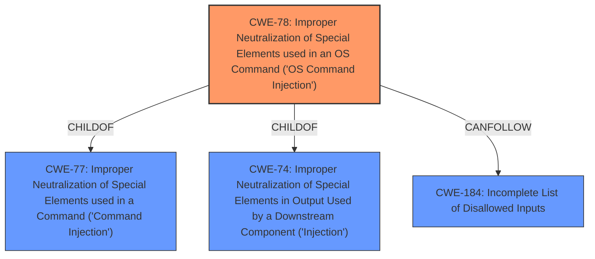

# Raw Analyzer Response for CVE-2021-38611

# Summary
| CWE ID | CWE Name | Confidence | CWE Abstraction Level | CWE Vulnerability Mapping Label | CWE-Vulnerability Mapping Notes |
|---|---|---|---|---|---|
| CWE-78 | Improper Neutralization of Special Elements used in an OS Command ('OS Command Injection') | 1.0 | Base | Allowed | Primary CWE: The vulnerability involves the injection of shell metacharacters into the filename parameter, leading to arbitrary command execution as root. |
| CWE-184 | Incomplete List of Disallowed Inputs | 0.7 | Base | Allowed | Secondary CWE: The vulnerability may stem from an incomplete list of disallowed shell metacharacters in the filename parameter. |

## Evidence and Confidence

*   **Confidence Score:** 0.9
*   **Evidence Strength:** HIGH

## Relationship Analysis
The primary CWE is CWE-78, which is a base-level CWE describing the improper neutralization of special elements used in an OS command. It is a child of CWE-77 (Improper Neutralization of Special Elements used in a Command) and CWE-74 (Improper Neutralization of Special Elements in Output Used by a Downstream Component ('Injection')). CWE-184 (Incomplete List of Disallowed Inputs) is considered as a secondary CWE, as the root cause could be an incomplete list of disallowed inputs.

## Vulnerability Chain
The vulnerability chain starts with the **command-injection vulnerability** due to the **improper neutralization** of shell metacharacters in the filename parameter. This leads to the ability to execute arbitrary commands as root.

## Summary of Analysis
The analysis is based on the vulnerability description, which explicitly mentions a **command-injection vulnerability** and the use of shell metacharacters in the filename parameter as the injection vector.

The vulnerability description states: "A **command-injection vulnerability** in the Image Upload function of the NASCENT RemKon Device Manager 4.0.0.0 allows attackers to execute arbitrary commands, as root, via shell metacharacters in the filename parameter to assets/index.php."

CWE-78 (Improper Neutralization of Special Elements used in an OS Command ('OS Command Injection')) is the most appropriate CWE because it directly addresses the root cause of the vulnerability: the improper handling of shell metacharacters in a command string. The use of "shell metacharacters" in the filename parameter strongly suggests that the vulnerability involves OS command injection. The impact is that attackers can "execute arbitrary commands, as root".

CWE-184 (Incomplete List of Disallowed Inputs) is considered as a secondary CWE, as the root cause could be an incomplete list of disallowed inputs.

Other CWEs were considered but deemed less appropriate. CWE-77 (Improper Neutralization of Special Elements used in a Command ('Command Injection')) is a broader category that includes OS command injection, but CWE-78 is more specific. CWE-88 (Improper Neutralization of Argument Delimiters in a Command ('Argument Injection')) addresses argument injection, but the primary issue is the **injection** of shell metacharacters, not necessarily the manipulation of argument delimiters. CWE-95 (Improper Neutralization of Directives in Dynamically Evaluated Code ('Eval Injection')) involves dynamic code evaluation, which is not directly indicated in the vulnerability description. CWE-434 (Unrestricted Upload of File with Dangerous Type) is relevant to file uploads but doesn't capture the command injection aspect. CWE-94 (Improper Control of Generation of Code ('Code Injection')) is similar to CWE-95 but involves general code injection, which is less specific than OS command injection in this case.