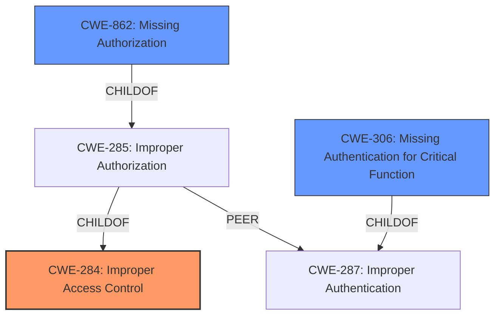

# Analysis Report for CVE-2021-38615

# Vulnerability Analysis Report: CVE-2021-38615

## Description


## Analysis (with Relationship Data)

# Summary
| CWE ID  | CWE Name | Confidence | CWE Abstraction Level | CWE Vulnerability Mapping Label | CWE-Vulnerability Mapping Notes |
|---|---|---|---|---|---|
| CWE-284 | Improper Access Control | 0.75 | Pillar | Primary | Discouraged |
| CWE-862 | Missing Authorization | 0.6 | Class | Secondary | Allowed-with-Review |
| CWE-306 | Missing Authentication for Critical Function | 0.5 | Base | Secondary | Allowed |

## Evidence and Confidence

*   **Confidence Score:** 0.75
*   **Evidence Strength:** HIGH

## Relationship Analysis
The primary CWE selected is CWE-284, Improper Access Control (Pillar). While it's a high-level categorization, the description clearly indicates a broad failure to restrict access to a resource. However, the specific root cause points to a lack of authorization checks, suggesting a more specific classification could be useful.

CWE-862, Missing Authorization (Class), is a child of CWE-285 (Improper Authorization), which in turn is a child of CWE-284. This indicates that the vulnerability might be more precisely described as a missing authorization check. Similarly, CWE-306, Missing Authentication for Critical Function (Base), is a child of CWE-287, which is a peer of CWE-285.



## Vulnerability Chain
The vulnerability chain starts with a **lack of access control** on the SSO configuration endpoint. This leads to the ability for any logged-in user to view and modify sensitive information. The chain can be summarized as:

1.  **Lack of Access Control (CWE-284)**: The root cause, as the system does not properly restrict access.
2.  **Missing Authorization (CWE-862)**: No authorization checks are performed before allowing access to the SSO configuration.
3.  **Information Exposure/Unauthorized Modification**: As a consequence, users can view and modify information.

## Summary of Analysis
Initially, the **lack of access control** points to CWE-284 (Improper Access Control). The CVE description states a **lack of access control** on the /auth/v1/sso/config/ SSO configuration endpoint allows any logged-in user (guest, standard, or admin) to view and modify information.

However, the retriever results also suggest CWE-862 (Missing Authorization) and CWE-306 (Missing Authentication for Critical Function). While authentication is present (users must be logged in), authorization is missing, which allows any logged-in user to access the SSO configuration endpoint regardless of their privileges.

Although CWE-284 is a high-level *Pillar*, it accurately reflects the overall vulnerability. CWE-862 is a *Class* which is more specific, and a better fit for the root cause because there is a specific **lack of authorization**. CWE-306 is a *Base* which is the most specific, however it's not the *best* fit because it requires authentication and the vulnerability only requires that a user be logged in. Therefore, CWE-284 is kept as the primary CWE, and CWE-862 and CWE-306 are noted as a secondary candidates.

Relevant CWE Information:

# Enhanced Context (25 CWEs)
The following CWEs were identified as potentially relevant to this vulnerability:

## CWE-274: Improper Handling of Insufficient Privileges
**Abstraction Level**: Base
**Similarity Score**: 0.77
**Source**: dense

**Description**:
The product does not handle or incorrectly handles when it has insufficient privileges to perform an operation, leading to resultant weaknesses.

**Mapping Guidance**:
- Usage: Discouraged
- Rationale: This CWE entry could be deprecated in a future version of CWE.
- *Not Selected*: While the impact involves privilege issues, the root cause is not in *handling* insufficient privileges but in the **lack of privilege checks**.

## CWE-266: Incorrect Privilege Assignment
**Abstraction Level**: Base
**Similarity Score**: 0.75
**Source**: dense

**Description**:
A product incorrectly assigns a privilege to a particular actor, creating an unintended sphere of control for that actor.

**Mapping Guidance**:
- Usage: Allowed
- Rationale: This CWE entry is at the Base level of abstraction, which is a preferred level of abstraction for mapping to the root causes of vulnerabilities.
- *Not Selected*: This is not the root cause because there is no **incorrect assignment of privileges**, but rather a **lack of privilege enforcement**.

## CWE-267: Privilege Defined With Unsafe Actions
**Abstraction Level**: Base
**Similarity Score**: 0.75
**Source**: dense

**Description**:
A particular privilege, role, capability, or right can be used to perform unsafe actions that were not intended, even when it is assigned to the correct entity.

**Mapping Guidance**:
- Usage: Allowed
- Rationale: This CWE entry is at the Base level of abstraction, which is a preferred level of abstraction for mapping to the root causes of vulnerabilities.
- *Not Selected*: This is not the root cause because the issue isn't that existing privileges are misused, but that **privileges are ignored altogether**.

## CWE-280: Improper Handling of Insufficient Permissions or Privileges 
**Abstraction Level**: Base
**Similarity Score**: 0.75
**Source**: dense

**Description**:
The product does not handle or incorrectly handles when it has insufficient privileges to access resources or functionality as specified by their permissions. This may cause it to follow unexpected code paths that may leave the product in an invalid state.

**Mapping Guidance**:
- Usage: Allowed
- Rationale: This CWE entry is at the Base level of abstraction, which is a preferred level of abstraction for mapping to the root causes of vulnerabilities.
- *Not Selected*: The root cause is not in *handling* insufficient privileges but in the **lack of privilege checks**.

## CWE-639: Authorization Bypass Through User-Controlled Key
**Abstraction Level**: Base
**Similarity Score**: 0.75
**Source**: dense

**Description**:
The system's authorization functionality does not prevent one user from gaining access to another user's data or record by modifying the key value identifying the data.

**Mapping Guidance**:
- Usage: Allowed
- Rationale: This CWE entry is at the Base level of abstraction, which is a preferred level of abstraction for mapping to the root causes of vulnerabilities.
- *Not Selected*: This doesn't apply because the authorization bypass is not happening through a user-controlled key, but due to an **absence of checks**.

## CWE-653: Improper Isolation or Compartmentalization
**Abstraction Level**: Class
**Similarity Score**: 0.75
**Source**: dense

**Description**:
The product does not properly compartmentalize or isolate functionality, processes, or resources that require different privilege levels, rights, or permissions.

**Mapping Guidance**:
- Usage: Allowed
- Rationale: This CWE entry is at the Base level of abstraction, which is a preferred level of abstraction for mapping to the root causes of vulnerabilities.
- *Not Selected*: The root cause is the **lack of access control**, not necessarily a failure in compartmentalization.

## CWE-1390: Weak Authentication
**Abstraction Level**: Class
**Similarity Score**: 0.74
**Source**: dense

**Description**:
The product uses an authentication mechanism to restrict access to specific users or identities, but the mechanism does not sufficiently prove that the claimed identity is correct.

**Mapping Guidance**:
- Usage: Allowed-with-Review
- Rationale: This CWE entry is a Class and might have Base-level children that would be more appropriate
- *Not Selected*: While authentication is present (users must be logged in), the core issue is the **lack of authorization**, not the *strength* of the authentication.

## CWE-668: Exposure of Resource to Wrong Sphere
**Abstraction Level**: Class
**Similarity Score**: 0.74
**Source**: dense

**Description**:
The product exposes a resource to the wrong control sphere, providing unintended actors with inappropriate access to the resource.

**Mapping Guidance**:
- Usage: Discouraged
- Rationale: CWE-668 is


## CWE Relationship Analysis

Current CWEs represent these abstraction levels: .


### Vulnerability Chain Analysis

**Chain starting from CWE-306:**
- 306 (Missing Authentication for Critical Function) - ROOT


**Chain starting from CWE-862:**
- 862 (Missing Authorization) - ROOT


### CWE Relationship Diagram

```mermaid
graph TD
    classDef primary fill:#f96,stroke:#333,stroke-width:2px
    classDef secondary fill:#69f,stroke:#333
    classDef tertiary fill:#9e9,stroke:#333
```


*Report generated on 2025-04-02 00:29:28*
