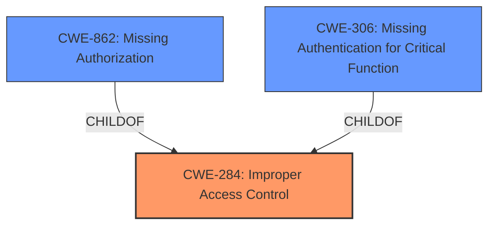

# Raw Analyzer Response for CVE-2021-38617

# Summary
| CWE ID | CWE Name | Confidence | CWE Abstraction Level | CWE Vulnerability Mapping Label | CWE-Vulnerability Mapping Notes |
|---|---|---|---|---|---|
| CWE-284 | Improper Access Control | 0.9 | Pillar | Primary | Discouraged |
| CWE-862 | Missing Authorization | 0.7 | Class | Secondary | Allowed-with-Review |
| CWE-306 | Missing Authentication for Critical Function | 0.6 | Base | Secondary | Allowed |

## Evidence and Confidence

*   **Confidence Score:** 0.8
*   **Evidence Strength:** HIGH

## Relationship Analysis
The primary CWE selected is CWE-284, Improper Access Control, which is a high-level Pillar. The analysis also considered its child CWEs, such as CWE-862 (Missing Authorization) and CWE-306 (Missing Authentication for Critical Function). While the vulnerability description indicates a **lack of access control**, it specifically points to the absence of authorization on the user creation endpoint. Therefore, CWE-862 and CWE-306 are also considered but are lower in confidence because authentication is also a form of access control that could be missing. The final decision favors the broader CWE-284 due to the high-level description and the fact that the specific type of missing access control (authentication or authorization) is not definitively specified in the description.

## Vulnerability Chain
The vulnerability chain starts with the **lack of access control** on the user creation endpoint, leading to the ability for a standard user to create a super user account, ultimately resulting in privilege escalation.

## Summary of Analysis
The initial analysis identified the **lack of access control** as the root cause, leading to privilege escalation. The retriever results suggested several CWEs related to access control and authorization. The final decision to select CWE-284 is based on the high-level description of the vulnerability and the fact that more specific authorization or authentication failures were not explicitly stated.

The evidence from the vulnerability description key phrases and CVE Reference Links Content Summary clearly points to a **lack of access control**:
- **Vulnerability Description Key Phrases**: **rootcause:** **lack of access control**
- **CVE Reference Links Content Summary**: "Root cause of vulnerability: A **lack of access control** on the user creation endpoint."

While CWE-284 is a high-level Pillar, it accurately represents the vulnerability's nature. The decision aligns with MITRE's mapping guidance to consider more specific CWEs when available, but in this case, the general **lack of access control** is the most fitting description given the available information. CWE-862 and CWE-306 are considered as secondary possibilities and are included in the summary.

Relevant CWE Information:

# Enhanced Context (25 CWEs)

## CWE-274: Improper Handling of Insufficient Privileges
**Abstraction Level**: Base
**Similarity Score**: 0.75
**Source**: dense

**Description**:
The product does not handle or incorrectly handles when it has insufficient privileges to perform an operation, leading to resultant weaknesses.
**Rationale**: This is not the core issue. The core issue is the ability to create a super user.

## CWE-280: Improper Handling of Insufficient Permissions or Privileges 
**Abstraction Level**: Base
**Similarity Score**: 0.74
**Source**: dense

**Description**:
The product does not handle or incorrectly handles when it has insufficient privileges to access resources or functionality as specified by their permissions. This may cause it to follow unexpected code paths that may leave the product in an invalid state.
**Rationale**: This is not the core issue. The core issue is the ability to create a super user.

## CWE-266: Incorrect Privilege Assignment
**Abstraction Level**: Base
**Similarity Score**: 0.74
**Source**: dense

**Description**:
A product incorrectly assigns a privilege to a particular actor, creating an unintended sphere of control for that actor.
**Rationale**: This is not the core issue. The core issue is the ability to create a super user.

## CWE-1220: Insufficient Granularity of Access Control
**Abstraction Level**: Base
**Similarity Score**: 0.74
**Source**: dense

**Description**:
The product implements access controls via a policy or other feature with the intention to disable or restrict accesses (reads and/or writes) to assets in a system from untrusted agents. However, implemented access controls lack required granularity, which renders the control policy too broad because it allows accesses from unauthorized agents to the security-sensitive assets.
**Rationale**: While this could be related, the description is too specific. The core issue is more general: a standard user can create a super user.

## CWE-267: Privilege Defined With Unsafe Actions
**Abstraction Level**: Base
**Similarity Score**: 0.73
**Source**: dense

**Description**:
A particular privilege, role, capability, or right can be used to perform unsafe actions that were not intended, even when it is assigned to the correct entity.
**Rationale**: This is not the core issue. The core issue is the ability to create a super user.

## CWE-639: Authorization Bypass Through User-Controlled Key
**Abstraction Level**: Base
**Similarity Score**: 0.73
**Source**: dense

**Description**:
The system's authorization functionality does not prevent one user from gaining access to another user's data or record by modifying the key value identifying the data.
**Rationale**: This is not the core issue. The core issue is the ability to create a super user.

## CWE-807: Reliance on Untrusted Inputs in a Security Decision
**Abstraction Level**: Base
**Similarity Score**: 0.73
**Source**: dense

**Description**:
The product uses a protection mechanism that relies on the existence or values of an input, but the input can be modified by an untrusted actor in a way that bypasses the protection mechanism.
**Rationale**: This is not the core issue. The core issue is the ability to create a super user.

## CWE-653: Improper Isolation or Compartmentalization
**Abstraction Level**: Class
**Similarity Score**: 0.72
**Source**: dense

**Description**:
The product does not properly compartmentalize or isolate functionality, processes, or resources that require different privilege levels, rights, or permissions.
**Rationale**: This is not the core issue. The core issue is the ability to create a super user.

## CWE-303: Incorrect Implementation of Authentication Algorithm
**Abstraction Level**: Base
**Similarity Score**: 0.72
**Source**: dense

**Description**:
The requirements for the product dictate the use of an established authentication algorithm, but the implementation of the algorithm is incorrect.
**Rationale**: This is not the core issue. The core issue is the ability to create a super user.

## CWE-1390: Weak Authentication
**Abstraction Level**: Class
**Similarity Score**: 0.72
**Source**: dense

**Description**:
The product uses an authentication mechanism to restrict access to specific users or identities, but the mechanism does not sufficiently prove that the claimed identity is correct.
**Rationale**: This is not the core issue. The core issue is the ability to create a super user.

## CWE-285: Improper Authorization
**Abstraction Level**: Class
**Similarity Score**: 5235.19
**Source**: sparse

**Description**:
The product does not perform or incorrectly performs an authorization check when an actor attempts to access a resource or perform an action.
**Rationale**: This is similar, but CWE-284 is more appropriate.

## CWE-863: Incorrect Authorization
**Abstraction Level**: Class
**Similarity Score**: 5201.61
**Source**: sparse

**Description**:
The product performs an authorization check when an actor attempts to access a resource or perform an action, but it does not correctly perform the check.
**Rationale**: This is not the core issue. The core issue is the ability to create a super user.

## CWE-639: Authorization Bypass Through User-Controlled Key
**Abstraction Level**: Base
**Similarity Score**: 4958.05
**Source**: sparse

**Description**:
The system's authorization functionality does not prevent one user from gaining access to another user's data or record by modifying the key value identifying the data.
**Rationale**: This is not the core issue. The core issue is the ability to create a super user.

## CWE-287: Improper Authentication
**Abstraction Level**: Class
**Similarity Score**: 4930.65
**Source**: sparse

**