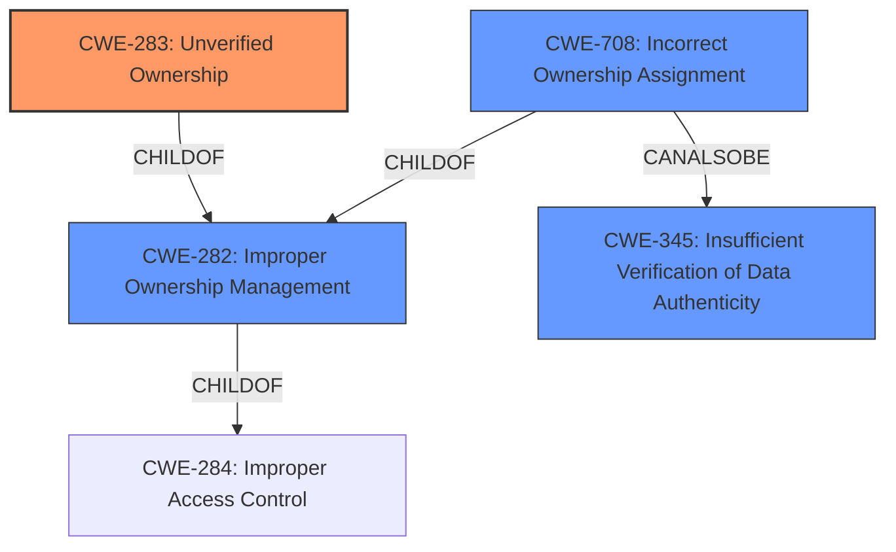

# Raw Analyzer Response for CVE-2021-38621

# Summary
| CWE ID | CWE Name | Confidence | CWE Abstraction Level | CWE Vulnerability Mapping Label | CWE-Vulnerability Mapping Notes |
|---|---|---|---|---|---|
| CWE-283 | Unverified Ownership | 0.9 | Base | Allowed | Primary CWE |
| CWE-708 | Incorrect Ownership Assignment | 0.7 | Base | Allowed | Secondary Candidate |
| CWE-282 | Improper Ownership Management | 0.6 | Class | Allowed-with-Review | Secondary Candidate |

## Evidence and Confidence

*   **Confidence Score:** 0.8
*   **Evidence Strength:** HIGH

## Relationship Analysis
The primary CWE, CWE-283 **Unverified Ownership**, is a child of CWE-282 **Improper Ownership Management**. CWE-282 itself falls under the higher-level category of CWE-284 **Improper Access Control**. The relationship highlights that the root cause involves a failure to adequately confirm ownership before performing an action. CWE-708 **Incorrect Ownership Assignment** is also a child of CWE-282, and can also be related to CWE-345 **Insufficient Verification of Data Authenticity**. The choice of CWE-283 as the primary CWE stems from the vulnerability description key phrases indicating **mishandles file ownership**, and the CVE reference link content summary explicitly mentioning insufficient file ownership validation. The base level of CWE-283 is preferred because the evidence directly supports the specific weakness of unverified ownership.

## Vulnerability Chain
The vulnerability chain begins with the **mishandling of file ownership**, specifically, the **lack of verification of file ownership** before deletion, leading to the potential for unauthorized data deletion and service disruption.

## Summary of Analysis
The initial assessment focused on identifying the core weakness in the Agora Flat Server vulnerability. The primary indicator was the description key phrase "**mishandles file ownership**" and the CVE reference links content summary which explicitly mentions "**insufficient file ownership validation**". This evidence strongly pointed towards a problem related to improper ownership management.

The Retriever Results highlighted CWE-283 **Unverified Ownership**, CWE-282 **Improper Ownership Management**, and CWE-708 **Incorrect Ownership Assignment** as potential candidates. After reviewing the complete CWE specifications, CWE-283 emerged as the most fitting primary CWE due to its specific focus on the **failure to verify ownership**. The code changes described in the CVE reference links summary clearly indicated that the fix involved adding a check to verify the file owner before allowing deletion, directly addressing the **unverified ownership** weakness.

While CWE-282 and CWE-708 were also considered, they were deemed less specific than CWE-283. CWE-282 is a class-level CWE, and the vulnerability details support the selection of a more specific base-level CWE. CWE-708 relates to assigning ownership to the wrong entity, which is not the core issue here; the core issue is the **lack of verification** before taking action.

The choice of CWE-283 is further supported by its "Allowed" usage in the mapping guidance and its base level of abstraction, which is preferred when the evidence supports it. The relationship analysis confirmed that CWE-283 is a child of CWE-282, fitting into the hierarchy of ownership-related weaknesses.

In summary, the decision to prioritize CWE-283 is based on the following evidence and rationale:

*   Direct evidence from the vulnerability description and CVE reference links content summary indicating **insufficient file ownership validation**.
*   The specific description of CWE-283 aligning with the weakness of **unverified ownership**.
*   The "Allowed" usage and base level of abstraction for CWE-283 in the MITRE mapping guidance.
*   The hierarchical relationship between CWE-283 and CWE-282, ensuring that the chosen CWE fits within the broader context of ownership management.

The vulnerability description "**The remove API... mishandles file ownership**" directly supports the classification of CWE-283 as the primary weakness.

CWEs considered but not used:

*   CWE-22 **Improper Limitation of a Pathname to a Restricted Directory ('Path Traversal')**: This CWE relates to path traversal vulnerabilities, which are not relevant to the described vulnerability.
*   CWE-78 **Improper Neutralization of Special Elements used in an OS Command ('OS Command Injection')**: This CWE relates to command injection, which is not relevant to the described vulnerability.
*   CWE-79 **Improper Neutralization of Input During Web Page Generation ('Cross-site Scripting')**: This CWE relates to cross-site scripting vulnerabilities, which are not relevant to the described vulnerability.
*   CWE-94 **Improper Control of Generation of Code ('Code Injection')**: This CWE relates to code injection, which is not relevant to the described vulnerability.
*   CWE-98 **Improper Control of Filename for Include/Require Statement in PHP Program ('PHP Remote File Inclusion')**: This CWE relates to remote file inclusion, which is not relevant to the described vulnerability.
*   CWE-20 **Improper Input Validation**: While related to security, this is a broad, class-level CWE. The evidence points to a more specific weakness (CWE-283).
*   CWE-41 **Improper Resolution of Path Equivalence**: This CWE relates to path equivalence, which is not relevant to the described vulnerability.
*   CWE-59 **Improper Link Resolution Before File Access ('Link Following')**: This CWE relates to link following, which is not relevant to the described vulnerability.
*   CWE-73 **External Control of File Name or Path**: This CWE relates to external control of file paths, which is not the direct issue in this vulnerability.
*   CWE-74 **Improper Neutralization of Special Elements in Output Used by a Downstream Component ('Injection')**: This CWE relates to injection vulnerabilities, which are not relevant to the described vulnerability.
*   CWE-88 **Improper Neutralization of Argument Delimiters in a Command ('Argument Injection')**: This CWE relates to argument injection vulnerabilities, which are not relevant to the described vulnerability.
*   CWE-138 **Improper Neutralization of Special Elements**: This is a class level CWE and other entries are a better fit.
*   CWE-184 **Incomplete List of Disallowed Inputs**: This CWE is not directly related to the described vulnerability.
*   CWE-212 **Improper Removal of Sensitive Information Before Storage or Transfer**: This CWE is not related to the vulnerability.
*   CWE-328 **Use of Weak Hash**: This CWE relates to usage of weak hashes, which is not relevant to the described vulnerability.
*   CWE-668 **Exposure of Resource to Wrong Sphere**: This is too high-level; the problem is specifically related to ownership verification.